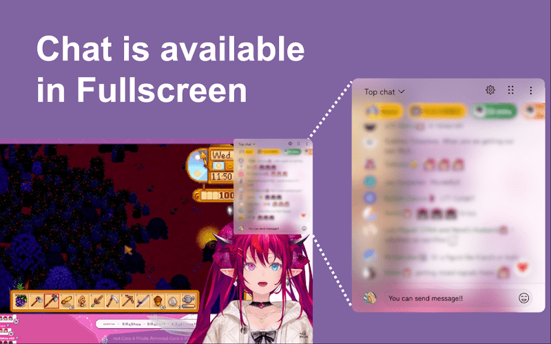

<div align="center">
  
</div>

<h1 align="center">YouTube Live Chat Fullscreen</h1>

<p align="center">
  YouTube ライブチャットをフルスクリーン動画にオーバーレイ表示 — ドラッグ、リサイズ、スタイルを自由にカスタマイズ。
</p>

<p align="center">
  <a href="README.md">English</a> ·
  <a href="README.ja.md">日本語</a> ·
  <a href="README.zh-TW.md">繁體中文</a>
</p>

<p align="center">
  <a href="https://chromewebstore.google.com/detail/youtube-live-chat-fullscr/dlnjcbkmomenmieechnmgglgcljhoepd">
    
  </a>
  <a href="https://chromewebstore.google.com/detail/youtube-live-chat-fullscr/dlnjcbkmomenmieechnmgglgcljhoepd">
    
  </a>
  <a href="https://addons.mozilla.org/ja/firefox/addon/youtube-live-chat-fullscreen/">
    
  </a>
  <a href="https://addons.mozilla.org/ja/firefox/addon/youtube-live-chat-fullscreen/">
    
  </a>
</p>

<p align="center">
  <a href="https://github.com/daichan132/Youtube-Live-Chat-Fullscreen/stargazers">
    
  </a>
  <a href="https://github.com/daichan132/Youtube-Live-Chat-Fullscreen/releases/latest">
    
  </a>
  <a href="LICENSE">
    
  </a>
  <a href="https://github.com/daichan132/Youtube-Live-Chat-Fullscreen/actions/workflows/ci.yml">
    
  </a>
</p>

<p align="center">
  <a href="https://chromewebstore.google.com/detail/youtube-live-chat-fullscr/dlnjcbkmomenmieechnmgglgcljhoepd">
    
  </a>
  <a href="https://addons.mozilla.org/ja/firefox/addon/youtube-live-chat-fullscreen/">
    
  </a>
</p>

---

## プレビュー



## 30秒クイックスタート

1. [Chrome ウェブストア](https://chromewebstore.google.com/detail/youtube-live-chat-fullscr/dlnjcbkmomenmieechnmgglgcljhoepd) または [Firefox アドオン](https://addons.mozilla.org/ja/firefox/addon/youtube-live-chat-fullscreen/) からインストール。
2. YouTube のライブ配信、またはチャットリプレイ付きアーカイブ動画を開く。
3. フルスクリーンにして、右下のスイッチからチャット表示を切替。
4. オーバーレイをドラッグ/リサイズし、設定でスタイルを調整。

## 機能

### 💬 フルスクリーンチャット

- フルスクリーンを維持したまま、チャットの閲覧と投稿が可能
- オーバーレイから直接 Super Chat を投稿
- ライブ配信とチャットリプレイ付きアーカイブの両方に対応

### 🎨 スタイルカスタマイズ

- 背景色・文字色・フォント・文字サイズ・ぼかし・余白を自在に調整
- ユーザー名・アイコン・Super Chat バー・チャットのみ表示を切替
- オーバーレイのドラッグ・リサイズ・位置調整が自由自在

### 📋 プリセット

- 視聴シーンごとにスタイルプリセットを保存・切替
- ワンクリックで設定を即座に切替

### 🌐 多言語対応

- 50以上の言語をビルトインでサポート

## Tech Stack

| カテゴリ | スタック | プロジェクトでの役割 |
| --- | --- | --- |
| **Core** |   <a href="https://wxt.dev"></a> | React 19 でオーバーレイ UI を構築、TypeScript で型安全を確保、[WXT](https://wxt.dev) をクロスブラウザ拡張フレームワークとして採用 |
| **State & Style** | <a href="https://zustand.docs.pmnd.rs"></a>  | Zustand で軽量なエントリポイント間状態管理、UnoCSS でアトミックスタイリング |
| **Quality** |     | Vitest でユニットテスト、Playwright で E2E、Storybook で UI カタログ、Biome で lint & format |

## アーキテクチャ

<details>
<summary>クリックして展開</summary>

### システム概要


この拡張機能は、ブラウザの `tabs` / `runtime` メッセージング API を介して通信する2つのエントリポイントで構成されています:

| コンポーネント | 役割 |
| --- | --- |
| **Content Script** | YouTube ページに注入。チャットオーバーレイの描画、ドラッグ/リサイズ処理、チャットソースの解決（ライブ vs. アーカイブ）を担当。 |
| **Popup** | 拡張機能ツールバーの UI。言語・有効/無効・テーマを制御し、Content Script とリアルタイムに状態を同期。 |
| **Shared** | 両エントリポイント共通のモジュール — ストア（Zustand）、i18n アセット、UI コンポーネント、テーマ、ユーティリティ関数。 |

### チャットソースの解決

Content Script が動画タイプを自動検出し、適切なチャットソースを選択します:

| 動画状態 | チャットソース | スイッチ / オーバーレイ |
| --- | --- | --- |
| ライブ配信 | 公開 `live_chat?v=<videoId>` | 表示される |
| リプレイ可能なアーカイブ | ネイティブ `live_chat_replay` iframe | リプレイが再生可能な時のみ表示 |
| チャットなし / リプレイ不可 | なし | 非表示 |

### プロジェクト構成

```
entrypoints/
├── content/          # Content Script（YouTube に注入）
│   ├── chat/         # チャットソース解決（live / archive）
│   ├── features/     # UI 機能（Draggable, Iframe, Settings, Switch）
│   └── hooks/        # Content 固有の React hooks
├── popup/            # Popup UI（拡張機能ツールバー）
│   ├── components/   # Popup 固有のコンポーネント
│   └── utils/        # Popup ユーティリティ
shared/               # エントリポイント間で共有
├── stores/           # Zustand 状態管理
├── i18n/             # 50以上の言語アセット
├── components/       # 共有 UI コンポーネント
├── theme/            # テーマ設定
└── hooks/            # 共有 React hooks
```

</details>

## 開発者向けセットアップ

### 必須環境

- **[Node.js](https://nodejs.org)** v22.x
- **[Yarn](https://yarnpkg.com)**（Corepack 経由を推奨）

### インストール

```bash
git clone https://github.com/daichan132/Youtube-Live-Chat-Fullscreen.git
cd Youtube-Live-Chat-Fullscreen
corepack enable
yarn install
```

### コマンド

| コマンド | 説明 |
| --- | --- |
| `yarn dev` | 開発サーバー起動（Chrome） |
| `yarn dev:firefox` | 開発サーバー起動（Firefox） |
| `yarn build` | 本番ビルド（Chrome） |
| `yarn build:firefox` | 本番ビルド（Firefox） |
| `yarn zip` | Zip パッケージ作成 |
| `yarn zip:firefox` | Firefox 用 Zip パッケージ作成 |
| `yarn lint` | Biome チェック + TypeScript 型検査 |
| `yarn test:unit` | ユニットテスト実行 |
| `yarn storybook` | Storybook 起動 |
| `yarn storybook:build` | Storybook 静的ビルド |
| `yarn e2e` | E2E テスト実行 |

> Storybook では `Catalog/CurrentUIDesigns` を開くと、現状の UI デザインを一括確認できます。

### 品質チェック

Pull Request 前に実行してください:

```bash
yarn lint
yarn test:unit
yarn build
```

Firefox 互換に関係する変更では `yarn build:firefox` も実行してください。

## コントリビュート

バグ報告・機能提案・Pull Request、すべて歓迎です!

- [Issue](https://github.com/daichan132/Youtube-Live-Chat-Fullscreen/issues) を作成するか、[Pull Request](https://github.com/daichan132/Youtube-Live-Chat-Fullscreen/pulls) を送ってください。
- 翻訳のコントリビュートも歓迎です — `README.<locale>.md` を追加してください。

<a href="https://github.com/daichan132/Youtube-Live-Chat-Fullscreen/graphs/contributors">
  
</a>

## サポート

この拡張が役に立ったら、Star が継続開発の後押しになります!

<p>
  <a href="https://github.com/daichan132/Youtube-Live-Chat-Fullscreen/stargazers">
    
  </a>
  <a href="https://ko-fi.com/D1D01A39U6">
    
  </a>
</p>

## ライセンス

GPL-3.0 ライセンス。詳細は [LICENSE](LICENSE) を参照してください。
