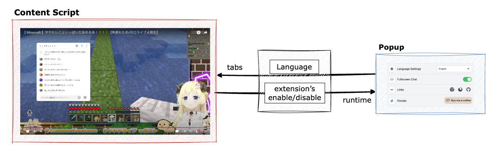

<div align="center">
  
</div>
<br>
<h1 align="center">YouTube Live Chat Fullscreen</h1>
<p align="center">
  <a href="README.md">English (US)</a> ·
  <a href="README.ja.md">日本語</a> ·
  <a href="README.zh-TW.md">繁體中文 (台灣)</a>
</p>
<p align="center">
  <a target="_blank" href="https://chromewebstore.google.com/detail/youtube-live-chat-fullscr/dlnjcbkmomenmieechnmgglgcljhoepd">
    
  </a>
  <a target="_blank" href="https://chromewebstore.google.com/detail/youtube-live-chat-fullscr/dlnjcbkmomenmieechnmgglgcljhoepd">
    
  </a>
  <a target="_blank" href="https://addons.mozilla.org/ja/firefox/addon/youtube-live-chat-fullscreen/">
    
  </a>
  <a target="_blank" href="https://addons.mozilla.org/ja/firefox/addon/youtube-live-chat-fullscreen/">
    
  </a>
</p>
<br>

この拡張機能を使えば、YouTube Live をフルスクリーンのまま、チャットの表示と投稿ができます。

## 🚀 ダウンロード
- [Chrome ウェブストア](https://chromewebstore.google.com/detail/youtube-live-chat-fullscr/dlnjcbkmomenmieechnmgglgcljhoepd)
- [Firefox アドオン](https://addons.mozilla.org/ja/firefox/addon/youtube-live-chat-fullscreen/)

## ✨ 機能
💬 フルスクリーンのまま、コメントや Super Chat を投稿できます。

✒️ 背景色・文字色・フォントサイズなど、チャットの見た目を柔軟にカスタマイズできます。

⚙️ チャットウィンドウのサイズや位置も調整できます。

🌐 複数言語に対応しています。

## 🖼️ プレビュー


## 📚 プロジェクト概要
この拡張機能は、コンテンツスクリプトで YouTube Live のチャットを制御します。ポップアップから言語や有効/無効を切り替えでき、両者は直接通信して設定を同期します。



## 🛠️ はじめに

### 必須環境
以下が必要です。

- **[Node.js](https://nodejs.org)** (v22.x)
- **[Yarn](https://yarnpkg.com)**

> [!NOTE]
> Yarn が未インストールの場合は `npm install -g yarn` でグローバルにインストールできます。

### インストール

リポジトリをクローンし、依存関係をインストールします。

```bash
git clone https://github.com/daichan132/Youtube-Live-Chat-Fullscreen.git
cd Youtube-Live-Chat-Fullscreen
yarn install
```

フォークしてカスタマイズすることも可能です。

### コマンド
- `dev`: 開発サーバーを起動
- `dev:firefox`: Firefox 用の開発サーバーを起動
- `build`: 本番ビルドを作成
- `build:firefox`: Firefox 向けにビルド
- `zip`: Zip パッケージを作成
- `zip:firefox`: Firefox 向け Zip パッケージを作成
- `format`: コードを整形
- `lint`: 静的解析 (Biome + TypeScript 型検査)
- `storybook`: 拡張機能を起動せずに UI を確認する Storybook を起動
- `storybook:build`: Storybook の静的ファイルをビルド
- `e2e`: E2E テストを実行

Storybook では `Catalog/CurrentUIDesigns` を開くと、現状 UI デザインを一覧で確認できます。

## 🤝 貢献
アイデア、バグ報告、改善提案があれば、GitHub の Issue や Pull Request を歓迎します。

## 💖 支援
この拡張機能を気に入っていただけたら、ご支援いただけると嬉しいです。継続的な開発・改善に役立ちます。

[](https://ko-fi.com/D1D01A39U6)

## 📄 ライセンス
GPL-3.0 ライセンス。詳細は [LICENSE](LICENSE) をご覧ください。
