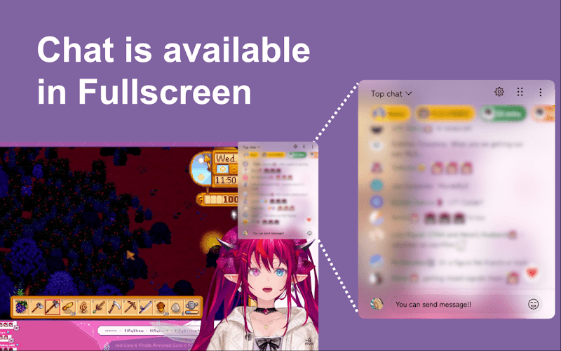

  

 
<h1 align="center">Youtube Live Chat Fullscreen</h1>

  
  
  
  

 

Using this extension, you can display the chat panel and post comments while keeping YouTube Live in full-screen mode.

## Download
- [Chrome Web Store](https://chromewebstore.google.com/detail/youtube-live-chat-fullscr/dlnjcbkmomenmieechnmgglgcljhoepd)
- [Firefox Browser Add-ons](https://addons.mozilla.org/ja/firefox/addon/youtube-live-chat-fullscreen/)

## Features
💬 Post comments and Super Chats even in full-screen mode.

✒️ Freely customize the chat appearance, including background color, text color, and font size.

⚙️ Adjust the size and position of the chat window as desired.

🌐 Supports multiple languages to cater to a wide range of users.

## Preview

## Contributing
Contributions are welcome! If you have ideas, bug reports, or improvements, please feel free to open an issue or submit a pull request on GitHub.

## Sponsor
If you enjoy using this extension, please consider supporting the project.
Your contributions help keep the project running and allow for future improvements.

## License
This project is licensed under the **GNU General Public License v3.0**. See the [LICENSE](LICENSE) file for more details.

