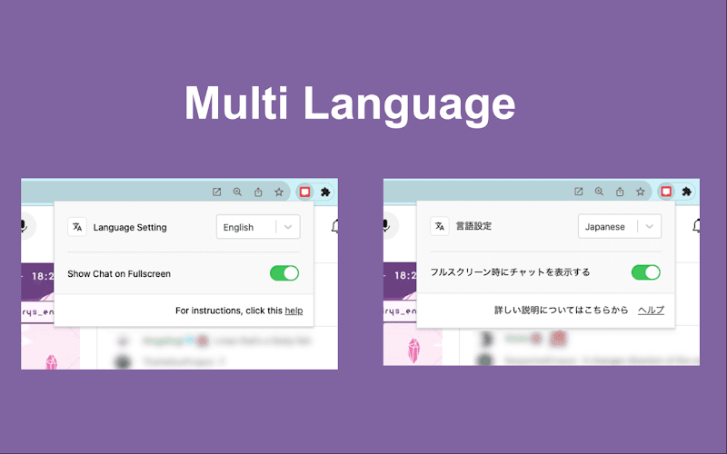

<h1> Youtube Live Chat Fullscreen</h1>

This extension allows Youtube Live to use chat when in Fullscreen.

## App Screenshots

|        Chat is available in Fullscreen         |                  Style Change                   |                 Multi Language                  |
| :--------------------------------------------: | :---------------------------------------------: | :---------------------------------------------: |
|  |  |  |

## Third-Party Licenses

This project uses third-party libraries or components, each subject to their own license terms. Please see below for details on each license.

- browser-extension-react-typescript-starter
  - License: MIT License
  - License Details: https://github.com/sinanbekar/browser-extension-react-typescript-starter/blob/main/LICENSE
