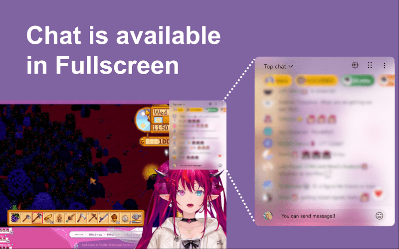
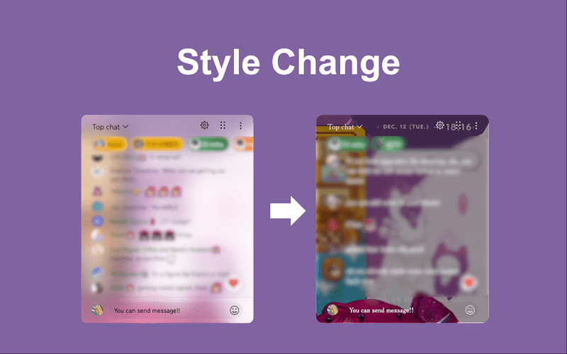

<div align="center">
  
</div>
<br>
<h1 align="center">Youtube Live Chat Fullscreen</h1>
<p align="center">
  <a target="_blank" href="https://chromewebstore.google.com/detail/youtube-live-chat-fullscr/dlnjcbkmomenmieechnmgglgcljhoepd">
    
  </a>
  <a target="_blank" href="https://addons.mozilla.org/ja/firefox/addon/youtube-live-chat-fullscreen/">
    
  </a>
</p>
<br>

## 🌟 Features

<div align="center">
  
  
</div>

## 🎉 Getting Started

### Requirements

Before you begin, ensure you have the following software installed:

- **[Node.js](https://nodejs.org)** (v22.x)
- **[Yarn](https://yarnpkg.com)**

> **Note**: If Yarn is not installed, run `npm install -g yarn` to install it globally.

### Installation

Clone the repository and install the dependencies:

```bash
git clone https://github.com/daichan132/Youtube-Live-Chat-Fullscreen.git
cd Youtube-Live-Chat-Fullscreen
yarn install
```

### Loading the Extension

**Chrome (Chromium, Manifest V3)**

1. Open `chrome://extensions` in your browser.
2. Enable **Developer Mode**.
3. Click **Load unpacked**.
4. Select the `dist` folder from the project root.

**Firefox (Manifest V2)**

1. Open `about:debugging` in your browser.
2. Click **This Firefox** (or **This Nightly**).
3. Click **Load Temporary Add-on...**.
4. Select any file in the `dist-firefox` directory.

## 📄 License

This project is licensed under the **GNU General Public License v3.0**. See the [LICENSE](LICENSE) file for more details.

## 🤝 Contributing

Contributions are welcome! Feel free to open issues or submit pull requests to help improve this project.
