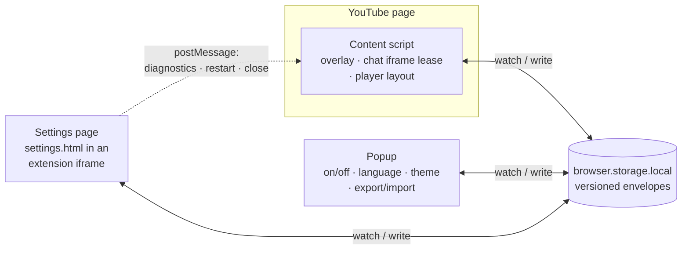

<div align="center">
  
</div>

<h1 align="center">YouTube Live Chat Fullscreen</h1>

<p align="center">
  Fullscreen keeps the video and drops the conversation.<br />
  This extension brings live chat back as a draggable, resizable overlay — without making you leave fullscreen.
</p>

<p align="center">
  <strong>Used by 20,000+ Chrome viewers</strong><br />
  Chrome (also runs in Opera) + Firefox · 55 locales (49 languages) · No account · No tracking · Open source
</p>

<p align="center">
  <strong>English</strong> ·
  <a href="docs/translations/README.ja.md">日本語</a> ·
  <a href="docs/translations/README.zh-TW.md">繁體中文</a>
</p>

<p align="center">
  <a href="https://chromewebstore.google.com/detail/youtube-live-chat-fullscr/dlnjcbkmomenmieechnmgglgcljhoepd">
    
  </a>
  <a href="https://chromewebstore.google.com/detail/youtube-live-chat-fullscr/dlnjcbkmomenmieechnmgglgcljhoepd">
    
  </a>
  <a href="https://addons.mozilla.org/firefox/addon/youtube-live-chat-fullscreen/">
    
  </a>
  <a href="https://addons.mozilla.org/firefox/addon/youtube-live-chat-fullscreen/">
    
  </a>
</p>

<p align="center">
  <a href="https://chromewebstore.google.com/detail/youtube-live-chat-fullscr/dlnjcbkmomenmieechnmgglgcljhoepd">
    
  </a>
  <a href="https://addons.mozilla.org/firefox/addon/youtube-live-chat-fullscreen/">
    
  </a>
  <a href="https://github.com/daichan132/Youtube-Live-Chat-Fullscreen">
    
  </a>
</p>

<p align="center">
  If the overlay earns a place in your streams, a GitHub star helps the next viewer find it.
</p>

---

## Preview


### Screenshots

<table>
<tr>
<th align="center" colspan="2">Fullscreen Chat Overlay</th>
</tr>
<tr>
<td colspan="2"></td>
</tr>
<tr>
<th align="center">Popup — Light</th>
<th align="center">Popup — Dark</th>
</tr>
<tr>
<td align="center"></td>
<td align="center"></td>
</tr>
<tr>
<th align="center">Settings — Light</th>
<th align="center">Settings — Dark</th>
</tr>
<tr>
<td></td>
<td></td>
</tr>
</table>

## From Install to Fullscreen Chat

There is no account to create and no setup wizard to finish.

1. Install from the [Chrome Web Store](https://chromewebstore.google.com/detail/youtube-live-chat-fullscr/dlnjcbkmomenmieechnmgglgcljhoepd) (the Chrome build also runs in Opera) or [Firefox Add-ons](https://addons.mozilla.org/firefox/addon/youtube-live-chat-fullscreen/).
2. Open a YouTube live stream or an archive with chat replay.
3. Enter fullscreen — the chat is already there. The speech-bubble button in the player control bar toggles it off and back on.
4. Drag or resize the overlay, then adjust its appearance from the extension settings.

The video stays fullscreen. The conversation stays with it.

## What Stays in Your Browser

The overlay runs in the browser, and its settings stay there. No analytics, no tracking, nothing to the developer: the extension never collects, stores, or sends what you read or type. Only fonts beyond the default are fetched, from Google Fonts; nothing else leaves the browser.

- **No extension account or data collection:** the extension does not collect personal data
- **Local settings:** appearance, layout, presets, and backups remain in browser storage
- **Minimal permissions:** only `activeTab` and `storage`
- **Public implementation:** the source code and release pipeline can be reviewed in this repository

## Features

Restoring a read-only chat window would solve only half the problem. The overlay keeps the parts of YouTube chat that viewers use while the video remains fullscreen.

### 💬 Fullscreen Chat

- Post comments from the overlay without leaving fullscreen — and Super Chats on live streams
- Works with both live streams and archived streams with chat replay
- "Show When Idle" keeps the overlay visible while player controls are hidden — on by default, and switchable to auto-hide

### 🎨 Style & Appearance

- Adjust background color, text color, font, size, blur, and spacing so the overlay fits your stream layout
- Hide usernames and profile pictures on ordinary messages (paid messages keep theirs), toggle the Super Chat bar, or switch to Chat-Only Mode while Show When Idle is on
- Drag, resize, and reposition the chat overlay freely
- Light, dark, and auto (system-follow) theme across the overlay, popup, and settings panel

### 📋 Presets & Backup

- Save named style presets and switch between them with one click
- Export and import all settings as JSON for backup or cross-device sync

### 🌐 Internationalization

- 55 locales covering 49 languages, including RTL layout for Arabic, Hebrew, and Farsi

<p align="center">
  <a href="https://chromewebstore.google.com/detail/youtube-live-chat-fullscr/dlnjcbkmomenmieechnmgglgcljhoepd">
    
  </a>
  <a href="https://addons.mozilla.org/firefox/addon/youtube-live-chat-fullscreen/">
    
  </a>
</p>

---

## A Production Extension on a Moving Page

The extension serves 20,000+ Chrome viewers, but the YouTube page beneath it never stays entirely still. URLs change without full reloads, chat DOM is replaced, and live chat and archive replay do not share the same source rules. The codebase treats those differences as explicit runtime contracts instead of scattered exceptions.

- Cross-browser Chrome and Firefox builds from one WXT codebase, with the Chrome build also running in Opera
- React 19, TypeScript, Jotai, and Tailwind CSS v4
- 55 generated locales covering 49 languages, with RTL support
- Pure chat-source decisions separated from YouTube DOM side effects
- Unit, contract, deterministic Playwright E2E, visual, accessibility, and live canary coverage
- Explicit handling of SPA navigation, DOM replacement, live chat, and archive replay
- Versioned settings migration and synchronization across extension contexts
- Release artifacts built once, hash-proven, and published without a rebuild
- Minimal permissions and no personal-data collection

The runtime boundaries, test strategy, settings ownership, and release safeguards are documented in [Engineering YouTube Live Chat Fullscreen](docs/engineering.md).

## Tech Stack

| Category | Stack | Role in this project |
| --- | --- | --- |
| **Core** |   <a href="https://wxt.dev"></a> | React 19 for overlay UI, TypeScript for type safety, [WXT](https://wxt.dev) as the cross-browser extension framework |
| **State & Style** | <a href="https://jotai.org"></a> <a href="https://tailwindcss.com"></a> | Jotai for synchronized state transitions, Tailwind CSS v4 for styling |
| **Quality** |    | Vitest for unit tests, Playwright for E2E, Biome for lint & format |

## Architecture

<details>
<summary>Click to expand</summary>

### Runtime Overview

The browser shows one extension, but three runtime entrypoints do the work. There is no background service worker.


```mermaid
flowchart LR
  subgraph Y["YouTube page"]
    CS["Content script<br/>overlay · chat iframe lease<br/>· player layout"]
  end
  P["Popup<br/>on/off · language · theme<br/>· export/import"]
  S["Settings page<br/>settings.html in an<br/>extension iframe"]
  ST[("browser.storage.local<br/>versioned envelopes")]

  CS <-->|watch / write| ST
  P <-->|watch / write| ST
  S <-->|watch / write| ST
  S -.->|postMessage:<br/>diagnostics · restart · close| CS
```

| Component | Role |
| --- | --- |
| **Content script** | Injected into YouTube pages. Renders the chat overlay, handles drag and resize, and resolves the chat source (live vs. archive vs. none). |
| **Popup** | Extension toolbar UI. Enable/disable, language, theme, and settings export/import. |
| **Settings page** | A separate `settings.html` entrypoint displayed through an extension iframe over the player. It has its own React root and state store. |
| **Shared** | Modules used by all three — settings repository and migration, Jotai state, generated i18n assets, UI components, and theme. |

The three contexts do not exchange `tabs` or `runtime` messages. Each writes a versioned envelope carrying a writer identifier to extension storage, and watchers in the other contexts pick up the change while ignoring their own writes. The settings iframe additionally uses `window.postMessage` for the three things storage cannot carry: requesting a diagnostic report, restarting the chat runtime, and closing itself.

### Chat Source Resolution

Live and archived streams look similar in the player, but their chat sources are not interchangeable. Where possible the extension **borrows YouTube's own chat iframe** rather than creating one, because that preserves YouTube-owned authentication, comment posting, and Super Chat. A created iframe is a live-only fallback.

| Video state | Chat source | Switch / Overlay |
| --- | --- | --- |
| Live stream, native chat present | Borrowed native `live_chat` iframe | Available |
| Live stream, no native iframe | Created `live_chat?v=<videoId>` iframe | Available |
| Archive with replay | Borrowed native `live_chat_replay` iframe | Available when replay is playable |
| No chat / replay unavailable | None | Hidden |

Resolution is not always terminal. While a video is loading, or when an archive's chat panel exists but is not yet playable, the runtime holds a *pending* state in which the switch may be visible before the overlay can mount.

### Project Structure

```
entrypoints/
├── content/          # Content script (injected into YouTube)
│   ├── bootstrap/    # Route gate, session lifecycle, scope ownership
│   ├── platform/     # YouTube compatibility adapter and selector catalog
│   ├── runtime/      # Chat decision, pure runtime model, reconciler
│   │   └── resources/  # The four leases that own page mutations
│   ├── overlay/      # Overlay frame, geometry, drag/resize, safe-area placement
│   ├── features/     # Iframe styling, settings panel, player switch
│   ├── style/        # Style patch compilation and injection
│   ├── diagnostics/  # Runtime trace, failure codes, sanitized reports
│   └── settings/     # Host side of the settings iframe
├── popup/            # Popup UI (extension toolbar)
└── settings/         # settings.html — the full settings application
shared/               # Shared across all three entrypoints
├── settings/         # Storage repository, migration, geometry model, backup
├── state/            # Jotai atoms and write-only commands
├── runtime/          # Per-context app runtime bootstrap
├── i18n/             # 55 locale assets (49 languages) and the generated artifacts
├── components/       # Shared UI components
├── styles/           # Theme tokens
└── hooks/            # Shared React hooks
```

The architecture is documented in depth under [`docs/architecture/`](docs/architecture/).

</details>

## Development Setup

### Requirements

- **[Node.js](https://nodejs.org)** v24.x — pinned in `mise.toml`, so [mise](https://mise.jdx.dev) users get it automatically
- **[Yarn](https://yarnpkg.com)** (via Corepack recommended)
- A Playwright browser, if you plan to run E2E tests: `yarn playwright install --with-deps chromium`

### Install

```bash
git clone https://github.com/daichan132/Youtube-Live-Chat-Fullscreen.git
cd Youtube-Live-Chat-Fullscreen
corepack enable
yarn install
```

### Commands

| Command | Description |
| --- | --- |
| `yarn dev` | Start dev server (Chrome) |
| `yarn build` | Production build (Chrome) |
| `yarn check` | Biome, TypeScript, and four contract verifiers (see below) |
| `yarn fix` | Apply safe Biome formatting and lint fixes |
| `yarn test:unit` | All three Vitest projects: core, dom, contracts |
| `yarn test:coverage` | Unit tests with the coverage thresholds CI enforces |
| `yarn e2e` | Deterministic Playwright fixtures — the pull-request gate |
| `yarn test:visual` | Visual regression project |
| `yarn test:accessibility` | Accessibility project |
| `yarn test:package` | Build, package, and verify the production ZIPs |
| `yarn locales:check` | Verify generated locale artifacts are current |

> `yarn dev`, `yarn build`, and `yarn zip` have `:firefox` variants. The other commands do not.

`yarn check` is not only a linter. It runs Biome and `tsc --noEmit`, then four verifiers that enforce the release workflow shape, the runtime architecture contract, the 55 store listing manuscripts, and generated locale freshness. If it fails with a message like `Runtime architecture contract failed`, one of those is why — see [`docs/architecture/content-runtime.md`](docs/architecture/content-runtime.md) for the rule list.

### Quality Checks

Run before opening a pull request:

```bash
yarn check
yarn test:unit
yarn build
```

For Firefox compatibility changes, also run `yarn build:firefox`. For runtime behavior changes, run the relevant Playwright project. [CONTRIBUTING.md](CONTRIBUTING.md) lists the gates CI applies that these three commands do not reproduce.

### Documentation

| Document | For |
| --- | --- |
| [Documentation index](docs/README.md) | Everything, grouped by audience |
| [Engineering overview](docs/engineering.md) | Architecture, vocabulary, and where to change things |
| [Test contracts](docs/testing/contracts.md) | Which test layer proves which boundary |
| [Troubleshooting](docs/troubleshooting.md) | User-facing fixes |

## Contributing

Focused bug reports, feature ideas, documentation fixes, translations, and pull requests are welcome. A reproducible YouTube state — live, archive with replay, or no chat — makes behavior changes much easier to verify.

Read [CONTRIBUTING.md](CONTRIBUTING.md) for setup, validation, translation, screenshot, and pull-request guidance. Report security issues through the private process in [SECURITY.md](SECURITY.md).

<a href="https://github.com/daichan132/Youtube-Live-Chat-Fullscreen/graphs/contributors">
  
</a>

## Support

If chat stayed beside the stream when you needed it, a star helps more viewers discover the extension and supports its continued maintenance.

<p>
  <a href="https://github.com/daichan132/Youtube-Live-Chat-Fullscreen/stargazers">
    
  </a>
  <a href="https://ko-fi.com/D1D01A39U6">
    
  </a>
</p>

## License

Licensed under GPL-3.0. See [LICENSE](LICENSE) for details.
