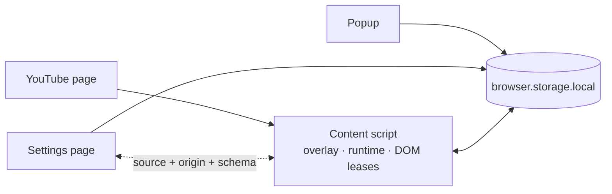

<div align="center">
  
</div>

<h1 align="center">YouTube Live Chat Fullscreen</h1>

<p align="center">
  Fullscreen keeps the video and drops the conversation.<br />
  This extension restores YouTube live chat as a draggable, resizable overlay without leaving fullscreen.
</p>

<p align="center">
  <strong>Used by 20,000+ Chrome viewers</strong><br />
  Chrome (also runs in Opera) + Firefox · 55 locales · No account · No tracking · Open source
</p>

<p align="center">
  <a href="https://chromewebstore.google.com/detail/youtube-live-chat-fullscr/dlnjcbkmomenmieechnmgglgcljhoepd">Install on Chrome</a>
  ·
  <a href="https://addons.mozilla.org/firefox/addon/youtube-live-chat-fullscreen/">Install on Firefox</a>
  ·
  <a href="docs/translations/README.ja.md">日本語</a>
  ·
  <a href="docs/translations/README.zh-TW.md">繁體中文</a>
</p>


## Use it

1. Install the extension.
2. Open a YouTube live stream or an archive with chat replay.
3. Enter fullscreen and use the chat toggle in the player controls.
4. Drag or resize the overlay, then adjust its appearance from the settings panel.

The overlay keeps YouTube's own chat experience whenever possible, including authentication, message posting, and Super Chat.

## Features

- Live streams and archived streams with playable chat replay
- Draggable and resizable fullscreen chat overlay
- Colors, font, size, blur, spacing, visibility, and chat-only controls
- Named appearance presets
- Light, dark, and system themes
- 55 generated locales, including RTL layouts
- JSON backup for enabled/theme, appearance, presets, and geometry

The selected UI language is intentionally not included in backups; it remains a browser-local preference.

## Privacy and permissions

The extension has no account, analytics, or tracking service. User settings stay in `browser.storage.local`.

- The only extension permission is `storage`.
- The content script is limited to YouTube pages.
- Web-accessible resources are limited to runtime locale files and the settings page, exposed only to YouTube.
- Additional fonts selected by the user may be fetched from Google Fonts; no viewing activity or chat content is sent to the developer.

See [SECURITY.md](SECURITY.md) for private vulnerability reporting.

## Architecture

The project uses one WXT codebase and three runtime entrypoints. There is no background service worker.


```mermaid
flowchart LR
  Y[YouTube page] --> C[Content script\noverlay · runtime · DOM leases]
  P[Popup] --> S[(browser.storage.local)]
  T[Settings page] --> S
  C <--> S
  T <-. source + origin + schema .-> C
```

| Area | Responsibility |
| --- | --- |
| Content script | YouTube SPA lifecycle, chat-source decisions, overlay UI, reversible DOM ownership |
| Popup | Enable/disable, theme, language, backup import/export |
| Settings page | Appearance and preset editor shown inside an extension iframe |
| Shared runtime | One Jotai store and one settings repository per extension context |

Settings are persisted by write ownership rather than as broad snapshots:

```text
enabled · theme · appearance(profile + presets) · geometry · locale
```

This prevents geometry changes in the content script from overwriting appearance changes in the settings page. Existing `global`, `chat`, Zustand, and legacy locale values remain read-compatible. Startup does not rewrite or delete global/chat compatibility data; an extension page may non-destructively copy a legacy locale into the current locale key so every context can converge.

The settings iframe uses `window.postMessage` only for close, diagnostics, and runtime restart. Both directions validate the expected window, exact origin, and payload schema.

The YouTube-facing runtime separates page observation, pure decisions, and reversible side effects. See [docs/engineering.md](docs/engineering.md) for the design, guarantees, and intentional non-goals.

## Development

### Requirements

- Node.js 24.x (`mise.toml`)
- Yarn 4.18.0, vendored under `.yarn/releases/`
- Playwright Chromium for browser verification

```bash
corepack enable
yarn install --immutable
yarn dev
```

### Verification

Normal development has one local quality gate:

```bash
yarn verify
```

It checks generated locales and store copy, Biome, TypeScript, unit/DOM coverage, and contracts.

Before publishing a version, run the explicit release gate:

```bash
yarn verify:release
```

It additionally builds Chrome and Firefox packages, verifies package contents, rebuilds Firefox from the submitted source archive, runs deterministic browser/visual/accessibility checks, boots the exact production Chrome package, and runs the explicit real-YouTube canary.

GitHub Actions workflows are manual-only fallbacks. Pull requests, pushes, and schedules do not automatically consume Actions minutes.

| Command | Purpose |
| --- | --- |
| `yarn dev` / `yarn dev:firefox` | Development build |
| `yarn build` / `yarn build:firefox` | Production unpacked build |
| `yarn verify` | Local source and test gate |
| `yarn test:package` | Build and inspect production ZIPs |
| `yarn e2e:fixture` | Deterministic YouTube scenarios |
| `yarn e2e:canary` | Real YouTube compatibility check |
| `yarn capture:store-assets` | Regenerate store screenshots |
| `yarn verify:release` | Full release-time verification |

## Documentation

- [Engineering overview](docs/engineering.md)
- [Settings, state, and storage](docs/architecture/settings-and-state.md)
- [Content runtime](docs/architecture/content-runtime.md)
- [Testing contracts](docs/testing/contracts.md)
- [Troubleshooting](docs/troubleshooting.md)
- [Contributing](CONTRIBUTING.md)

## License

Licensed under GPL-3.0. See [LICENSE](LICENSE).
