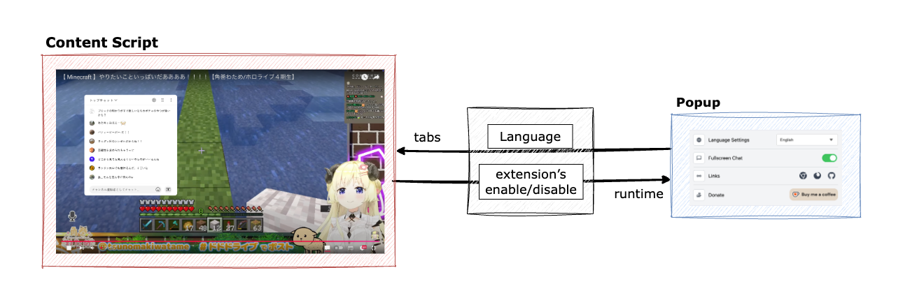

<div align="center">
  
</div>
<br>
<h1 align="center">YouTube Live Chat Fullscreen</h1>
<p align="center">
  <a href="README.md">English (US)</a> ·
  <a href="README.ja.md">日本語</a> ·
  <a href="README.zh-TW.md">繁體中文 (台灣)</a>
</p>
<p align="center">
  <a target="_blank" href="https://chromewebstore.google.com/detail/youtube-live-chat-fullscr/dlnjcbkmomenmieechnmgglgcljhoepd">
    
  </a>
  <a target="_blank" href="https://chromewebstore.google.com/detail/youtube-live-chat-fullscr/dlnjcbkmomenmieechnmgglgcljhoepd">
    
  </a>
  <a target="_blank" href="https://addons.mozilla.org/zh-TW/firefox/addon/youtube-live-chat-fullscreen/">
    
  </a>
  <a target="_blank" href="https://addons.mozilla.org/zh-TW/firefox/addon/youtube-live-chat-fullscreen/">
    
  </a>
  <a target="_blank" href="https://github.com/daichan132/Youtube-Live-Chat-Fullscreen">
    
  </a>
</p>

<p align="center">
  讓你在 YouTube 直播全螢幕時，仍可順暢閱讀與傳送聊天訊息。
</p>
<p align="center">
  <a target="_blank" href="https://chromewebstore.google.com/detail/youtube-live-chat-fullscr/dlnjcbkmomenmieechnmgglgcljhoepd"><strong>安裝到 Chrome</strong></a> ·
  <a target="_blank" href="https://addons.mozilla.org/zh-TW/firefox/addon/youtube-live-chat-fullscreen/"><strong>安裝到 Firefox</strong></a> ·
  <a target="_blank" href="https://github.com/daichan132/Youtube-Live-Chat-Fullscreen"><strong>GitHub Star</strong></a>
</p>

## 為什麼使用這個擴充功能
- 維持全螢幕觀看，不必在影片與聊天之間切換版面。
- 聊天視窗可拖曳、縮放、調整位置，降低遮擋重點畫面的機會。
- 可自訂背景色、字色、字型、字級、模糊與間距，提升可讀性。
- 支援樣式預設（Preset），可快速切換不同觀看情境。
- 適用於直播與具備聊天重播的存檔影片。

## 30 秒快速開始
1. 從 [Chrome 線上應用程式商店](https://chromewebstore.google.com/detail/youtube-live-chat-fullscr/dlnjcbkmomenmieechnmgglgcljhoepd) 或 [Firefox 附加元件](https://addons.mozilla.org/zh-TW/firefox/addon/youtube-live-chat-fullscreen/) 安裝。
2. 開啟 YouTube 直播，或有聊天重播的存檔影片。
3. 進入全螢幕後，使用右下角開關切換聊天顯示。
4. 依需求拖曳/縮放覆蓋視窗，並在設定中調整樣式。

## 模式行為（直播 / 存檔 / 無聊天）
| 影片狀態 | 擴充功能使用的聊天來源 | 開關 / 覆蓋視窗 |
| --- | --- | --- |
| 直播 | 公開 `live_chat?v=<videoId>` | 可用 |
| 可重播聊天的存檔 | 原生 `live_chat_replay` iframe | 需重播可播放時才可用 |
| 無聊天 / 重播不可用 | 無 | 隱藏 |

## 預覽


## 主要功能
- 全螢幕下傳送聊天（含 Super Chat 流程）。
- 覆蓋聊天視窗的拖曳、縮放、定位。
- 視覺自訂：背景色、字色、字型、字級、模糊、間距。
- 顯示切換：使用者名稱、頭像、Super Chat bar、僅聊天模式。
- 預設管理，快速切換樣式。
- 多語系支援。

## 下載
- [Chrome 線上應用程式商店](https://chromewebstore.google.com/detail/youtube-live-chat-fullscr/dlnjcbkmomenmieechnmgglgcljhoepd)
- [Firefox 附加元件](https://addons.mozilla.org/zh-TW/firefox/addon/youtube-live-chat-fullscreen/)

## 開發者安裝
### 環境需求
- **[Node.js](https://nodejs.org)**（v22.x）
- **[Yarn](https://yarnpkg.com)**（建議使用 Corepack）

### 安裝
```bash
git clone https://github.com/daichan132/Youtube-Live-Chat-Fullscreen.git
cd Youtube-Live-Chat-Fullscreen
corepack enable
yarn install
```

### 常用指令
- `yarn dev`: 啟動開發伺服器
- `yarn dev:firefox`: 啟動 Firefox 開發伺服器
- `yarn build`: 建置專案
- `yarn build:firefox`: 建置 Firefox 版本
- `yarn zip`: 建立 Zip 套件
- `yarn zip:firefox`: 建立 Firefox Zip 套件
- `yarn lint`: 執行 Biome + TypeScript 型別檢查
- `yarn test:unit`: 執行單元測試
- `yarn storybook`: 啟動 Storybook
- `yarn storybook:build`: 建置 Storybook 靜態輸出
- `yarn e2e`: 執行 E2E 測試

## 品質檢查
提交 Pull Request 前，建議執行：

```bash
yarn lint
yarn test:unit
yarn build
```

若涉及 Firefox 相容性，也請執行：

```bash
yarn build:firefox
```

## 專案概覽
此擴充功能由 content script 控制 YouTube 頁面的全螢幕聊天行為。popup 設定（語言、開關、主題）會與 content 狀態同步。



## 貢獻
歡迎提出想法、回報問題或送出 Pull Request。

- 建議先開 issue 說明需求或問題。
- 若修改全螢幕聊天來源邏輯，請先閱讀 `docs/architecture/live-archive-boundary.md`。

## 支持
若這個擴充功能對你有幫助，歡迎給專案一個 Star。

- [GitHub Star](https://github.com/daichan132/Youtube-Live-Chat-Fullscreen)
- [Ko-fi 贊助](https://ko-fi.com/D1D01A39U6)

[](https://ko-fi.com/D1D01A39U6)

## 授權
採用 GPL-3.0 授權，詳見 [LICENSE](LICENSE)。

## 多語 README
- English (US): `README.md`
- 日本語: `README.ja.md`
- 繁體中文 (台灣): `README.zh-TW.md`

歡迎補充其他語言，檔名請使用 `README.<locale>.md` 格式。
