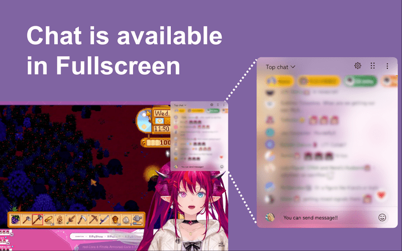
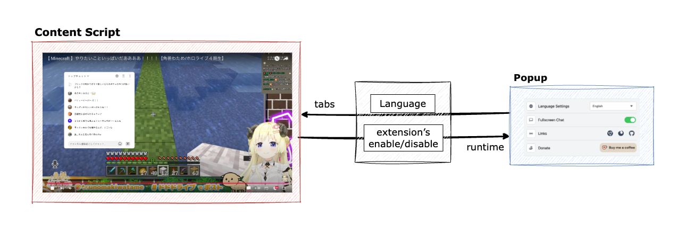

<div align="center">
  
</div>

<h1 align="center">YouTube Live Chat Fullscreen</h1>

<p align="center">
  將 YouTube 直播聊天疊加在全螢幕影片上 — 自由拖曳、縮放、自訂樣式。
</p>

<p align="center">
  <a href="../README.md">English</a> ·
  <a href="README.ja.md">日本語</a> ·
  <a href="README.zh-TW.md">繁體中文</a>
</p>

<p align="center">
  <a href="https://chromewebstore.google.com/detail/youtube-live-chat-fullscr/dlnjcbkmomenmieechnmgglgcljhoepd">
    
  </a>
  <a href="https://chromewebstore.google.com/detail/youtube-live-chat-fullscr/dlnjcbkmomenmieechnmgglgcljhoepd">
    
  </a>
  <a href="https://addons.mozilla.org/zh-TW/firefox/addon/youtube-live-chat-fullscreen/">
    
  </a>
  <a href="https://addons.mozilla.org/zh-TW/firefox/addon/youtube-live-chat-fullscreen/">
    
  </a>
</p>

<p align="center">
  <a href="https://chromewebstore.google.com/detail/youtube-live-chat-fullscr/dlnjcbkmomenmieechnmgglgcljhoepd">
    
  </a>
  <a href="https://addons.mozilla.org/zh-TW/firefox/addon/youtube-live-chat-fullscreen/">
    
  </a>
</p>

---

## 預覽



## 30 秒快速開始

1. 從 [Chrome 線上應用程式商店](https://chromewebstore.google.com/detail/youtube-live-chat-fullscr/dlnjcbkmomenmieechnmgglgcljhoepd) 或 [Firefox 附加元件](https://addons.mozilla.org/zh-TW/firefox/addon/youtube-live-chat-fullscreen/) 安裝。
2. 開啟 YouTube 直播，或有聊天重播的存檔影片。
3. 進入全螢幕後，使用右下角開關切換聊天顯示。
4. 依需求拖曳/縮放覆蓋視窗，並在設定中調整樣式。

## 功能

### 💬 全螢幕聊天

- 維持全螢幕觀看，同時閱讀與傳送聊天訊息
- 直接從覆蓋視窗發送 Super Chat
- 適用於直播與具備聊天重播的存檔影片

### 🎨 樣式自訂

- 背景色、字色、字型、字級、模糊、間距自由調整
- 切換使用者名稱、頭像、Super Chat bar、僅聊天模式
- 聊天覆蓋視窗可自由拖曳、縮放、調整位置

### 📋 預設

- 針對不同觀看情境儲存與切換樣式預設
- 一鍵切換設定

### 🌐 多語系

- 內建支援 50 種以上語言

## Tech Stack

| 分類 | 技術棧 | 在此專案中的角色 |
| --- | --- | --- |
| **Core** |   <a href="https://wxt.dev"></a> | React 19 建構覆蓋 UI、TypeScript 確保型別安全、[WXT](https://wxt.dev) 作為跨瀏覽器擴充框架 |
| **State & Style** | <a href="https://zustand.docs.pmnd.rs"></a>  | Zustand 輕量跨進入點狀態管理、UnoCSS 原子化樣式 |
| **Quality** |    | Vitest 單元測試、Playwright E2E 測試、Biome lint & format |

## 架構

<details>
<summary>點擊展開</summary>

### 系統概覽



此擴充功能由兩個進入點組成，透過瀏覽器的 `tabs` / `runtime` 訊息 API 通訊：

| 元件 | 角色 |
| --- | --- |
| **Content Script** | 注入至 YouTube 頁面。負責聊天覆蓋視窗的繪製、拖曳/縮放處理，以及聊天來源的解析（直播 vs. 存檔）。 |
| **Popup** | 擴充功能工具列 UI。控制語言、啟用/停用、主題，並即時同步狀態至 Content Script。 |
| **Shared** | 兩個進入點共用的模組 — Store（Zustand）、i18n 資源、UI 元件、主題、工具函式。 |

### 聊天來源解析

Content Script 自動偵測影片類型並選擇適當的聊天來源：

| 影片狀態 | 聊天來源 | 開關 / 覆蓋視窗 |
| --- | --- | --- |
| 直播 | 公開 `live_chat?v=<videoId>` | 可用 |
| 可重播聊天的存檔 | 原生 `live_chat_replay` iframe | 需重播可播放時才可用 |
| 無聊天 / 重播不可用 | 無 | 隱藏 |

### 專案結構

```
entrypoints/
├── content/          # Content Script（注入至 YouTube）
│   ├── chat/         # 聊天來源解析（live / archive）
│   ├── features/     # UI 功能（Draggable, Iframe, Settings, Switch）
│   └── hooks/        # Content 專用 React hooks
├── popup/            # Popup UI（擴充功能工具列）
│   ├── components/   # Popup 專用元件
│   └── utils/        # Popup 工具函式
shared/               # 跨進入點共用
├── stores/           # Zustand 狀態管理
├── i18n/             # 50 種以上語言資源
├── components/       # 共用 UI 元件
├── theme/            # 主題設定
└── hooks/            # 共用 React hooks
```

</details>

## 開發者安裝

### 環境需求

- **[Node.js](https://nodejs.org)** v22.x
- **[Yarn](https://yarnpkg.com)**（建議使用 Corepack）

### 安裝

```bash
git clone https://github.com/daichan132/Youtube-Live-Chat-Fullscreen.git
cd Youtube-Live-Chat-Fullscreen
corepack enable
yarn install
```

### 常用指令

| 指令 | 說明 |
| --- | --- |
| `yarn dev` | 啟動開發伺服器（Chrome） |
| `yarn build` | 正式建置（Chrome） |
| `yarn lint` | Biome 檢查 + TypeScript 型別檢查 |
| `yarn test:unit` | 執行單元測試 |
| `yarn e2e` | 執行 E2E 測試 |

> Firefox 版請在末尾加上 `:firefox` — 例如 `yarn dev:firefox`、`yarn build:firefox`

### 品質檢查

提交 Pull Request 前，建議執行：

```bash
yarn lint
yarn test:unit
yarn build
```

若涉及 Firefox 相容性，也請執行 `yarn build:firefox`。

## 貢獻

歡迎提出問題回報、功能建議或 Pull Request！

- 建立 [Issue](https://github.com/daichan132/Youtube-Live-Chat-Fullscreen/issues) 或送出 [Pull Request](https://github.com/daichan132/Youtube-Live-Chat-Fullscreen/pulls)。
- 翻譯貢獻也十分歡迎 — 請新增 `docs/README.<locale>.md` 檔案。

<a href="https://github.com/daichan132/Youtube-Live-Chat-Fullscreen/graphs/contributors">
  
</a>

## 支持

如果這個擴充功能對你有幫助，歡迎給個 Star！

<p>
  <a href="https://github.com/daichan132/Youtube-Live-Chat-Fullscreen/stargazers">
    
  </a>
  <a href="https://ko-fi.com/D1D01A39U6">
    
  </a>
</p>

## 授權

採用 GPL-3.0 授權，詳見 [LICENSE](../LICENSE)。
