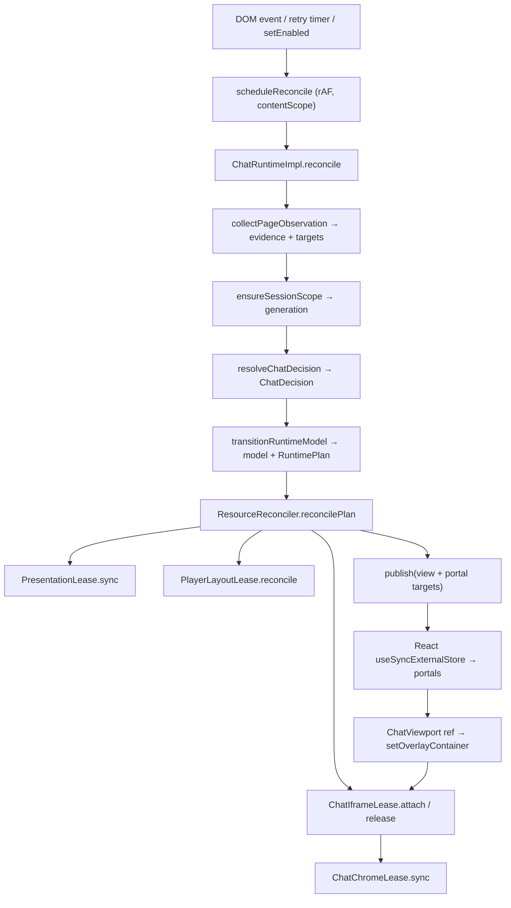

# The content runtime

*Part of the architecture set: [overview](../engineering.md) · [Settings, state, and storage](./settings-and-state.md) · [The overlay and iframe styling](./overlay-and-styling.md) · [Internationalization](./i18n.md) — see the [documentation index](../README.md).*

The content script is injected into every `www.youtube.com` page and does almost nothing until the URL is a watch surface. From there it runs one session at a time: a React tree in a shadow root plus one `ChatRuntimeImpl`, the only DOM and timer driver on that path. Every pass through it is the same shape — read the page, decide, produce a plan, hand the plan to leases that own reversible mutations, publish a snapshot to React. This document follows one such pass end to end and then lists the rules that keep it correct; the [engineering overview](../engineering.md) has the shorter version and the vocabulary shared with the other subsystems.

## What this owns

In scope: the lazy bootstrap and session lifecycle ([`bootstrap/`](../../entrypoints/content/bootstrap/)), the YouTube compatibility adapter ([`platform/youtube/`](../../entrypoints/content/platform/youtube/)), the pure decision and plan model ([`resolveChatDecision.ts`](../../entrypoints/content/runtime/resolveChatDecision.ts), [`runtimeModel.ts`](../../entrypoints/content/runtime/runtimeModel.ts)), the driver ([`ChatRuntime.ts`](../../entrypoints/content/runtime/ChatRuntime.ts)), the four leases ([`runtime/resources/`](../../entrypoints/content/runtime/resources/)), and the in-memory diagnostics ([`diagnostics/`](../../entrypoints/content/diagnostics/)).

Deliberately not in scope: overlay geometry, dragging, resizing, and auto placement, which run on their own layout-effect loop in [`useOverlayGeometry.ts`](../../entrypoints/content/overlay/useOverlayGeometry.ts) and never enter the reconcile pass; the CSS injected into the chat document, which has its own cascade contract in [`styles/README.md`](../../entrypoints/content/features/YTDLiveChatIframe/styles/README.md); and settings storage, which the runtime consumes only as a `ChatProfile` pushed in from React. There is no background context — the extension has three entrypoints (content, popup, settings) and the runtime is per-tab, per-session state with no extension messaging behind it; the only channel it answers is the settings iframe's `window.postMessage` protocol in [`settingsFrameMessages.ts`](../../entrypoints/content/settings/settingsFrameMessages.ts).

**Why the runtime borrows YouTube's own iframe.** Most of the complexity below exists to move a live `ytd-live-chat-frame iframe` into the overlay and put it back afterwards. A fresh iframe would be far simpler, and the runtime does create one — but only as a live fallback. Borrowing preserves what a new iframe cannot: the signed-in session YouTube established in that frame, message posting, Super Chat and Super Sticker flows, and memberships (see [`monetization.css`](../../entrypoints/content/features/YTDLiveChatIframe/styles/monetization.css) and [`installMembershipFallback`](../../entrypoints/content/features/YTDLiveChatIframe/utils/iframeInitializer.ts)). Archives have no equivalent standalone URL at all, so `live_chat_replay` can only ever be borrowed. Because the node belongs to YouTube, every mutation applied to it has to be captured and undone — that is what the restore machinery in [`iframeAttachment.ts`](../../entrypoints/content/features/YTDLiveChatIframe/utils/iframeAttachment.ts) is for.

## Vocabulary

| Term | What it means here |
| --- | --- |
| **generation** | A monotonic integer identifying one chat session inside a single watch page. `ChatRuntimeImpl.generation` starts at `0` and is pre-incremented for every new `SessionScope`, so the first chat generation is `1`. Every deferred callback captures its scope and compares it against the current one before acting. The long-lived `contentScope` is a separate scope built at generation `0` in `start()`. |
| **observation** | One `collectPageObservation()` result: `{ evidence, targets }`. |
| **evidence** | `PageEvidence` — JSON-serializable, no DOM nodes. Route, fullscreen, videoId, `videoMode`, `chatAvailability`, six capability booleans, `sourceKind`, `probeIds`. Diffable, fingerprintable, testable. |
| **targets** | `PageTargets` — the live element references (`player`, `rightControls`, `nativeChatHost`, `chatIframe`, …) that leases need. Never leaves the process, never enters a report. |
| **probe / probeId** | A `SelectorProbe` is a stable id plus an ordered list of fallback selectors. Query helpers report which fallback matched as `<probeId>.<1-based index>` — for example `chat.iframe.v2.2`. Those ids land in `evidence.probeIds`, so a diagnostic report can say which YouTube shape was seen without carrying any content. |
| **decision** | `resolveChatDecision(evidence, targets)` → `inactive` / `pending` / `available` / `unavailable`. `pending` carries `canToggle`: the chat is not usable yet, but the switch may still be shown. |
| **plan** | `RuntimePlan` is intent, not DOM commands: `monitoring`, `presentation`, `chat`, `layout`, `retry`, optional `openArchivePanel`. Every field has a `'preserve'` value meaning "do not touch this resource this tick". |
| **model / view** | `RuntimeModel` is `{ state, view, retryAttempts, retryPending, observing }`. `state` is the five-status machine; `view` is the render projection (`status`, `mode`, `showSwitch`, `showOverlay`, `loading`). `ChatRuntime` merges `view` with the portal targets into the published `RuntimeView`. |
| **lease** | An object owning exactly one reversible page mutation plus the knowledge of how to undo it. Four exist. Acquiring and releasing are both idempotent, and releasing restores rather than deletes anything that was YouTube's to begin with. |
| **reconcile** | The idempotent "make the world match the plan" pass. It exists at two levels — `ChatRuntimeImpl.reconcile()` (observe → decide → transition → apply) and `ResourceReconciler.reconcilePlan()` (plan → lease calls) — plus the `reconcile` methods on the iframe and layout leases; the presentation and chrome leases expose `sync` instead. |

## The path through the code

1. **Injection.** [`index.tsx`](../../entrypoints/content/index.tsx) matches `*://www.youtube.com/*` ([`packagePolicy.ts`](../../config/packagePolicy.ts)), constructs `new ContentBootstrap(() => createContentSession(ctx))`, registers `ctx.onInvalidated(bootstrap.dispose)`, and calls `start()`. Fifteen lines, no application state.

2. **Route gate.** [`ContentBootstrap.start()`](../../entrypoints/content/bootstrap/ContentBootstrap.ts) listens for `yt-navigate-finish` on `document` and `popstate` on `window`, then runs `reconcileLocation()`. That disposes any session when `isYouTubeWatchSurface` is false (`new URL(href).pathname !== '/watch'`), and otherwise returns early if a session or an in-flight activation already exists.

3. **Session creation.** `reconcileLocation` captures `const token = ++this.activationToken` before awaiting [`createContentSession`](../../entrypoints/content/bootstrap/createContentSession.tsx), which builds the app runtime (jotai store, settings repository, locale), a `new ChatRuntimeImpl()`, and a WXT shadow-root UI anchored at `body` rendering `AppProvider > ChatRuntimeProvider > Content`. When the promise resolves, `!this.started || token !== this.activationToken` disposes the fresh session instead of installing it.

4. **Runtime start.** [`Content.tsx`](../../entrypoints/content/Content.tsx) calls `chatRuntime.start()` in a mount effect, and separate effects push `enabled` and `effectiveProfile` in. `start()` creates `contentScope = createSessionScope(0)`, listens for `fullscreenchange` and `yt-navigate-finish`, registers a **capturing** `load` listener on `document` (iframe load events do not bubble; it filters to `#chatframe` and `ytd-live-chat-frame iframe.ytd-live-chat-frame`), and schedules the first reconcile.

5. **Scheduling.** `scheduleReconcile(expectedGeneration?)` coalesces every trigger into one animation frame on the `contentScope`; a second call while a frame is pending is dropped. The optional generation makes the callback a no-op if the session moved on in the meantime.

6. **Observe.** `reconcile()` calls `collectPageObservation(this.resources.lease?.iframe ?? null)`. [The adapter](../../entrypoints/content/platform/youtube/collectPageObservation.ts) queries probes for the watch surface, `#movie_player`, `.ytp-right-controls`, chat hosts, and chat iframes; stamps unlabeled chat iframes with `data-ylc-observed-video-id`; picks `chatIframe` as the native iframe matching the current videoId, falling back to the leased iframe when it still matches and is connected; reads the chat document for `chatUnavailable` / `chatDocumentReady`; classifies `sourceKind` as `native-replay` / `managed-live` / `native-live`; and fills the capability booleans, including `canMountOverlay = player !== null && document.fullscreenElement !== null`.

7. **Session identity.** `ensureSessionScope(observation)` builds `{ videoId, player, fullscreenRoot }`. If a previous identity existed and any of the three changed, it first applies `stopRuntimeModel` against the *freshly read* observation and disposes the old `SessionScope`, then creates `createSessionScope(++this.generation)`. Only afterwards is the observation restamped through `withObservationGeneration` — the read can itself cause the bump.

8. **Decide.** [`resolveChatDecision`](../../entrypoints/content/runtime/resolveChatDecision.ts) walks a fixed preference order: route `'other'` → `inactive/not-watch-page`; not fullscreen → `inactive/not-fullscreen`; no videoId → `pending`; `chatAvailability === 'unavailable'` → `unavailable`; `native-replay` → `archive_borrow` only once the iframe exists and the document is ready, otherwise `pending` with `canToggle`; `native-live` → `live_borrow`; `managed-live` → `live_direct`; a live `videoMode` with `canCreateManagedLiveChat` → `live_direct` at `https://www.youtube.com/live_chat?v=<id>`; `canOpenArchiveChat` → `pending` archive with `canToggle`; unknown `videoMode` → `pending`; otherwise `unavailable`.

9. **Transition (pure).** [`transitionRuntimeModel`](../../entrypoints/content/runtime/runtimeModel.ts) takes `{ enabled, decision, lease }` and returns `{ model, plan }`. `available` + enabled yields `{ monitoring: 'active', presentation: 'overlay-and-switch', layout: 'floating', chat: { kind: 'acquire', decision } }`. If a lease exists for a different videoId it first emits `chat: { kind: 'none' }` and drops the lease from consideration, so release always precedes the next acquire. `pending` picks `recovering` when a matching lease is still held and `searching` otherwise, keeps the overlay when `canToggle || lease`, sets `openArchivePanel` for a togglable archive, and schedules a retry. `!enabled` releases the lease but keeps the switch (`presentation: 'switch-only'`). `inactive` releases everything, with `ensureNativeVisible: true` only when leaving fullscreen from an `active` or `recovering` archive session.

10. **Apply.** `applyModelTransition` stores the model, traces the plan if its signature changed, then runs `applyRuntimeOperations` — connect or disconnect the `MutationObserver`, cancel or schedule the retry timer, and `ensureArchivePanelOpen()` behind a 2000 ms cooldown — and calls `this.resources.reconcilePlan(plan, observation, scope, onLoad)`.

11. **Reconcile resources, in a fixed order.** [`ResourceReconciler.reconcilePlan`](../../entrypoints/content/runtime/ResourceReconciler.ts) does: retry pending restorations (`reconcileRestoring`); release on `chat.kind === 'none'`; release first when an `acquire` decision fails `sourceMatches` (same videoId **and** same ownership, **and** — for a borrowed source — the same iframe node); `abandonRestoring()` when monitoring goes inactive; deactivate or fully release the layout lease on `layout: 'none'`; `presentation.clear()` on `presentation: 'none'`; `presentation.sync(...)` for the presentation flags, which returns `{ overlayRoot, switchContainer }`; `ensureLayoutLease(scope).reconcile(true)` on `layout: 'floating'`; and only then, for `acquire`, `createIframe` if there is no lease followed by `initializeIframe`.

12. **Attach.** `initializeIframe` returns `false` immediately when there is no lease or no overlay container. Otherwise `lease.attach(container)` sets `data-ylc-chat`, captures restore state (original parent, next sibling, a `ylc-borrowed-iframe-anchor` comment placeholder, inline styles, source videoId), moves the node into the carrier, and applies the overlay iframe styles. The reconciler then registers a scope-owned `load` listener, requires a real document (`documentElement`, `head`, `body`, not `about:blank`), injects the extension stylesheet, adds the chat body class, installs the membership fallback, applies the profile, and syncs the chat chrome.

13. **Settle.** If `reconcilePlan` returned an `initialization` result, `applyModelTransition` records `IFRAME_DOCUMENT_NOT_READY` on failure and **recurses** into itself with `settleRuntimeLeaseInitialization(...)`, then returns. Success gives state `active` and `{ showSwitch: true, showOverlay: true, loading: false }` with the retry reset; failure with a lease present gives `recovering` (`loading: true`) and a scheduled retry.

14. **Publish.** `publish({ ...model.view, ...result.targets })` compares the next `RuntimeView` field by field and only notifies subscribers when something actually differs. [`ChatRuntimeContext.tsx`](../../entrypoints/content/runtime/ChatRuntimeContext.tsx) exposes it through `useSyncExternalStore`.

15. **Closing the loop.** The first `available` reconcile usually cannot attach: `overlayContainer` is still `null`, so step 12 fails, the runtime settles into `recovering` with `showOverlay: true` and a 250 ms retry pending. React then renders `Content` → the portal into `runtimeView.overlayRoot` → [`YTDLiveChat`](../../entrypoints/content/YTDLiveChat.tsx) → `OverlayFrame` → [`ChatViewport`](../../entrypoints/content/overlay/ChatViewport.tsx), whose carrier `div` carries `ref={chatRuntime.setOverlayContainer}`. `setOverlayContainer` stores the container and, when a lease and a session scope already exist, calls `initializeLease()` right there — out of band, not on the next frame. The iframe attaches, its `load` resets the retry, and the following reconcile settles to `active`.

### The five statuses and the retry policy

`RuntimeState` has exactly five statuses: `inactive` (with `reason: 'disabled' | 'not-watch-page' | 'not-fullscreen'`), `searching` (videoId may be null), `active` (videoId, mode, `sourceKind`), `recovering` (same shape as `active`, a lease is held but not usable), and `unavailable` (videoId). `view.loading` is true exactly for `searching` and `recovering`.

Retry is a backoff, never an interval. `RETRY_DELAYS_MS = [250, 500, 1000, 2000, 5000]` is indexed by `Math.min(retryAttempts, 4)`, so attempts five onward all wait 5000 ms, and `MAX_RETRY_ATTEMPTS = 12` caps the sequence at roughly 43.75 s of wall time. Reaching the cap does not just stop retrying: `scheduleRetry` forces `presentation: 'none'` and `layout: 'none'`, releases any lease, and moves a `searching` or `recovering` state with a videoId to `unavailable`. `yt-navigate-finish` and a successful iframe `load` both reset the attempt counter through `resetRuntimeRetry`.

### The nine failure codes

[`failureCodes.ts`](../../entrypoints/content/diagnostics/failureCodes.ts) defines the diagnostic vocabulary. `ChatRuntimeImpl` keeps one `lastFailure` at a time; it is cleared whenever the state reaches `active`.

| Code | Set when |
| --- | --- |
| `PLAYER_TARGET_MISSING` | Fullscreen, but `capabilities.canMountOverlay` is false — no `#movie_player` to host the overlay. The first of `updateFailure`'s evidence branches, after the `active` clear and the `RETRY_EXHAUSTED` check. |
| `CONTROL_TARGET_MISSING` | Fullscreen and the player exists, but `canMountPlayerSwitch` is false — no `.ytp-right-controls` for the switch. |
| `CHAT_SOURCE_PENDING` | The decision came back `pending`, or evidence says `chatAvailability === 'pending'`. The common transient state. |
| `CHAT_SOURCE_UNAVAILABLE` | The decision came back `unavailable`, or `chatAvailability === 'unavailable'` — this video has no chat. |
| `IFRAME_DOCUMENT_NOT_READY` | `initializeIframe` returned false. Covers a missing overlay container, a document still on `about:blank`, and a missing chat profile alike. |
| `RETRY_EXHAUSTED` | The state became `unavailable` coming from `searching` or `recovering`, i.e. the backoff hit `MAX_RETRY_ATTEMPTS`. |
| `BORROWED_IFRAME_DETACHED` | Reserved. Names a borrowed iframe that left the document while leased. **Never assigned in the current code.** |
| `RESTORE_TARGET_MISSING` | Reserved. Names a release with no placeholder, original parent, or matching host to restore into — the condition that puts a lease into `restoring`. **Never assigned.** |
| `PRESENTATION_TARGET_REPLACED` | Reserved. Names YouTube replacing the shadow host's or switch container's parent. **Never assigned.** |

Adding a code to the array is not enough for it to appear in a report: it has to be assigned in `updateFailure` or on a specific code path in [`ChatRuntime.ts`](../../entrypoints/content/runtime/ChatRuntime.ts).

### The three teardown paths

- **Leaving fullscreen, or the user turning chat off.** No session is destroyed. Evidence changes, the decision becomes `inactive/not-fullscreen` (or `enabled` is false), and the plan releases the iframe first, then the layout lease, then the presentation lease. `ensureNativeVisible` is true only for an archive session that was `active` or `recovering`, and makes `iframeAttachment` re-open YouTube's own panel.
- **SPA navigation or player replacement.** `ensureSessionScope` sees a changed identity, applies `stopRuntimeModel` against the freshly read observation, and disposes the old `SessionScope` — aborting its signal, clearing its timers and frames, removing its listeners, and disconnecting the `MutationObserver`. A scope at generation + 1 is created in the same tick and the reconcile continues, rebuilding the overlay for the new video.
- **Leaving `/watch`, extension invalidation, or React unmount.** `reconcileLocation` bumps the activation token and calls `session.dispose()` → `ui.remove()`. WXT's `onRemove` unmounts the React root, removes the wrapper, and calls `chatRuntime.stop()` and `runtime.dispose()`. `stop()` cancels the pending frame, applies `stopRuntimeModel`, then disposes the session scope and the content scope. `ctx.onInvalidated(bootstrap.dispose)` covers extension reload and uninstall; `Content`'s effect cleanup calls `stop()` as well.

### The borrowed-iframe restore path

`release()` on a borrowed lease restores the inline styles and the captured in-document styles, uninstalls the injected stylesheet and classes, and then tries three targets in order: the comment placeholder's parent, the original parent (with the original next sibling), and finally any `ytd-live-chat-frame` that `isChatHostForCurrentVideo` accepts. If none exist — YouTube replaced the whole subtree — the iframe is removed from the document and the attachment enters state `'restoring'`; `releaseIframe` then moves the lease into `ResourceReconciler.restoringLeases`. Every later reconcile that has an observation calls `reconcileRestoring(targets)`, which retries and drops the lease once its state reaches `'released'`. If the video changed in the meantime, `restoreToAvailableTarget` discards the iframe rather than grafting it onto the wrong page, and `abandonRestoring()` discards every pending one when monitoring goes inactive.

## Invariants

- **At most one `ContentSession`, and only on a `/watch` pathname.** Enforced in `reconcileLocation`, which disposes on any other path and returns early when a session or activation exists. [`check-runtime-architecture.mjs`](../../scripts/verify/check-runtime-architecture.mjs) fails `yarn check` with *"the top-level content script must defer runtime initialization until a watch surface is active"* if `index.tsx` calls `createAppRuntime()` or `ContentBootstrap.ts` stops mentioning `isYouTubeWatchSurface`. Pinned by [`ContentBootstrap.spec.ts`](../../entrypoints/content/bootstrap/ContentBootstrap.spec.ts).
- **A session that finishes constructing after the route changed must not be installed.** The activation token is captured before the await and re-checked after it; `dispose()` bumps it too. Pinned by "shares an in-flight activation and disposes a stale session after navigation".
- **Every timer, frame, and listener inside a generation belongs to that generation's `SessionScope`.** Structural in [`SessionScope.ts`](../../entrypoints/content/bootstrap/SessionScope.ts) (`dispose()` aborts the controller and clears tracked timers and frames, guarded so it runs once). The guard script rejects any `window.setTimeout` / `setInterval` / `requestAnimationFrame` call inside `ChatRuntime.ts` with *"ChatRuntime async work must be issued through SessionScope"*. [`ChatRuntime.spec.ts`](../../entrypoints/content/runtime/ChatRuntime.spec.ts) asserts `vi.getTimerCount()` is 0 after fullscreen exit and after `stop()`.
- **A callback from an older generation must never mutate the current session.** `scheduleReconcile` compares `expectedGeneration` against `this.sessionScope?.generation`; the retry timer, `initializeLease`'s `onLoad`, and `reconcilePlan`'s `onLoad` all check `scope !== this.sessionScope || scope.signal.aborted`. Pinned by "cancels retry callbacks owned by the previous video generation".
- **The model stays pure.** `runtimeModel.ts` imports nothing from the DOM. The guard script fails with *"the pure runtime model must emit semantic RuntimePlan values, not low-level DOM actions"* if the file stops mentioning `RuntimePlan` or starts containing `ensure-observer`, `sync-portals`, `clear-layout`, or `clear-runtime`.
- **Evidence is serializable; live nodes live only in targets.** The split is the type contract in [`platform/youtube/types.ts`](../../entrypoints/content/platform/youtube/types.ts), pinned by round-tripping evidence through JSON in [`collectPageObservation.spec.ts`](../../entrypoints/content/platform/youtube/collectPageObservation.spec.ts).
- **At most one chat iframe lease, and the old one is released before a new one is created.** `transitionRuntimeModel` emits `chat: { kind: 'none' }` on a videoId mismatch; `reconcilePlan` releases on a `sourceMatches` failure before the acquire branch. [`ResourceReconciler.spec.ts`](../../entrypoints/content/runtime/ResourceReconciler.spec.ts) asserts the first three acquire steps are exactly `['presentation-acquire', 'layout-acquire', 'iframe-acquire']`.
- **Restoration happens before layout and presentation are torn down.** The release order in `reconcilePlan` is iframe, then layout, then presentation; the same comment sits on `clear()`. Pinned by an exact-equality assertion on `['iframe-release', 'layout-release', 'presentation-release']`.
- **Every release is idempotent.** `iframeAttachment` early-returns from `attach` and `release` in `'released'` and `'restoring'`, and only acts in `'restoring'` for `reconcile` and `abandonRestore`; `PlayerLayoutLease.reconcile` no-ops when `applied === active`; `PresentationLease.sync` reuses a still-correct node; `ChatChromeLease` collapse and expand early-return on the current class state. [`iframeLease.spec.ts`](../../entrypoints/content/runtime/iframeLease.spec.ts) calls `release()` and `reconcile()` twice on purpose.
- **A borrowed iframe returns to its exact original slot.** Placeholder, then original parent plus sibling, then a matching host. [`borrowRestore.fixture.spec.ts`](../../e2e/scenarios/archive/borrowRestore.fixture.spec.ts) asserts the native slot's children come back as exactly `['fixture-before', 'chatframe', 'fixture-after', 'show-hide-button']`.
- **Pending restorations are owned by the reconciler instance, never by module state.** The guard script requires `restoringLeases` to appear in `ResourceReconciler.ts` and rejects module-global restore maps in `iframeAttachment.ts` (*"iframe restore state must be owned by ChatIframeLease, not module-global collections"*).
- **No runtime state at module scope.** The guard script rejects `export const chatRuntime =` in `ChatRuntime.ts`, requires `createContentSession.tsx` to contain both `new ChatRuntimeImpl()` and `<ChatRuntimeProvider`, and rejects module-level `let applied` / `let resizeTimeouts` in `PlayerLayoutLease.ts` (*"player layout state and timers must be owned by PlayerLayoutLease instances"*).
- **The four lease contracts must keep their names.** The guard script fails with *"runtime DOM resources must expose the four scoped lease contracts"* if `ChatIframeLease`, `PresentationLease`, `PlayerLayoutLease`, or `ChatChromeLease` disappears from its file.
- **All YouTube selectors live in the catalog.** The guard script requires both [`utils/nativeChat.ts`](../../entrypoints/content/utils/nativeChat.ts) and [`e2e/utils/selectors.ts`](../../e2e/utils/selectors.ts) to import from `platform/youtube/selectorCatalog`. [`selectorCatalog.spec.ts`](../../entrypoints/content/platform/youtube/selectorCatalog.spec.ts) additionally asserts probe ids are unique and no selector is blank.
- **Diagnostics never carry video identity, URLs, or chat content.** The guard script slices the exported `SanitizedDiagnosticReport` type and fails if it contains a `videoId` or `url` field, and requires `ChatRuntime.ts` to use `RuntimeTrace` and `createSanitizedDiagnosticReport`. The trace is capped at 128 events.
- **`readPageSnapshot.ts` and `useChatRuntime.ts` must not come back.** The guard script fails if either path becomes readable again; their responsibilities moved into the scoped runtime and the compatibility adapter.

## Where to change things

| If you want to … | Edit … | Also update … |
| --- | --- | --- |
| Track a YouTube selector change | the probe's `selectors` array in [`selectorCatalog.ts`](../../entrypoints/content/platform/youtube/selectorCatalog.ts) | `runtimeBoundarySelector` in the same file if the element must wake the observer — probes and the boundary selector are maintained separately |
| Make the runtime react to a new attribute | `attributeFilter` in `ChatRuntimeImpl.ensureObserver` | `runtimeBoundarySelector`; `mutationTouchesChatBoundary` discards anything that does not match it |
| Add or change a chat source | [`resolveChatDecision.ts`](../../entrypoints/content/runtime/resolveChatDecision.ts) and `ChatSource` in [`runtime/types.ts`](../../entrypoints/content/runtime/types.ts) | `createIframeLease` in [`ChatIframeLease.ts`](../../entrypoints/content/runtime/resources/ChatIframeLease.ts) and `ResourceReconciler.sourceMatches`, or the wrong lease will be reused |
| Change what the overlay or switch shows in a state | `createView` / `presentationFor` in [`runtimeModel.ts`](../../entrypoints/content/runtime/runtimeModel.ts) | [`runtimeModel.unit.spec.ts`](../../entrypoints/content/runtime/runtimeModel.unit.spec.ts); `Content.tsx` gates both portals on `showOverlay` / `showSwitch` |
| Add a new page mutation | a new lease under [`runtime/resources/`](../../entrypoints/content/runtime/resources/) plus a `RuntimePlan` field | its release order in `reconcilePlan`, and `stopRuntimeModel` — teardown is expressed as a plan, not as a `clear()` call |
| Change retry timing | `RETRY_DELAYS_MS` / `MAX_RETRY_ATTEMPTS` | `runtimeModel.unit.spec.ts` and the backoff test in `ChatRuntime.spec.ts`, which also spies on `window.setInterval` and asserts it is never called |
| Add a failure code | [`failureCodes.ts`](../../entrypoints/content/diagnostics/failureCodes.ts) | the assignment site in `ChatRuntimeImpl.updateFailure` or `applyModelTransition`; three codes already exist with no assignment site |
| Add a field to the diagnostic report | [`sanitizeDiagnosticReport.ts`](../../entrypoints/content/diagnostics/sanitizeDiagnosticReport.ts) | nothing named `videoId` or `url` survives the guard script's type slice |
| Support `/live/<id>` URLs | `isYouTubeWatchSurface` in [`ContentBootstrap.ts`](../../entrypoints/content/bootstrap/ContentBootstrap.ts) | `ContentBootstrap.spec.ts`, which pins the current gate; the adapter and decision already handle route `'live'` |
| Add a spec for this subsystem | a file next to the code | [`vitest.config.ts`](../../vitest.config.ts) — `*.unit.spec.ts` runs in the `core` project with **no DOM**; everything else under `entrypoints/` lands in `dom`, apart from the pinned `legacyCoreSpecs` list that keeps a handful of older specs (`resolveChatDecision.spec.ts` among them) in `core`. [Test contracts](../testing/contracts.md) maps layers to boundaries |

## Gotchas

- The overlay and the chat iframe are mutually dependent, and the first `available` reconcile is expected to fail. Reading only `ChatRuntime.ts` leads to the conclusion that the iframe can never attach — the actual attachment is triggered by `ChatViewport`'s ref calling `setOverlayContainer`.
- `initializeIframe` also returns false when no `ChatProfile` has been set, because its return value is the `applyProfile(lease.iframe)` result it captures just before syncing the chat chrome, and `applyProfile` returns false when `this.profile` is null. A "chat never becomes active" bug can therefore be settings plumbing rather than DOM, and it is reported as `IFRAME_DOCUMENT_NOT_READY` either way.
- `collectPageObservation` is not read-only: it writes `data-ylc-observed-video-id` (and `data-ylc-observed-chat-mode`) onto chat iframes and hosts so a src-less iframe can be matched later. This does not loop only because those attribute names are absent from the observer's `attributeFilter`. Adding them there would spin the reconcile loop.
- There are two scopes with different lifetimes. `contentScope` (generation 0) owns the page-level listeners and the animation frame and survives generation bumps; `sessionScope` (generation N) owns the `MutationObserver`, the retry timer, and the iframe `load` listener and dies on every identity change. `scheduleReconcile` uses the former; `scheduleRetry` and `ensureObserver` use the latter.
- `ensureSessionScope` treats the first observation specially — `changed` requires `sessionIdentity !== null` — so the initial reconcile creates a scope without emitting a stop transition. Its `fullscreenRoot` also falls back to the player when evidence says fullscreen, which means entering or leaving fullscreen normally bumps the generation.
- `applyModelTransition` recurses into itself when a lease initialization result comes back and then returns, so `updateFailure`, `recordStatusTransition`, and `publish` run only on the inner call. Code added after that block is silently skipped on every acquire tick.
- `'preserve'` means "do not touch", not "nothing here". `stopRuntimeModel` emits `chat: { kind: 'preserve' }` when there is no lease. Every plan field reads three ways — preserve, off, on — and misreading `preserve` as a harmless default is the easiest way to write a wrong transition.
- `presentation: 'switch-only'` still creates the overlay shadow host. `getPresentationFlags` maps it to `overlayEnabled: true, switchEnabled: true`, identical to `overlay-and-switch`; only `view.showOverlay: false` keeps React from portalling into it. `ChatRuntime.spec.ts` pins this in "releases the lease but keeps the switch available when the user turns chat off".
- `getRoute` returns `'live'` for `/live/<id>` and paths ending in `/live`, and `resolveChatDecision` accepts any route that is not `'other'` — but `ContentBootstrap` only ever creates a session for `pathname === '/watch'`. The `'live'` branch is unreachable in production until the gate is widened.
- The archive panel opening has a 2000 ms cooldown driven by wall-clock `Date.now()`, not a `SessionScope` timer. It is not reset by a generation bump and is not controlled by fake timers in tests.
- `PlayerLayoutLease` dispatches synthetic `window` resize events at 0, 150, and 500 ms on **both** activation and deactivation, to force YouTube to recompute its fullscreen split. Anything listening to window resize inside the overlay sees three bursts per toggle; [`fullscreenChatLayout.spec.ts`](../../entrypoints/content/runtime/fullscreenChatLayout.spec.ts) pins the count at 3.
- The layout fix parks native chat off-screen at a fixed 400x600 (`top: -200vh`, `visibility: hidden`, `z-index: -9999`) instead of collapsing it, and the spec explicitly asserts the CSS does **not** contain `width: 0`. YouTube stops rendering messages into a zero-area chat, which would break the borrowed document.
- `ChatChromeLease` uses raw `window.setTimeout` and its own `MutationObserver` rather than a `SessionScope`. The CI timer rule only greps `ChatRuntime.ts`, so correctness here depends on `chatChrome.sync(null, 'inactive')` being reached from `releaseIframe`.
- `ChatRuntimeImpl.stop()` never calls `ResourceReconciler.clear()` — cleanup is expressed as a plan and executed by `reconcilePlan`. `clear()` is reachable only from its own spec today, which also means `chatChrome.release()` never runs in production.
- `PresentationLease` reuses a stale `#shadow-root-live-chat` or switch container when it is still connected under the expected parent, and removes it when it is parented elsewhere. This is what stops a re-injected content script from stacking duplicate shadow hosts; do not collapse it into an unconditional `createElement`.
- The `load` listener in `handleResourceLoad` hard-codes `#chatframe` and `ytd-live-chat-frame iframe.ytd-live-chat-frame` instead of reading `nativeChatIframeProbe`. The selector-catalog guard only checks `utils/nativeChat.ts` and `e2e/utils/selectors.ts`, so this duplicate will not fail CI if the probe changes.
- `collectPlayerObstacles` is not part of the reconcile loop at all. It runs from `useOverlayGeometry`'s layout effect and feeds auto placement, which is skipped entirely while geometry is pinned, during drag and resize, and after the first automatic reposition of an unpinned session.
