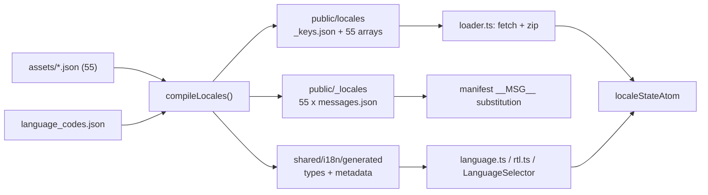

# Internationalization

*Part of the architecture set: [overview](../engineering.md) · [The content runtime](./content-runtime.md) · [Settings, state, and storage](./settings-and-state.md) · [The overlay and iframe styling](./overlay-and-styling.md) — see the [documentation index](../README.md).*

The extension ships 55 locale bundles, and almost none of what ships is written by hand. Two hand-authored inputs — one nested JSON file per locale in [`shared/i18n/assets/`](../../shared/i18n/assets/) and the endonym table [`language_codes.json`](../../shared/i18n/language_codes.json) — are compiled by [`scripts/generate-locales.mjs`](../../scripts/generate-locales.mjs) into three trees that are also committed to git: the runtime bundles under `public/locales/`, the browser manifest messages under `public/_locales/`, and the TypeScript types and metadata under `shared/i18n/generated/`. `yarn locales:check` recompiles and byte-compares, so any drift or hand-edit fails CI. At runtime a stored choice or the browser's own languages are mapped onto one of the 55 bundles, the bundle is fetched and zipped back into an object, and direction is derived from a three-entry list baked into the compiler.

## What this owns

In scope: the locale asset format and its key-set rules; the compiler and its three output trees; how a BCP 47 tag resolves to a shipped bundle; how messages are fetched, validated, cached, and exposed to React; how text direction is decided and where it is applied; and the guard scripts that keep source and generated output in step.

Out of scope, deliberately:

- **Translation quality.** Nothing mechanical proves a string reads naturally. [`check-store-listing.mjs`](../../scripts/verify/check-store-listing.mjs) says so in its own header comment: a passing run is evidence that nothing vanished, never that a translation is correct.
- **Interpolation and pluralization.** There is no engine. The single placeholder key, `content.aria.fontsFound`, ships the literal `{count}` and its one consumer patches it by hand.
- **Settings persistence in general.** The locale is one of three stored envelopes; the envelope format, the `writerId` echo guard, and legacy migration belong to the settings repository in [`shared/settings/repository.ts`](../../shared/settings/repository.ts). This document covers only the locale-specific parts of that path.
- **The store listing manuscripts** in `docs/store-listing/`. They are gated by the same script that gates `extensionName` and `extensionDescription`, so they appear in the procedures below, but their prose is not this subsystem's concern.

## Vocabulary

| Term | Meaning |
| --- | --- |
| Locale asset | `shared/i18n/assets/<code>.json`. Hand-authored, nested, 76 leaf strings. `en.json` is the shape authority. |
| Locale code | A bundle name matching `localeCodePattern = /^[a-z]{2,3}(?:_(?:[A-Z]{2}|\d{3}))?$/u`. Underscores, no script subtag — `zh_TW`, never `zh_Hant`. |
| Translation key | A flattened dotted path such as `popup.theme`. There are 74 of them: the 76 leaves minus the two manifest-only keys. |
| Manifest-only key | `extensionName` and `extensionDescription`, listed in `manifestOnlyKeys`. They reach the browser manifest but never the runtime bundles. |
| Runtime bundle | `public/locales/<code>.json` — a **positional array** of 74 strings with no keys in it. |
| `_keys.json` | `public/locales/_keys.json`, the sorted key list that gives those positions meaning. |
| Manifest messages | `public/_locales/<code>/messages.json`, seven Chrome message entries built from `manifestMessageSources`. |
| Endonym table | `shared/i18n/language_codes.json`, code to native language name. Feeds `localeDisplayNames` and the popup dropdown. |
| `rtlBaseLocales` | `['ar', 'fa', 'he']`, declared in the compiler and copied verbatim into generated metadata. |
| `LocaleState` | `{ code, direction, messages }` — the shape held by `localeStateAtom`. |

## The path through the code

### Build time: `compileLocales()`

[`scripts/locales/compiler.mjs`](../../scripts/locales/compiler.mjs) does the whole compilation in one function, and every validation lives inside it.

1. `readdir` the assets directory, keep `.json`, sort, strip the extension: that list *is* `localeCodes`. There is no registry of supported languages — the filesystem is the registry.
2. Every code is tested against `localeCodePattern`; the first failure throws `Invalid locale code: <code>`.
3. `en` must be present, or `English locale source is required`.
4. `language_codes.json` is parsed and its keys sorted. If that list is not identical to `localeCodes`, it throws `Language display names must match locale assets`. The file itself is not sorted on disk (`ar` sits before `am`), because the compiler sorts before comparing.
5. `flattenMessages` walks each asset into dotted paths. Any leaf that is not a non-empty trimmed string — `null`, a number, an array, `""` — throws `Invalid locale value at <path>`.
6. Every locale's sorted key list is compared to `en`'s. A mismatch throws `Locale keys differ: <locale>`.
7. `translationKeys = sourceKeys.filter(key => !manifestOnlyKeys.has(key))` — 76 minus 2 gives 74.

It then builds three maps: `runtimeFiles` (`_keys.json` as compact JSON, plus `translationKeys.map(key => messages[key])` per locale), `manifestFiles` (the seven `manifestMessageSources` entries wrapped as `{ message }`, pretty-printed with two spaces), and `generatedFiles` (`translationTypes.ts` with the `LocaleCode` and `TranslationKey` unions, `localeMetadata.ts` with `localeCodes`, `localeDisplayNames`, and `rtlBaseLocales`).

[`scripts/generate-locales.mjs`](../../scripts/generate-locales.mjs) then writes or verifies. `writeFiles` calls `rm(directory, { recursive: true, force: true })` on `public/locales/`, `public/_locales/`, and `shared/i18n/generated/` before writing — all three are destroyed and rebuilt on every run. With `--check`, `verifyFiles` reads the actual tree and compares the union of actual and expected paths, throwing `Runtime locale output is stale: <path>`, `Manifest locale output is stale: <path>`, or `Generated locale metadata is stale: <path>`. Either direction fails: a missing file, a differing file, or an unexpected extra file. Both modes end by printing `Generated 55 locale assets` or `Checked 55 locale assets`.

[`scripts/verify/check-locales.mjs`](../../scripts/verify/check-locales.mjs) is a thirteen-line wrapper that spawns the generator with `--check` and forwards its exit status, so every `yarn locales:check` failure is one of the messages above. It runs inside `yarn check` and as its own step in [`ci.yml`](../../.github/workflows/ci.yml) and `cd.yml`.

### Runtime: resolving the active language

All three entrypoints — [popup](../../entrypoints/popup/main.tsx), [settings](../../entrypoints/settings/main.tsx), and the [content session](../../entrypoints/content/bootstrap/createContentSession.tsx) — `await createAppRuntime()` before rendering, and that call is what picks the language.

1. [`createAppRuntime`](../../shared/runtime/createAppRuntime.ts) calls `repository.load()`.
2. In [`repository.ts`](../../shared/settings/repository.ts), `readNormalizedCurrentValues` reads the envelope at `local:ylc-locale` (`LOCALE_STORAGE_KEY` in [`storageKeys.ts`](../../shared/settings/storageKeys.ts)) and passes its value through `resolveLanguageCode`.
3. If nothing is stored, `readLegacySnapshot` looks for the old `i18nextLng` value — first in extension-page `localStorage` (only when the page origin matches `browser.runtime.getURL('/')`), then in `browser.storage.local`.
4. Only when nothing is stored anywhere does `detectBrowserLocale` run. It pushes `browser.i18n.getUILanguage()` **first**, then spreads `browser.i18n.getAcceptLanguages()`, and hands the ordered list to `resolveLanguagePreference`. Both calls are individually wrapped in `try`/`catch` because some contexts do not implement them.

[`matchLanguageCode`](../../shared/i18n/language.ts) is the mapper, and it runs in a fixed order: normalize `-` to `_`; return immediately on an exact hit in the 55-code `Set`; otherwise expand the tag through `new Intl.Locale(tag).maximize()` (falling back to naive `_`-splitting when `Intl` throws); apply `BUNDLE_ALIASES` (`nb` and `nn` both map to `no`); apply `resolveVariant`; then the bare language; then the first sorted code starting `<language>_`. `resolveVariant` covers the four languages shipped in several forms: `zh` splits on script (`hant` gives `zh_TW`, anything else `zh_CN`), `pt` on region (`br` gives `pt_BR`, else `pt_PT`), `es` on `PENINSULAR_SPANISH_REGIONS = {es, gq}` versus `es_419`, and `en` returns `en_GB` only for `COMMONWEALTH_ENGLISH_REGIONS = {ie, in, nz, sg, za}`.

`matchLanguageCode` returns `null` on a miss; `resolveLanguageCode` collapses that to `DEFAULT_LANGUAGE = 'en'`; `resolveLanguagePreference` walks the whole list and only reaches `'en'` after every entry misses. That is the entire reason both functions exist.

### Runtime: loading messages

`createAppRuntime` calls `loadMessagesWithEnglishFallback`, which wraps [`loadLocaleMessages`](../../shared/i18n/loader.ts). The loader fetches `/locales/_keys.json` and `/locales/<code>.json` in parallel through `browser.runtime.getURL`, rejects a non-`ok` response with `Locale asset not found: <url>`, and rejects a payload that is not an array of strings **of exactly the key list's length** with `Invalid locale message asset: <locale>`. It then zips: `Object.fromEntries(keys.map((key, index) => [key, value[index]]))`. Any failure for a non-`en` locale recurses to `en`; a failure for `en` itself propagates. Both the key list and each locale promise are memoized at module level, cleared only by `clearLocaleCache()`.

Those files reach the content script because [`wxt.config.ts`](../../wxt.config.ts) declares `locales/*.json` (and `settings.html`) as `web_accessible_resources` matched to `https://www.youtube.com/*`.

### Runtime: direction, and switching

`localeStateFromMessages` in [`shared/state/atoms.ts`](../../shared/state/atoms.ts) is the only place direction is computed: `direction: isRTL(code) ? 'rtl' : 'ltr'`. [`isRTL`](../../shared/i18n/rtl.ts) takes the base subtag (`code.replaceAll('-', '_').split('_')[0]`) and tests membership in the generated `rtlBaseLocales`, so a hypothetical `ar_EG` would be RTL too. `localeDirectionAtom` exposes it, [`useLocaleDirection`](../../shared/i18n/react.ts) wraps it, and exactly two components consume it as `dir={direction}` on a wrapper `
`: [`Popup.tsx`](../../entrypoints/popup/Popup.tsx) and [`YTDLiveChatSetting.tsx`](../../entrypoints/content/features/YTDLiveChatSetting/components/YTDLiveChatSetting.tsx).

[`LanguageSelector`](../../entrypoints/popup/components/LanguageSelector.tsx) is the only UI that changes the language. Its `<option>` list is `Object.entries(localeDisplayNames)`, and on change it runs the raw value through `resolveLanguageCode` and calls `runtime.setLocale`. `setLocale` loads messages and saves the choice in parallel under a monotonic `localeRequestId`, so a slow in-flight load cannot overwrite a newer choice. Other contexts pick the change up through `repository.watch` → `onLocale` → `applyWatchedLocale`, which ignores writes carrying this context's own `writerId`.

## Invariants

- **Every locale asset carries exactly `en.json`'s key set.** Enforced twice: `compileLocales` throws `Locale keys differ: <locale>` before emitting anything, and [`assets.spec.ts`](../../shared/i18n/assets.spec.ts) asserts it independently.
- **`language_codes.json`'s key set equals the asset locale set.** Enforced by `Language display names must match locale assets`. A locale added to one and not the other blocks the entire build, including `yarn check`.
- **Every leaf value is a non-empty, non-whitespace string.** Enforced by `Invalid locale value at <path>` in `flattenMessages`; `assets.spec.ts` re-checks the non-emptiness half independently, but it stringifies each leaf first, so the string type itself is the compiler's alone.
- **Locale filenames match `localeCodePattern`.** Enforced by `Invalid locale code: <code>`, and mirrored on the generated output filenames by [`generated.spec.ts`](../../shared/i18n/generated.spec.ts).
- **An `en` asset exists.** It is both the key-set authority and the runtime fallback bundle. Enforced by `English locale source is required`, and relied on by the loader's fallback branch and by `loadMessagesWithEnglishFallback`.
- **`public/locales`, `public/_locales`, and `shared/i18n/generated` are generated-only.** Enforced by `verifyFiles` via `yarn locales:check`, and stated in [`CONTRIBUTING.md`](../../CONTRIBUTING.md). Write mode deletes each directory first, so a hand-added file is removed rather than merged.
- **A runtime bundle is a positional array whose order and length come from `_keys.json`.** The loader rejects any array whose length differs from the key list. Reordering keys without regenerating every locale would silently mistranslate the whole UI.
- **`extensionName` stays at or under 75 characters and `extensionDescription` at or under 132, in every locale.** Enforced by `check-store-listing.mjs` (`NAME_LIMIT`, `SUMMARY_LIMIT`). [`publicLocales.spec.ts`](../../shared/i18n/publicLocales.spec.ts) re-checks the 132-character description limit on the generated output — not the name limit — and also asserts that no locale outside the English family (`en`, `en_AU`, `en_GB`, `en_US`) still carries the English description. The compiler checks neither.
- **The five theme labels in each `messages.json` equal the corresponding runtime asset strings.** The compiler guarantees this by construction; `publicLocales.spec.ts` pins it so a careless edit to `manifestMessageSources` is caught.
- **The shipped package contains exactly 55 runtime locales, and its `_locales` inventory matches its `locales` inventory.** Enforced by [`check-package-contracts.mjs`](../../scripts/verify/check-package-contracts.mjs) (`expected 55 runtime locales, got N`) and by [`package-source.contract.spec.ts`](../../tests/contracts/package-source.contract.spec.ts).
- **Every locale has a `docs/store-listing/<code>.md` and a `SUMMARY_CAPABILITIES` entry.** Enforced by `check-store-listing.mjs`, which runs inside `yarn check`.

## Where to change things

| If you want to… | Edit… | Also update… |
| --- | --- | --- |
| Fix a translated string | `shared/i18n/assets/<code>.json` | Run `node scripts/generate-locales.mjs`; commit the regenerated `public/locales/<code>.json` and `public/_locales/<code>/messages.json` |
| Add or rename a translation key | All 55 files in `shared/i18n/assets/` | Regenerate; the diff touches `_keys.json`, all 55 runtime arrays, and `translationTypes.ts` |
| Change the store name or summary | `extensionName` / `extensionDescription` in the asset | Stay within 75 / 132 characters — `yarn check` fails otherwise; five locales (`et`, `fr`, `hr`, `nl`, `ru`) already sit at 131 |
| Push a string into the browser manifest | `manifestMessageSources` in [`compiler.mjs`](../../scripts/locales/compiler.mjs) | Regenerate; add an assertion in `publicLocales.spec.ts` — the compiler does not verify the source key exists |
| Make a language render right-to-left | `rtlBaseLocales` in `compiler.mjs` | Regenerate (`localeMetadata.ts` is emitted from it); extend the `isRTL` cases in `generated.spec.ts` |
| Change how a browser tag maps to a bundle | `BUNDLE_ALIASES`, `resolveVariant`, or the region sets in [`language.ts`](../../shared/i18n/language.ts) | [`language.spec.ts`](../../shared/i18n/language.spec.ts), which pins the `getUILanguage()` values the project has actually seen |
| Change where direction is applied | `dir={direction}` in `Popup.tsx` / `YTDLiveChatSetting.tsx` | Nothing enforces coverage; check the overlay container by hand |
| Add a language | See the procedure below | See the procedure below — five separate places, all of them enforced by a hard failure except the prose counts |

### Adding a translation key

1. Add the nested key to [`shared/i18n/assets/en.json`](../../shared/i18n/assets/en.json).
2. **Add the identical path to all 54 other asset files.** This is not optional and not deferrable: the compiler throws `Locale keys differ: <locale>` and emits nothing, so a partial addition breaks `yarn check` and every build, not just the untranslated locale. Placeholder text still has to be a non-empty trimmed string.
3. Run `node scripts/generate-locales.mjs`. Expect a large diff: the key lands in sorted position in `_keys.json`, which shifts the positional array in all 55 runtime bundles.
4. Consume it as `t('your.key')` via `useT()` from [`shared/i18n/react.ts`](../../shared/i18n/react.ts).
5. Only if the string must also reach the browser manifest, add a `manifestKey: 'source.key'` pair to `manifestMessageSources` and regenerate. Manifest keys must match `/^[A-Za-z0-9_]+$/u`, which `publicLocales.spec.ts` asserts on the generated files.
6. Verify with `yarn locales:check` and `yarn test:unit`.

### Adding a language

1. Create `shared/i18n/assets/<code>.json` with all 76 keys. The filename must match `localeCodePattern` — `pt_BR` and `es_419` are legal, `zh_Hant` and `en-GB` are not.
2. Add the endonym to [`shared/i18n/language_codes.json`](../../shared/i18n/language_codes.json). Skipping this throws `Language display names must match locale assets` and blocks the whole compile.
3. Run `node scripts/generate-locales.mjs`.
4. If the language is right-to-left, add its base subtag to `rtlBaseLocales` in `compiler.mjs` and regenerate.
5. Add a `SUMMARY_CAPABILITIES` entry in [`summaryCapabilities.mjs`](../../scripts/verify/summaryCapabilities.mjs). A missing entry fails with `<code>: no SUMMARY_CAPABILITIES entry — add this locale's comment and Super Chat patterns before shipping it`. Anchor the comment pattern on a posting verb, not a bare noun; the file's header explains why.
6. Write `docs/store-listing/<code>.md`. `check-store-listing.mjs` requires it to exist and be non-empty, to contain all eight `REQUIRED_TOKENS` (`YouTube`, `Opera`, `GitHub`, `GPL-3.0`, `activeTab`, `storage`, `Google Fonts`, `WCAG 2.1`), to end with the three `REQUIRED_URLS` as its last three lines in reference order, to avoid `opera://`, to sit within `BLOCK_TOLERANCE = 3` blank-line blocks of `en.md`, and to contain the literal locale count.
7. **Update the count in every place it is written down.** Two are hard failures on the number itself: the literal `55` in `check-package-contracts.mjs` (`if (runtimeLocales.length !== 55)`) and `expect(runtimeLocales).toHaveLength(55)` in `tests/contracts/package-source.contract.spec.ts`. One is a hard failure spread across the corpus: `check-store-listing.mjs` requires `String(localeCodes.length)` to appear in *every* `docs/store-listing/<code>.md`, so going to 56 means editing all 56 manuscripts, including the new one — and [`en.md`](../../docs/store-listing/en.md) additionally states a distinct language figure ("55 options across 49 languages") that no check verifies. The rest is prose that nothing enforces. Grep for the number rather than trusting a list: `git grep -n '\b55\b' -- '*.md'` currently reaches [`README.md`](../../README.md), both files under [`docs/translations/`](../translations/), [`docs/engineering.md`](../engineering.md), [`docs/README.md`](../README.md), this document, and the header comments in `check-store-listing.mjs`. Note that several of those state the *language* count (49) alongside the locale count, and the two move independently — a new regional variant changes 55 but not 49.
8. Verify with `yarn locales:check`, `yarn check`, `yarn test:unit`, and `yarn test:package`.

## Gotchas

- **`useT()` is not type-checked against `TranslationKey`.** `translatorAtom` returns `(key: string) => messages[key as keyof LocaleMessages] ?? key`, so a typo compiles cleanly and renders the raw dotted key to the user. The generated union exists and `loader.ts` uses it to type the key list, but no `t()` call site consumes it.
- **`extensionName` and `extensionDescription` are store copy hiding inside the translation files.** A translator improving the description can fail `yarn check` at 133 characters with no visible connection to what they edited — the failure comes from `check-store-listing.mjs`, not from the locale compiler, and the current worst case has one character of headroom.
- **Running the generator deletes three directories outright.** Anything parked by hand in `public/locales`, `public/_locales`, or `shared/i18n/generated` is gone without a message.
- **A stray `.DS_Store` fails `yarn locales:check`.** `verifyFiles` compares the union of actual and expected paths, so an unexpected file reports as `Runtime locale output is stale: .DS_Store`. `publicLocales.spec.ts` filters `.DS_Store` at six separate `readdirSync` calls, which is evidence this has bitten before.
- **RTL is a build-script constant, not data.** To make a language right-to-left you edit `rtlBaseLocales` in `compiler.mjs` and regenerate. Editing `localeMetadata.ts` directly is reverted by the next run and fails `locales:check` until then.
- **Direction is set on two wrapper `
`s, never on `<html>`.** Both `index.html` shells hard-code `lang="en"` with no `dir`, and the draggable chat overlay container sets no direction at all, so RTL support is partial by construction.
- **Five of the seven generated manifest messages are dead weight.** `wxt.config.ts` references only `__MSG_extensionName__` and `__MSG_extensionDescription__`, and a repository-wide grep for `getMessage` finds nothing. `popup_theme` and the four `content_setting_theme*` keys are emitted into all 55 files and asserted by tests, but nothing reads them.
- **The compiler does not check that `manifestMessageSources` source keys exist.** Renaming `popup.theme` across all 55 assets leaves the mapping pointing at nothing; `messages[sourceKey]` is `undefined`, `JSON.stringify` drops it, and `"popup_theme": {}` is emitted without an error. Nothing catches that particular rename either: `publicLocales.spec.ts` reads the same missing key back out of the asset, so it compares `undefined` against `undefined` and passes. What it does catch is the narrower mistake — pointing `manifestMessageSources` at a key the assets still define.
- **First-run language is the browser UI language, not the head of accept-languages.** `detectBrowserLocale` pushes `getUILanguage()` before the accept-languages list on purpose, so the Chrome-localized extension name and the popup contents agree.
- **`resolveLanguageCode` never returns `null`.** Any caller walking a preference list must use `matchLanguageCode`, or the first unmatched entry short-circuits the whole list to English.
- **`en-CA` resolves to plain `en`, not `en_GB`,** because `COMMONWEALTH_ENGLISH_REGIONS` is `ie`, `in`, `nz`, `sg`, `za` only. Pinned in `language.spec.ts`.
- **Bare `pt` resolves to `pt_BR` through CLDR, not through the fallback.** `Intl.Locale('pt').maximize()` yields region `BR`, so `resolveVariant` answers before the last-resort `startsWith('pt_')` scan is reached. With the current bundle set that last step never fires at all: the only languages shipped without a bare bundle are `pt` and `zh`, and `resolveVariant` already covers both.
- **Tag lookup uses a `Map`, not an object literal,** so a tag such as `toString` cannot reach `Object.prototype`. Pinned in `language.spec.ts`.
- **Before hydration, `localeStateAtom` holds `EMPTY_MESSAGES` and `t()` returns raw dotted keys.** Every entrypoint awaits `createAppRuntime()` before rendering precisely to avoid that flash.
- **The loader caches the promise, including one that resolved through the English fallback.** Once a locale has fallen back in a given context it stays fallen back until `clearLocaleCache()` runs.
- **The popup dropdown is ordered by locale code, not display name,** because `localeDisplayNames` is emitted in the compiler's sorted `localeCodes` order. 日本語 sits at the `ja` position, not alphabetically among the Latin-script names.
