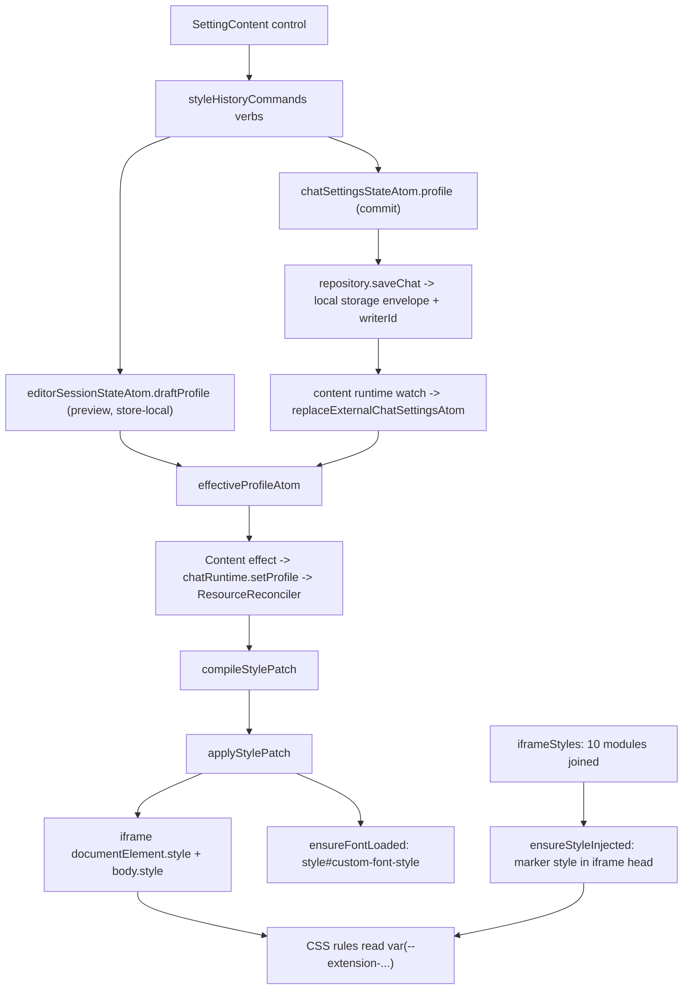

# The overlay and iframe styling

*Part of the architecture set: [overview](../engineering.md) · [The content runtime](./content-runtime.md) · [Settings, state, and storage](./settings-and-state.md) · [Internationalization](./i18n.md) — see the [documentation index](../README.md).*

The extension paints its own chat panel over YouTube's fullscreen player and re-skins YouTube's live-chat document from the inside. Those are two separate mechanisms with one shared input: the current `ChatProfile`. The panel is a React tree portalled into a shadow root the runtime attaches to `#movie_player`; the re-skin is a static stylesheet injected once into the chat iframe's `<head>` plus a set of CSS custom properties rewritten on that document's `documentElement` every time the profile changes. This document covers both, and the geometry code that sits between them.

## What this owns

In scope: the two shadow roots and the portal topology, which component owns which box inside the panel, the pointer-gesture model behind drag and resize, the `ChatProfile` to CSS pipeline (`compileStylePatch` -> `applyStylePatch` -> inline properties, plus the injected stylesheet), the borrowed-iframe restore contract for anything this pipeline writes, the two z-index scales, and the `data-ylc-*` attributes that outside tooling selects on.

Not in scope: deciding *which* iframe to show. Chat source resolution, the lease lifecycle, and video-generation scoping live in [`entrypoints/content/runtime/`](../../entrypoints/content/runtime/) and are described in [`docs/engineering.md`](../engineering.md) under *One reconcile pass* and *Resource ownership*. The internal cascade of the ten iframe CSS modules is owned by [`styles/README.md`](../../entrypoints/content/features/YTDLiveChatIframe/styles/README.md), which stays authoritative for module responsibility and per-surface guardrails; this document describes only what feeds those modules and what enforces them from outside. Settings storage, migration, and normalization belong to [`shared/settings/`](../../shared/settings/repository.ts).

## Vocabulary

| Term | Meaning |
| --- | --- |
| WXT root | The `wxt-react-content` shadow root anchored to `<body>`, created in [`createContentSession.tsx`](../../entrypoints/content/bootstrap/createContentSession.tsx). The React tree mounts here. Nothing visible renders here. |
| Overlay root | The second shadow root, host id `shadow-root-live-chat` ([`domIds.ts`](../../entrypoints/content/constants/domIds.ts)), attached to `#movie_player` by [`PresentationLease.ts`](../../entrypoints/content/runtime/resources/PresentationLease.ts). Every visible overlay element is portalled into this one. |
| Carrier | The `data-ylc-iframe-carrier` div in [`ChatViewport.tsx`](../../entrypoints/content/overlay/ChatViewport.tsx). YouTube's chat `<iframe>` is physically appended here via `chatRuntime.setOverlayContainer`. |
| Borrowed / managed iframe | Borrowed is YouTube's own chat iframe, moved into the carrier and handed back on release. Managed is one the extension created and can simply delete. Only borrowed documents need the restore snapshot. |
| Draft geometry | The pixel layout held in `useOverlayGeometry` state during a pointer gesture. It shadows the stored value and is never persisted. |
| Pinned | `ChatGeometryV2.pinned`. True when the user placed the panel; auto safe area refuses to touch pinned geometry. |
| Style patch | `ChatStylePatch` from [`compileStylePatch.ts`](../../entrypoints/content/style/compileStylePatch.ts): `documentProperties`, `bodyProperties`, `fontFamily`. |
| Chat-only chrome | YouTube's chat header and `#input-panel`, collapsed by height by [`ChatChromeLease.ts`](../../entrypoints/content/runtime/resources/ChatChromeLease.ts) when the profile asks for a messages-only always-visible panel. |
| Control rail | The `data-ylc-control-rail` strip below the panel holding the settings button and the drag handle. |
| Hover bridge | A transparent `data-ylc-control-hover-bridge` div spanning the gap between panel and rail so hover does not drop while the pointer crosses it. |

## The path through the code

### 1. Two shadow roots

[`index.tsx`](../../entrypoints/content/index.tsx) declares `cssInjectionMode: 'ui'`. WXT therefore emits `content-scripts/content.css` as a web-accessible resource with `use_dynamic_url` instead of injecting it into the page, and injects it only into shadow roots it creates itself.

`createContentSession` calls `createShadowRootUi(ctx, { name: 'wxt-react-content', anchor: 'body', append: 'first' })` and renders `AppProvider > ChatRuntimeProvider > Content` into a wrapper div carrying `data-ylc-root`. This is shadow root one. It hosts state and effects only.

`createOverlayRoot` in `PresentationLease.ts` builds shadow root two. It creates the host div, sets inline `pointer-events: none`, `position: absolute`, `inset: 0`, `width/height: 100%`, `z-index` from `CONTENT_UI_LAYER.overlay`, `isolation: isolate`, and `transform: translateZ(0)` (empty string on Firefox), attaches an open shadow root, writes a small `:host` reset stylesheet inline, and appends `<link rel="stylesheet">` pointing at `browser.runtime.getURL('content-scripts/content.css')`. That link is required precisely because WXT's automatic CSS injection does not reach a root the extension created by hand. The host is appended to the player element (`#movie_player`, [`selectorCatalog.ts`](../../entrypoints/content/platform/youtube/selectorCatalog.ts)). `sync()` re-creates the root whenever the host's parent is no longer the current player, so YouTube replacing the player during SPA navigation cannot leave a detached overlay behind.

[`Content.tsx`](../../entrypoints/content/Content.tsx) then `createPortal`s the overlay UI into `runtimeView.overlayRoot`, wrapped in a `data-ylc-overlay-container` div that carries `data-ylc-theme` and `pointer-events: none`. A second portal puts the on/off switch into the container `PresentationLease` prepends to `.ytp-right-controls`.

### 2. Who owns which box

[`YTDLiveChat.tsx`](../../entrypoints/content/YTDLiveChat.tsx) renders [`SettingsFrame`](../../entrypoints/content/settings/SettingsFrame.tsx) and [`OverlayFrame`](../../entrypoints/content/overlay/OverlayFrame.tsx) as siblings, with `ChatViewport` as `OverlayFrame`'s child.

- `OverlayFrame` outer div: `absolute inset-0 overflow-hidden`, pointer events off. Because it is `absolute inset-0` inside the overlay root, its box equals the player box; it is the geometry reference element.
- `data-ylc-resizable` (`role="application"`): the positioned frame. `frameStyle` sets `left`, `top`, `width`, `height` and re-enables pointer events. This div owns the panel's position and size, and it is what e2e locates first.
- `data-ylc-draggable-frame`: `relative h-full w-full`, the positioning context for rail, handles, and bridge.
- [`ChatSurface.tsx`](../../entrypoints/content/overlay/ChatSurface.tsx) renders `data-ylc-chat-inner` with `overflow: hidden` and `borderRadius: 6` passed down from `OverlayFrame`. It owns hover: `isInsideVisibleBounds` re-tests the pointer against `getBoundingClientRect()` on both `mouseenter` and `mousemove`, and it renders the drag shield at `CHAT_PANEL_LAYER.dragShield`.
- `ChatViewport` renders two siblings: `data-ylc-chat-background` (`rgba` background from the profile plus `backdropFilter`/`WebkitBackdropFilter`, which carry `blur(...)` only when `appearance.blur > 0` and `none` otherwise) and `data-ylc-chat-viewport` (opacity transition), with the carrier inside the viewport. The loading pulse sits at `CHAT_PANEL_LAYER.interactionOverlay`.
- [`ResizeHandles.tsx`](../../entrypoints/content/overlay/ResizeHandles.tsx) renders eight divs, one per `ResizeDirection`, each with `data-ylc-resize-direction`, `aria-hidden`, `pointer-events: auto`, `interactionOverlay` z-index, and negative offsets (`-top-2`, `-right-2`, ...) so the 16px hit areas straddle the edge.
- [`OverlayControlRail.tsx`](../../entrypoints/content/overlay/OverlayControlRail.tsx) sits at `CHAT_PANEL_LAYER.controls` and publishes `--ylc-overlay-control-rail-bg-runtime` and `--ylc-overlay-control-hover-runtime` from the profile; [`shared/styles/controls.css`](../../shared/styles/controls.css) consumes both as overrides of the theme defaults.

Placement math is in [`clipGeometry.ts`](../../entrypoints/content/features/Draggable/hooks/clipGeometry.ts): `getControlRailTop` puts the rail at `chatHeight + 6` but clamps it between `4 - containerTop` and `viewportHeight - containerTop - 46 - 4`. `OverlayFrame` freezes the last visible placement in a ref so the rail fades out where it was instead of sliding. The bridge spans from `max(0, height - 12)` down to `railTop + 46 + 12` and drops to `pointer-events: none` while resizing so it cannot swallow handle events.

Visibility is a pure function, `deriveOverlayPresentation` in [`useOverlayInteraction.ts`](../../entrypoints/content/overlay/useOverlayInteraction.ts): `controlsVisible = !settingsOpen && gesture !== 'resizing' && (hoverRegion !== 'none' || gesture === 'dragging')` and `chatVisible = alwaysVisible || hoverRegion !== 'none' || gesture !== 'none' || !idle || settingsOpen || !documentFocused`. Idle is 1000 ms without `mousemove`, `mousedown`, `keydown`, `touchstart`, or `scroll`; the rail hide is deferred by 160 ms.

### 3. One pointer session, two gestures

Drag and resize share a single code path.

1. `onPointerDown` arrives at `geometry.onPointerDown` from either a resize handle or the rail's drag button.
2. [`usePointerSession.ts`](../../entrypoints/content/overlay/usePointerSession.ts) ignores anything but `event.button === 0` and refuses re-entry, calls `begin`, captures the pointer, registers **window-level** `pointermove`, `pointerup`, `pointercancel`, and `keydown`, calls `preventDefault()`, then fires `onStart`.
3. `beginSession` in [`useOverlayGeometry.ts`](../../entrypoints/content/overlay/useOverlayGeometry.ts) reads `event.currentTarget.dataset.ylcResizeDirection`. The presence of that attribute is the only thing that separates a resize from a move. It snapshots the start point and `displayGeometry`, and clears any prior draft.
4. `updateSession` computes the delta and calls either `deriveResizedLayout` or a plain coordinate translation, runs the result through `fitGeometryToViewport(next, viewport, GEOMETRY_VIEWPORT_PADDING)` where the padding is `10`, and stores it in both `draftGeometryRef` and React state. The draft, not the store, drives rendering for the whole gesture.
5. `deriveResizedLayout` pins the opposite edge: it precomputes `fixedRight`/`fixedBottom`, clamps the requested size against `ResizableMinWidth = 240` and `ResizableMinHeight = 180` from [`shared/constants/index.ts`](../../shared/constants/index.ts), and only moves `x`/`y` for left- and top-anchored directions.
6. `finishSession` commits once: `commitLayout(draft ?? startGeometry, true)` -> `fitGeometryToViewport` -> `layoutGeometryToV2` -> `commitGeometryAtom`. The draft is cleared, so rendering falls back to the stored ratios.
7. `pointercancel`, `Escape`, and unmount all route to `finish(false)` -> `cancelSession`, which drops the draft without committing.
8. Unmodified arrow keys on the drag button call `moveByKeyboard({ x: ±10 })` or `{ y: ±10 }`, which commits immediately as pinned.

The store never holds pixels. `ChatGeometryV2` in [`chatGeometry.ts`](../../shared/settings/chatGeometry.ts) is `{ reference: 'player', rect: {x, y, width, height} as ratios, pinned }`. `renderChatGeometry` multiplies by the player size and clamps to at least 240x180 px (or the player size when it is smaller) and at most 65% width / 90% height. Legacy pixel geometry migrates once, gated on a usable player rect. The reference size comes from `getPlayerElement`, which walks `referenceElement.getRootNode()` and takes `root.host.parentElement` when that root is a `ShadowRoot` — that is the player. A `ResizeObserver` plus a `window.resize` listener keep it current, and a `MutationObserver` on the player (`aria-hidden`, `class`, `hidden`, `style`, plus `childList` and `subtree`) bumps an obstacle revision through `requestAnimationFrame`.

Auto safe area runs only when the geometry is unpinned, no pointer is active, no draft exists, and the interaction state is neither dragging nor resizing. [`collectPlayerObstacles.ts`](../../entrypoints/content/platform/youtube/collectPlayerObstacles.ts) gathers captions, player controls, menus, and the end screen, plus a synthetic `min(460, playerWidth) x min(480, playerHeight)` centered rect while settings are open. [`autoSafeArea.ts`](../../entrypoints/content/overlay/autoSafeArea.ts) scores the current placement against four corner candidates, ordering by overlap area, then movement distance, then descending visible area. `shouldApplyAutoSafePlacement` requires an overlap of at least 12% of the panel area, an improvement of at least `max(2400, 5% of the panel area)`, and an actual coordinate change; the commit uses `pinned: false` so the panel stays auto-managed.

### 4. A setting becomes CSS inside YouTube's document

**The control.** [`SettingContent.tsx`](../../entrypoints/content/features/YTDLiveChatSetting/components/SettingContent.tsx) renders the style controls. Continuous controls such as [`YLCNumberSlider.tsx`](../../entrypoints/content/features/YTDLiveChatSetting/components/YLCChangeItems/YLCNumberSlider.tsx) call `beginYLCStyleGesture` / `previewYLCStyleUpdate` / `finishYLCStyleGesture`; discrete controls call `commitYLCStyleUpdate`. The verbs are defined in [`styleHistoryCommands.ts`](../../entrypoints/content/features/YTDLiveChatSetting/styleHistoryCommands.ts).

**The store.** In [`commands.ts`](../../shared/state/commands.ts), `previewStylePatchAtom` writes only `editorSessionStateAtom.draftProfile`; `finishStyleGestureAtom` promotes the draft into `chatSettingsStateAtom.profile` and pushes the pre-gesture profile onto a history capped at `HISTORY_LIMIT = 50`. `effectiveProfileAtom` in [`atoms.ts`](../../shared/state/atoms.ts) is `draftProfile ?? profile`.

**Crossing the document boundary.** The settings UI does not run in the content script's React tree. `SettingsFrame` mounts `settings.html` as a `position: fixed; inset: 0` extension-origin iframe at `CONTENT_UI_LAYER.modal`, and [`entrypoints/settings/main.tsx`](../../entrypoints/settings/main.tsx) boots its own `createAppRuntime()` with its own jotai store. Propagation is through storage, not messaging: [`createAppRuntime.ts`](../../shared/runtime/createAppRuntime.ts) subscribes to `chatSettingsStateAtom` and calls `repository.saveChat`, [`repository.ts`](../../shared/settings/repository.ts) writes a `{ schemaVersion, writerId, value }` envelope, and the content script's watcher applies it only when the `writerId` differs, under an `applyingExternal` flag that suppresses the echo write. Close, diagnostics, and restart requests use `window.postMessage` between the two frames, each message aimed at an explicit target origin and each listener filtered by `event.source`.

**Into the iframe.** `Content` pushes `effectiveProfile` into `chatRuntime.setProfile` on every change. [`ResourceReconciler.ts`](../../entrypoints/content/runtime/ResourceReconciler.ts) `setProfile` re-applies the patch and re-syncs chat-only chrome; `applyProfile` bails when `documentElement`, `head`, or `body` is missing or the document is still `about:blank`, then calls `applyChatProfileToDocument`.

**Compile.** `compileStylePatch` is pure. It forces `--yt-live-chat-background-color` to `transparent`; darkens `--yt-spec-icon-disabled` by 40 and `--yt-live-chat-vem-background-color` by 20; makes six more YouTube background variables transparent; derives two surface alphas from the configured background — elevated menu `a + (1 - a) * 0.28` and panel `max(0.08, a * 0.28)`, the latter collapsing to a flat `0` when the background is fully transparent — plus a subtle control surface taken from the *font* color at `max(0.08, a * 0.12)`; sets the primary font color and a secondary at `max(0, a - 0.4)`; resolves the membership name color from the profile or from the value read off YouTube, falling back to the literal string `var(--yt-live-chat-sponsor-color)` when neither is available; then sets blur, font size, spacing, three display flags (`inline`/`inline`/`block` or `none`), and a quoted `font-family` with a `Roboto, Arial, sans-serif` fallback. `bodyProperties` contains only `backdrop-filter` and `-webkit-backdrop-filter`.

**Apply.** [`applyStylePatch.ts`](../../entrypoints/content/style/applyStylePatch.ts) writes `documentProperties` onto `document.documentElement.style`, `bodyProperties` onto `document.body.style`, and calls `ensureFontLoaded`. `readYouTubeMembershipDefaultColor` reads the computed then the inline `--yt-live-chat-sponsor-color` and parses `rgb()`, `rgba()`, or hex. [`fontLoader.ts`](../../entrypoints/content/style/fontLoader.ts) creates or updates `<style id="custom-font-style">` containing a Google Fonts `@import`, memoized per document through a `WeakMap` and by `dataset.fontFamily`; the family first passes `normalizeFontFamily`, which accepts only the 50 names in [`fontFamilyPolicy.ts`](../../shared/utils/fontFamilyPolicy.ts) and returns `''` for anything else, in which case the style element is removed.

### 5. The static half and the restore snapshot

`ResourceReconciler.initializeIframe` is where the document becomes styleable: it attaches the iframe into the carrier, registers a `load` listener, bails on a missing or `about:blank` document, calls `lease.captureDocumentStyle()` when the iframe is borrowed, then `ensureStyleInjected(doc, iframeStyles)`, adds `IFRAME_CHAT_BODY_CLASS` to the body, installs the membership-picker click fallback, and applies the profile. [`iframeInitializer.ts`](../../entrypoints/content/features/YTDLiveChatIframe/utils/iframeInitializer.ts) makes injection idempotent by querying `style[data-ylc-style-injected="true"]` first. `iframeStyles` is one string built by [`styles/index.ts`](../../entrypoints/content/features/YTDLiveChatIframe/styles/index.ts) from ten `?inline` imports joined in `iframeStyleModuleNames` order.

The six names that couple the CSS modules, the reconciler, `ChatChromeLease`, and cleanup live in [`styleContract.ts`](../../entrypoints/content/features/YTDLiveChatIframe/constants/styleContract.ts). The second half of the contract is `YLC_DOCUMENT_STYLE_PROPERTIES` in [`ylcStyleConstants.ts`](../../entrypoints/content/hooks/ylcStyleChange/ylcStyleConstants.ts), which enumerates every inline property the extension claims on the chat document's `documentElement`, `font-family` included. [`iframeAttachment.ts`](../../entrypoints/content/features/YTDLiveChatIframe/utils/iframeAttachment.ts) snapshots exactly that list (value and priority), plus the two body backdrop-filter properties and the `#custom-font-style` element's identity, parent, next sibling, and text; `restoreDocumentStyle` plays it back. `cleanupBorrowedDocument` additionally removes the four body classes, strips `--extension-chat-only-target-height` from every element still carrying it, removes five legacy chat-only height variables from the body, and deletes the marker `<style>`. All of this exists because a borrowed iframe is YouTube's own element and has to be returned unmodified.

## Invariants

- **Everything visible is portalled into the overlay root, not the WXT root.** `Content.tsx` portals into `runtimeView.overlayRoot`, and only `PresentationLease.createOverlayRoot` produces one. Enforced by the fact that no other code path yields that `ShadowRoot`, and observed by the e2e page object [`ExtensionOverlay.ts`](../../e2e/pages/ExtensionOverlay.ts), whose panel locators prefix the `#shadow-root-live-chat` host exported from [`e2e/utils/selectors.ts`](../../e2e/utils/selectors.ts).
- **Geometry is stored as player-relative ratios, never pixels.** `commitLayout` always routes through `layoutGeometryToV2` before `commitGeometryAtom`, and `normalizeChatGeometryV2` clamps width to 0.65 and height to 0.9. Covered by [`useOverlayGeometry.spec.ts`](../../entrypoints/content/overlay/useOverlayGeometry.spec.ts) ("renders ratios against player resizes and clamps the result locally").
- **A pointer gesture writes a draft and commits exactly once, on pointer-up.** `updateSession` only calls `setDraftGeometry`; only `finishSession` calls `commitLayout`; cancel paths drop the draft. Asserted by "keeps pointer resize updates in a draft and commits once on pointer up".
- **Resize keeps the opposite edge fixed and never goes below 240x180.** Enforced in `deriveResizedLayout` and asserted by "keeps the opposite edges fixed while resizing from the bottom-left handle".
- **The panel never leaves the player box.** Every layout passes through `fitGeometryToViewport(..., 10)` — on render, on every draft update, on keyboard moves, and again inside `commitLayout`.
- **Any inline property the extension sets on the chat `documentElement` must be listed in `YLC_DOCUMENT_STYLE_PROPERTIES`.** `captureDocumentStyle` and `restoreDocumentStyle` snapshot and replay exactly that list, so an unlisted property survives release and leaks into YouTube's native chat panel. Enforced only by that shared constant; there is no guard script for it.
- **Style injection is idempotent and marker-keyed.** `ensureStyleInjected` returns early when `style[data-ylc-style-injected="true"]` exists, and `cleanupBorrowedDocument` removes it by the same selector.
- **The module concatenation order in `styles/index.ts` is the cascade contract, and at most one direct `display: none` rule exists.** [`iframe.spec.ts`](../../entrypoints/content/features/YTDLiveChatIframe/styles/iframe.spec.ts) pins the exact ten-name array and asserts the extracted `display: none` selector list equals exactly `['body.custom-yt-app-live-chat-extension yt-live-chat-header-renderer > #close-button']` — hiding an iframe or an ancestor lets the browser throttle the chat document.
- **The injected stylesheet is self-contained: no `@import`, no `@layer`.** Currently true by inspection of `styles/*.css`; stated in the README guardrails but not covered by an automated check.
- **Stacking order is explicit and ordered.** `CONTENT_UI_LAYER` is overlay 1000 < modal 1100 < nestedModal 1200; `CHAT_PANEL_LAYER` is iframe 1 < hoverBridge 10 < controls 20 < interactionOverlay 30 < dragShield 40. Ordering is asserted in [`zIndex.spec.ts`](../../shared/constants/zIndex.spec.ts). Never hard-code a raw number.
- **Only fonts in `ALLOWED_FONT_FAMILIES` reach a Google Fonts request.** `normalizeFontFamily` returns `''` for anything else and `ensureFontLoaded` then removes the style element.
- **`data-ylc-*` attributes are an external contract.** `data-ylc-resizable`, `data-ylc-chat-viewport`, `data-ylc-chat-inner`, `data-ylc-chat-background`, `data-ylc-draggable-frame`, `data-ylc-iframe-carrier`, `data-ylc-control-rail`, `data-ylc-settings-btn`, `data-ylc-settings-frame`, `data-ylc-overlay-container`, and `data-ylc-resize-direction` are selected by [`e2e/pages/ExtensionOverlay.ts`](../../e2e/pages/ExtensionOverlay.ts), the visual/accessibility/production e2e projects, [`inspect-overlay.mjs`](../../scripts/verify/inspect-overlay.mjs), and [`capture-overlay-screenshots.mjs`](../../scripts/verify/capture-overlay-screenshots.mjs). Renaming one breaks tooling that lives outside `entrypoints/`.

## Where to change things

| If you want to ... | Edit ... | Also update ... |
| --- | --- | --- |
| Add a chat style setting that reaches the iframe | [`compileStylePatch.ts`](../../entrypoints/content/style/compileStylePatch.ts) and the property name in [`ylcStyleConstants.ts`](../../entrypoints/content/hooks/ylcStyleChange/ylcStyleConstants.ts) | `YLC_DOCUMENT_STYLE_PROPERTIES` (restore contract), the default in [`tokens.css`](../../entrypoints/content/features/YTDLiveChatIframe/styles/tokens.css), the module that reads the variable, and [`compileStylePatch.spec.ts`](../../entrypoints/content/style/compileStylePatch.spec.ts) |
| Style a YouTube surface differently | the narrowest module under [`styles/`](../../entrypoints/content/features/YTDLiveChatIframe/styles/) | [`styles/README.md`](../../entrypoints/content/features/YTDLiveChatIframe/styles/README.md) surface table; `iframe.spec.ts` if the rule touches `display: none`, scope, or the header stacking context |
| Add or reorder an iframe CSS module | [`styles/index.ts`](../../entrypoints/content/features/YTDLiveChatIframe/styles/index.ts) (import plus `iframeStyleModuleNames`) | the cascade-order assertion in `iframe.spec.ts` and the README module table |
| Add an element that must stack above or below existing overlay parts | [`zIndex.ts`](../../shared/constants/zIndex.ts) | [`zIndex.spec.ts`](../../shared/constants/zIndex.spec.ts) ordering assertions |
| Add a new resize affordance | [`ResizeHandles.tsx`](../../entrypoints/content/overlay/ResizeHandles.tsx) | give it `data-ylc-resize-direction` or it becomes a move handle; `ExtensionOverlay.ts` enumerates the directions present in the DOM |
| Rename or drop a `data-ylc-*` hook | the component | `e2e/pages/ExtensionOverlay.ts`, `scripts/verify/inspect-overlay.mjs`, `scripts/verify/capture-overlay-screenshots.mjs` |
| Change the minimum panel size | [`shared/constants/index.ts`](../../shared/constants/index.ts) | `MIN_CHAT_WIDTH_PX` / `MIN_CHAT_HEIGHT_PX` in [`chatGeometry.ts`](../../shared/settings/chatGeometry.ts) are separate literals with the same values; plus `useOverlayGeometry.spec.ts` |
| Change when the panel or rail is visible | `deriveOverlayPresentation` in [`useOverlayInteraction.ts`](../../entrypoints/content/overlay/useOverlayInteraction.ts) | [`useOverlayInteraction.spec.ts`](../../entrypoints/content/overlay/useOverlayInteraction.spec.ts) |
| Change auto-safe-area thresholds | [`autoSafeArea.ts`](../../entrypoints/content/overlay/autoSafeArea.ts) | [`autoSafeArea.spec.ts`](../../entrypoints/content/overlay/autoSafeArea.spec.ts) and the *Settings, geometry, and adaptive placement* section of [`docs/engineering.md`](../engineering.md) |
| Change the chat-only collapse | [`ChatChromeLease.ts`](../../entrypoints/content/runtime/resources/ChatChromeLease.ts) | [`chat-only.css`](../../entrypoints/content/features/YTDLiveChatIframe/styles/chat-only.css), the class names in `styleContract.ts`, and the class/variable cleanup in `iframeAttachment.ts` |

## Gotchas

- The two shadow roots are easy to confuse. React mounts in `wxt-react-content` on `<body>`; every pixel renders in `#shadow-root-live-chat` on `#movie_player`. That split is why `PresentationLease` has to `<link>` `content-scripts/content.css` by extension URL — WXT's CSS injection only covers roots it created.
- `PresentationLease` sets `transform: translateZ(0)` on the overlay host for every browser except Firefox. A transformed ancestor becomes the containing block for `position: fixed` descendants, so `SettingsFrame`'s `position: fixed; inset: 0` iframe resolves against the *player box* on Chrome and against the *viewport* on Firefox. Anything else relying on `fixed` inside the overlay inherits that difference.
- Resize versus move is decided solely by the presence of `data-ylc-resize-direction` on the pointerdown target. Any new element wired to `geometry.onPointerDown` without it silently becomes a move handle.
- The drag shield in `ChatSurface.tsx` uses `className='absolute w-100% h-100% ...'`. `w-100%` and `h-100%` are not Tailwind utilities (they would have to be `w-full` or `w-[100%]`), and the built `content.css` contains no matching rule, so the shield is a zero-size element and does not actually block pointer events over the chat iframe during a drag. `ChatSurface.spec.tsx` only asserts the element exists.
- A slider preview does not cross the settings-iframe boundary. `createAppRuntime` persists and watches the global, chat, and locale settings atoms — never `editorSessionStateAtom`, so `draftProfile` is store-local. The overlay therefore re-styles when a gesture commits, not while it is in progress. `effectiveProfileAtom` still resolves the draft — that path matters for tests and for any control rendered inside the content tree itself.
- `chatVisible` includes `|| !documentFocused`, so the panel deliberately stays visible when the window loses focus. This surprises people debugging with devtools focused.
- The chat-only collapse depends on forced synchronous reflows. `collapse`, `expand`, and `refreshCollapsedMeasurements` call `body.getBoundingClientRect()` between class changes on purpose, so the browser has a concrete start height to animate from. Removing those "pointless" calls, or touching the `chat-only-measuring` class that suppresses transitions during measurement, turns the animation into a jump.
- The `custom-font-style` element id is a duplicated literal in `fontLoader.ts` and `iframeAttachment.ts`, not a shared constant. Renaming one silently breaks borrowed-document restore.
- `fontLoader.ts` writes a Google Fonts `@import` into the chat document, which looks like a violation of the README's no-`@import` guardrail. It is not: that guardrail covers the concatenated module string installed as the marker `<style>`; the font rule lives in its own style element with an absolute URL.
- The README's blur guardrail is current, and it is easy to misread as forbidding what the code does. It bans blur as `filter` on the iframe *host*, not as `backdrop-filter` inside the document — and it says so explicitly, describing how `compileStylePatch` writes the configured value to the iframe body and publishes it as `--extension-yt-live-backdrop-filter` on the document element. `compileStylePatch.spec.ts` asserts `bodyProperties['backdrop-filter'] === 'blur(12px)'` on both Chrome and Firefox. Blur is applied in two places: the React background layer and the iframe body. No `changeYLCBlur()` survives anywhere in the repository, the README included.
- `useOverlayInteraction` returns `controlsHiding` and `finishResizing`, and exports `CONTROL_FADE_OUT_MS`, but `OverlayFrame` consumes none of them — `onGestureEnd` is wired to `finishDragging` for both gesture types. `CONTROL_FADE_OUT_MS` still times the fade inside the hook itself; outside the hook's own module and its spec, none of the three has a consumer.
- `getModalParentElement` still looks for `#shadow-root-live-chat` and creates a modal root inside it, but `YTDLiveChatSetting` now renders only from `entrypoints/settings/main.tsx` inside `settings.html`, where that host does not exist. In production it always falls through to `document.body` of the settings page.
- `ChatSurface` re-checks the pointer against `getBoundingClientRect()` on every `mouseenter` and `mousemove` instead of trusting the event, because the chat-only transition can collapse the surface to zero height and a naive `mouseenter` would latch hover on an invisible box.
