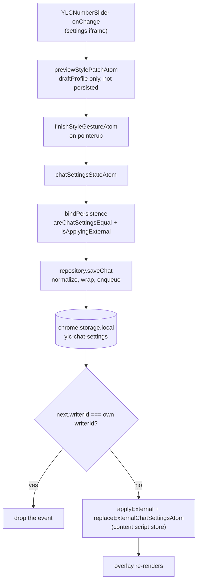

# Settings, state, and storage

*Part of the architecture set: [overview](../engineering.md) · [The content runtime](./content-runtime.md) · [The overlay and iframe styling](./overlay-and-styling.md) · [Internationalization](./i18n.md) — see the [documentation index](../README.md).*

Every user-visible preference in this extension lives as one of three values in `chrome.storage.local`, and every extension context reaches them through the same code: a `SettingsRepository` that owns the storage boundary, a private jotai store that owns the in-memory model, and `createAppRuntime` that wires the two together. There is no background service worker and no `runtime`/`tabs` messaging anywhere in the codebase. Contexts converge purely by watching storage and ignoring the events they wrote themselves.

## What this owns

In scope: the persisted schema and its defaults ([`shared/settings/`](../../shared/settings/)), the jotai atoms and write-only command atoms ([`shared/state/`](../../shared/state/)), the per-context boot path ([`shared/runtime/createAppRuntime.ts`](../../shared/runtime/createAppRuntime.ts)), overlay geometry commits ([`useOverlayGeometry.ts`](../../entrypoints/content/overlay/useOverlayGeometry.ts)), and export/import ([`backup.ts`](../../shared/settings/backup.ts), [`DataTransfer.tsx`](../../entrypoints/popup/components/DataTransfer.tsx)).

Deliberately out of scope: chat source resolution and the lease/generation machinery, which live in [`entrypoints/content/runtime/`](../../entrypoints/content/runtime/) and are described in [`docs/engineering.md`](../engineering.md); compiling a `ChatProfile` into CSS inside the chat iframe; and the locale asset pipeline, of which this subsystem uses only [`loadLocaleMessages`](../../shared/i18n/loader.ts), the resolvers in [`language.ts`](../../shared/i18n/language.ts) (`resolveLanguageCode` and `resolveLanguagePreference`), and `isRTL`.

## Vocabulary

| Term | Meaning |
| --- | --- |
| **Envelope** | `StoredEnvelope<T> = { schemaVersion: 1; writerId: string; value: T }` ([`repository.ts`](../../shared/settings/repository.ts)). `schemaVersion` versions the wrapper, not the settings; it has only ever been `1`. |
| **writerId** | A per-repository-instance id from `crypto.randomUUID()`, falling back to `` `ylc-${Date.now()}-${random}` ``. Stamped into every write so the writer can recognize and drop its own storage events. |
| **Snapshot** | `SettingsSnapshot = { global, chat, locale }` — the result of `repository.load()`, the only bulk read. |
| **Profile** | `ChatProfile = { appearance, display }`: everything about how chat looks. Position is *not* part of it. |
| **Geometry** | `ChatGeometry = LegacyChatGeometry \| ChatGeometryV2`. V2 stores four ratios of the player box plus `pinned`; the legacy shape stores absolute viewport pixels. |
| **pinned** | `true` means the user placed the overlay by hand, so auto-safe-area repositioning must leave it alone. |
| **Editor session** | `EditorSession = { draftProfile, past, future, activeGesture }` — undo history plus the uncommitted draft shown during a drag of a slider or color picker. Never persisted. |
| **Gesture** | One continuous edit, identified by a string such as `range:fontSize`. Begin/preview/finish collapses it into a single undo entry. |
| **Preset entry** | `{ kind: 'builtin', id }` (profile lives in [`builtinPresets.ts`](../../shared/settings/builtinPresets.ts)) or `{ kind: 'custom', id, name, profile }` (profile lives in storage). |
| **Reference box** | The YouTube player element's rect that V2 ratios are resolved against. |

## The path through the code

### The three stored values

[`storageKeys.ts`](../../shared/settings/storageKeys.ts) names them, and each is a separate `storage.defineItem` in `repository.ts`, so a write to one never rewrites another:

| Key | Value type | Defaults |
| --- | --- | --- |
| `ylc-global-settings` | `GlobalSettings = { ytdLiveChat, themeMode }` | `{ ytdLiveChat: true, themeMode: 'system' }` (`DEFAULT_GLOBAL_SETTINGS`) |
| `ylc-chat-settings` | `ChatSettings = { profile, geometry, presets }` | `DEFAULT_CHAT_SETTINGS`: white background at full alpha, black text, `membershipNameColor: { mode: 'youtube-default' }`, `fontFamily: null`, `fontSize: 13`, `blur: 0`, `spacing: 0`, all three `show*` true, `always-visible` + `full-chat`, `DEFAULT_CHAT_GEOMETRY`, and all seven built-ins in `BUILTIN_PRESET_IDS` order |
| `ylc-locale` | a bare `LocaleCode` string | resolved by `detectBrowserLocale()` on a first install |

Each value is wrapped as `StoredEnvelope<T> = { schemaVersion: 1; writerId: string; value: T }` by the repository's private `envelope()` helper. The settings *content* carries no version field of its own — shape detection is structural.

### Boot: one runtime per context

All three entrypoints — content ([`createContentSession.tsx`](../../entrypoints/content/bootstrap/createContentSession.tsx)), popup ([`popup/main.tsx`](../../entrypoints/popup/main.tsx)), and the settings page ([`settings/main.tsx`](../../entrypoints/settings/main.tsx)) — call `createAppRuntime()` with no arguments and hand the result to [`AppProvider`](../../shared/runtime/AppProvider.tsx). Each therefore gets its own `createStore()` and its own `createSettingsRepository()` with a fresh `writerId`. Nothing is shared between contexts except `chrome.storage.local`.

1. `createAppRuntime` calls `repository.watch({ onGlobal, onChat, onLocale })` **before** `repository.load()`. Events that arrive while `initialized` is false are buffered into `pendingGlobal` / `pendingChat` / `pendingLocale` rather than dropped.
2. `repository.load()` reads the three envelopes, migrates legacy data if any of them is missing, and returns a `SettingsSnapshot`.
3. Locale messages load via `loadMessagesWithEnglishFallback`. Any non-`en` failure retries as `en`; an `en` failure rethrows, and the runtime disposes its watchers and rejects. A `while (true)` loop re-reads `localeRequestId` so a locale event that lands mid-load wins.
4. `store.set(hydrateAppAtom, …)` applies `pending* ?? snapshot.*` and clears the editor session.
5. Only then does `bindPersistence` subscribe. Hydration itself can never write back to storage.

### Writing a setting

Take the font-size slider in [`YLCNumberSlider.tsx`](../../entrypoints/content/features/YTDLiveChatSetting/components/YLCChangeItems/YLCNumberSlider.tsx), rendered inside the settings iframe:

1. It reads `effectiveProfileAtom` (`draftProfile ?? chatSettings.profile`), so it shows the live draft during a drag.
2. `onPointerDown` calls `beginYLCStyleGesture('range:fontSize', …)` from [`styleHistoryCommands.ts`](../../entrypoints/content/features/YTDLiveChatSetting/styleHistoryCommands.ts), which finishes any prior gesture and sets `beginStyleGestureAtom`: the editor session records `activeGesture = { id, before }` and seeds `draftProfile`.
3. Each `onChange` sets `previewStylePatchAtom`, merging the patch into `draftProfile` through `normalizeChatProfile`. Nothing is committed and nothing is written.
4. `onPointerUp` (also pointer-cancel, lost-capture, key-up, and blur) sets `finishStyleGestureAtom`. If the draft differs from `gesture.before` it writes `chatSettingsStateAtom` and pushes `before` onto `past`, capped by `.slice(-HISTORY_LIMIT)` with `HISTORY_LIMIT = 50`.
5. `bindPersistence` in [`createAppRuntime.ts`](../../shared/runtime/createAppRuntime.ts) is subscribed to `chatSettingsStateAtom`. It compares against a cached previous value with `areChatSettingsEqual`, and if it changed and `isApplyingExternal()` is false, calls `repository.saveChat(next)`.
6. `saveChat` pushes onto the repository's serialized queue: `chatItem.setValue({ schemaVersion: 1, writerId, value: normalizeChatSettings(value, DEFAULT_CHAT_SETTINGS) })`. `chatItem` is `storage.defineItem('local:ylc-chat-settings')`.
7. In every other context `chatItem.watch` fires. The handler forwards only when `next?.writerId !== writerId && next?.value`.
8. `onChat` wraps the atom write in `applyExternal`, which flips `applyingExternal` around the `store.set` so step 5's subscriber does not write it straight back. The atom is `replaceExternalChatSettingsAtom`, which resets the editor session only when a gesture or draft is live or the arriving profile differs — a geometry-only external change keeps undo history.

Global settings and the locale follow the same path through `setThemeModeAtom` / `setYTDLiveChatEnabledAtom` and `runtime.setLocale`, which awaits `loadMessages` and `saveLocale` together before applying under `applyExternal`.

The settings panel that opens over the video is `settings.html` in an iframe injected by [`SettingsFrame.tsx`](../../entrypoints/content/settings/SettingsFrame.tsx). It builds its own runtime, so the panel and the overlay it edits are two jotai stores with two `writerId`s that converge only through storage. The `window.postMessage` channel defined in [`settingsFrameMessages.ts`](../../entrypoints/content/settings/settingsFrameMessages.ts) carries exactly four message types — `ylc-settings-close`, `ylc-settings-diagnostics-request`, `ylc-settings-diagnostics-report`, `ylc-settings-runtime-restart` — and never a settings payload.

### Reading old data: `load()` and migration

`repository.load()` in [`repository.ts`](../../shared/settings/repository.ts):

1. `readNormalizedCurrentValues()` reads all three envelopes. If all three are present and valid, the legacy extension-page `i18nextLng` is removed and the snapshot is returned. Nothing is rewritten.
2. Otherwise `readLegacySnapshot()` reads `globalSettingStore`, `ytdLiveChatStore`, and `i18nextLng` from `chrome.storage.local`. `parseLegacy` accepts a JSON string or an object and degrades broken JSON to `{}`; `legacyState` unwraps a zustand-style `{ state, version }` wrapper or takes the object as-is.
3. The envelopes are re-read so a migration another context finished in the meantime wins; `migrated` prefers whatever is already stored.
4. Only the missing entries are queued for writing. The queue task then reads back every key and requires: a valid envelope, this writer's id when this writer created it, and equality by `areGlobalSettingsEqual` / `areChatSettingsEqual` / `resolveLanguageCode`. Only if all of that holds are the legacy keys removed.

Locale resolution inside step 2 prefers extension-page `localStorage['i18nextLng']`, then `chrome.storage.local['i18nextLng']`. If neither exists, `detectBrowserLocale()` asks `browser.i18n.getUILanguage()` first — that is what Chrome uses to localize the extension's own name, so the popup title and its contents agree — then falls through to `getAcceptLanguages()`, both funnelled into `resolveLanguagePreference`. Both `i18n` calls are wrapped in `try`/`catch` because some contexts do not implement them and others reject.

`migrateSettings` decides shape structurally — `isV7Settings` checks for any of `profile`, `geometry`, `presets`. A v7-shaped input goes straight to `normalizeChatSettings`; anything else goes through `migrateV6ToV7` in [`migrateSettings.ts`](../../shared/settings/migrateSettings.ts), which maps `bgColor → appearance.backgroundColor`, `space → spacing`, `userNameDisplay`/`userIconDisplay`/`superChatBarDisplay → show*`, `alwaysOnDisplay → display.idleVisibility`, `chatOnlyDisplay → display.contentMode`, `coordinates` + `size → LegacyChatGeometry`, and the three parallel preset collections into `PresetEntry[]`. `addPresetEnabled` and `reactionButtonDisplay` are declared in `PersistedSettingsV6` and dropped.

The older shapes still accepted anywhere in the codebase, and nowhere else, are: the v6 flat record; a v7 record inside a zustand `{ state, version }` wrapper; a legacy global store including `version: 0` (which migrates a missing `themeMode` to `'light'` instead of `'system'`); `LegacyChatGeometry` and bare `{ coordinates, size }`; legacy preset ids `default1`…`default7` mapping to `standard, transparent, simple, dark, readable, compact, neon`; `i18nextLng` in extension-page `localStorage` or in `storage.local`; and backup files with `version: 1`.

### `ChatGeometryV2`

`{ reference: 'player', rect: { x, y, width, height }, pinned }`. All four numbers are fractions of the **player element's** box: `x`/`y` are the top-left offset over player width/height, `width`/`height` the size over the same. [`useOverlayGeometry.ts`](../../entrypoints/content/overlay/useOverlayGeometry.ts) resolves that element as the shadow-root host's `parentElement` and measures it with `getBoundingClientRect()`, falling back to `clientWidth`/`clientHeight`; `safeReference` floors both dimensions at 1 so division cannot blow up.

`DEFAULT_CHAT_GEOMETRY` is `{ reference: 'player', rect: { x: 0.015625, y: 0.027778, width: 0.3125, height: 0.555556 }, pinned: false }` — the old pixel defaults `DefaultCoordinates {20,20}` and `DefaultSize {400,400}` from [`shared/constants/index.ts`](../../shared/constants/index.ts) over a 1280x720 box.

**Pending migration.** A `LegacyChatGeometry` in storage is never converted eagerly. `renderChatGeometry` converts it to ratios transiently for rendering only. The persisted rewrite happens in exactly one place, a `useLayoutEffect` that returns early unless `referenceSize` exists and the geometry is not already V2. The popup and the settings iframe have no player element, so they read, normalize, export, and re-save legacy geometry unchanged, indefinitely.

**Clamps**, applied in three stages ([`chatGeometry.ts`](../../shared/settings/chatGeometry.ts), [`normalizeSettings.ts`](../../shared/settings/normalizeSettings.ts)):

- `normalizeChatGeometry`, on every read and commit: each ratio through `clampFinite(value, 0, 1, fallbackRatio)`. On the legacy branch, coordinates clamp to `±Number.MAX_SAFE_INTEGER` with fallback 20 and sizes to `[0, MAX_SAFE_INTEGER]` with fallback 400, then `normalizeLegacyChatGeometry` applies `Math.max(ResizableMinWidth = 240, …)` and `Math.max(ResizableMinHeight = 180, …)`.
- `normalizeChatGeometryV2`, in ratio space: `MAX_CHAT_WIDTH_RATIO = 0.65` and `MAX_CHAT_HEIGHT_RATIO = 0.9` cap width and height; `x` is then clamped to `[0, max(0, 1 - width)]` and `y` to `[0, max(0, 1 - height)]`. `pinned` passes through untouched.
- `renderChatGeometry`, in pixel space, with `MIN_CHAT_WIDTH_PX = 240` and `MIN_CHAT_HEIGHT_PX = 180`: `maxWidth = max(240, refW * 0.65)`, `width = clamp(refW * rect.width, min(240, refW), maxWidth)`, height analogous, then position clamped into `[0, ref - size]`.

On top of that the overlay runs [`fitGeometryToViewport`](../../shared/settings/fitGeometryToViewport.ts) with `GEOMETRY_VIEWPORT_PADDING = 10` on display, on every drag/resize frame, and before every commit. Drag and resize end, and keyboard arrow moves, commit through `layoutGeometryToV2(fitted, viewport, true)` — every interactive commit pins. [`autoSafeArea.ts`](../../entrypoints/content/overlay/autoSafeArea.ts) runs only while `pinned` is false, and commits with `false`, so a fresh install stays eligible for automatic repositioning around captions, controls, menus and end screens.

### Export and import

`runtime.exportSettings()` calls `buildRepositoryBackup` → `buildSettingsBackup`, producing `{ version: 2, exportedAt, globalSetting, chatSettings }` with `SETTINGS_EXPORT_VERSION = 2` from [`persistConfig.ts`](../../shared/settings/persistConfig.ts). [`DataTransfer.tsx`](../../entrypoints/popup/components/DataTransfer.tsx) serializes it with `JSON.stringify(data, null, 2)` into a Blob downloaded as `yt-livechat-fullscreen-backup-YYYY-MM-DD.json`.

Import reads the file, `JSON.parse`s it, and calls `runtime.importSettings`. `normalizeSettingsBackup` returns `null` — and `importSettings` throws `new Error('Unsupported settings backup')`, surfaced by the popup as the `popup.importError` toast — unless the input is a record with a record `globalSetting` and either `version === 2` with a record `chatSettings`, or `version === 1` with a record `ytdLiveChat` that is run through the full v6→v7 migration. `importSettings` then awaits `repository.flush()` before `repository.replaceSettings`, and applies `replaceImportedSettingsAtom` under `applyExternal`, clearing draft, history and gesture. [`popup/utils/dataTransfer.ts`](../../entrypoints/popup/utils/dataTransfer.ts) is a store-bound facade over the same functions used by unit tests; the shipped UI goes through the runtime.

## Invariants

- **Nothing enters the jotai state or `chrome.storage.local` un-normalized.** Enforced at every entry point: `saveGlobal`/`saveChat`/`saveLocale`/`replaceSettings` and the `watch` handlers in `repository.ts`, `hydrateAppAtom` / `replaceImportedSettingsAtom` in [`atoms.ts`](../../shared/state/atoms.ts), and every write-only atom in [`commands.ts`](../../shared/state/commands.ts).
- **`ChatSettings` has exactly three keys.** `normalizeChatSettings` builds a fresh literal, so no legacy or unknown key survives a round trip. Asserted by `normalizeSettings.spec.ts`, "returns only profile, geometry, and presets", which compares `Object.keys(result)`.
- **Every stored value is an envelope with `schemaVersion: 1` and a `writerId`.** `isStoredEnvelope` treats a value failing that as *absent*, not as data. The E2E helper `readStorageEntry` in [`popupHelpers.ts`](../../e2e/utils/popupHelpers.ts) enforces the same shape from outside, and [`popup.spec.ts`](../../e2e/scenarios/popup/popup.spec.ts) asserts `schemaVersion` on both envelopes after an import.
- **A context never re-applies its own write.** The `watch` handlers drop events whose `writerId` matches. Asserted by `originAwareStorage.spec.ts`, "ignores self-written events and forwards external envelope changes".
- **An externally received change never echoes back to storage.** `bindPersistence` checks `isApplyingExternal()` before every save, and the runtime sets that flag around every external `store.set`. Asserted by [`useSettingsStorageSync.spec.tsx`](../../entrypoints/content/hooks/globalState/useSettingsStorageSync.spec.tsx), "persists local atom changes and applies external updates without echoing them".
- **All writes from one repository are serialized.** `enqueueWrites` chains with `queue = queue.then(task, task)`, so a rejected write does not break the chain, and `flush()` resolves only after the queue drains. Asserted by "serializes bulk writes before flush resolves", which pins the order `[global, chat, locale]`.
- **Import flushes before replacing.** `useSettingsStorageSync.spec.tsx`, "flushes pending writes before bulk import replaces settings", asserts the call order is exactly `['flush', 'replace']`.
- **Legacy keys are removed only after a verified read-back.** If verification fails the legacy data stays put — `originAwareStorage.spec.ts`, "keeps legacy data when the new envelope cannot be read back".
- **Built-in presets cannot be renamed or deleted.** `deletePresetAtom` keeps every `kind: 'builtin'` entry and `updatePresetNameAtom` rewrites only `kind: 'custom'` ones; `normalizePresetEntry` also rejects a custom entry carrying a built-in id on read. Asserted by `chatSettingsStore.spec.ts`, "does not delete or rename built-in presets".
- **Preset ids are unique.** `normalizePresets` dedupes on read, `addPresetAtom` refuses an id already present, and `reorderPresetsAtom` dedupes and appends anything the caller omitted.
- **`fontFamily` is a member of `ALLOWED_FONT_FAMILIES` in canonical casing, or `null`.** Enforced by `normalizeFontFamily` in [`fontFamilyPolicy.ts`](../../shared/utils/fontFamilyPolicy.ts); arbitrary CSS font strings become `null`, which is why the field is `string | null`.
- **Only `chrome.storage.local` is used**, through WXT's `local:` key prefix. [`wxt.config.ts`](../../wxt.config.ts) declares only `activeTab` and `storage`. There is no sync storage and no background-page state.

## Where to change things

| If you want to … | Edit … | Also update … |
| --- | --- | --- |
| Add or change a field on `ChatAppearance` / `ChatDisplay` | [`model.ts`](../../shared/settings/model.ts), [`defaults.ts`](../../shared/settings/defaults.ts), `normalizeChatAppearance` in [`normalizeSettings.ts`](../../shared/settings/normalizeSettings.ts) | `areChatProfilesEqual` in [`equality.ts`](../../shared/settings/equality.ts) — it compares field by field, so persistence silently stops noticing a field you forget. Also the seven literal profiles in [`builtinPresets.ts`](../../shared/settings/builtinPresets.ts), and `migrateLegacyStyleToProfile` if a v6 key maps to it. |
| Change a slider's range | the `min`/`max` props in [`SettingContent.tsx`](../../entrypoints/content/features/YTDLiveChatSetting/components/SettingContent.tsx) | the matching `clampFinite` bound in `normalizeChatAppearance`. The two are independent; changing one desyncs the UI from the persisted value. |
| Add a built-in preset | `BUILTIN_PRESET_IDS` in `model.ts` and `BUILTIN_PRESETS` in `builtinPresets.ts` | the `labelKey` in `shared/i18n/assets/*.json` plus `node scripts/generate-locales.mjs`; `LEGACY_BUILTIN_IDS` in `migrateSettings.ts` if an old `defaultN` should map to it. |
| Change a geometry clamp | the constants in [`chatGeometry.ts`](../../shared/settings/chatGeometry.ts) | `ResizableMinWidth`/`ResizableMinHeight` in [`shared/constants/index.ts`](../../shared/constants/index.ts) if the pixel floor must stay consistent with `fitGeometryToViewport`; the literal fallbacks `0.3125` / `0.555556` inside `normalizeChatGeometryV2`; `chatGeometry.spec.ts` and `normalizeSettings.spec.ts`. |
| Add a fourth stored value | [`storageKeys.ts`](../../shared/settings/storageKeys.ts) and `repository.ts` (`defineItem`, `SettingsSnapshot`, `load`, a save function, `watch`) | `createAppRuntime.ts` — the `watch` handler, its pending-buffer branch, `hydrateAppAtom`, and `bindPersistence` — plus a state atom in `atoms.ts`. |
| Change the backup format | `SETTINGS_EXPORT_VERSION` in `persistConfig.ts` and `normalizeSettingsBackup` in `backup.ts` | `backup.spec.ts`; the E2E fixtures in `e2e/scenarios/popup/popup.spec.ts`, which import a `version: 1` file on purpose. |
| Add a command atom | `commands.ts` | the re-export list in [`shared/state/index.ts`](../../shared/state/index.ts); components import from `@/shared/state`, and only `styleHistoryCommands.ts` reaches into `commands.ts` (and `atoms.ts`) directly. |
| Add a spec under `shared/settings` or `shared/state` | the spec file | [`vitest.config.ts`](../../vitest.config.ts): specs default to the jsdom `dom` project, and `core` runs `**/*.unit.spec.ts` plus the twenty-two paths in the explicit `legacyCoreSpecs` list. New files should be named `*.unit.spec.ts` / `*.dom.spec.ts(x)` per [`docs/testing/contracts.md`](../testing/contracts.md). |
| Touch `normalizeSettings.ts` or `migrateSettings.ts` | the file | the per-file thresholds in [`vitest.coverage.ts`](../../vitest.coverage.ts); [`tests/coverage.contract.spec.ts`](../../tests/coverage.contract.spec.ts) pins several of them as literals and fails on drift. |
| Add a settings-page ↔ content message | `settingsFrameMessages.ts` | both ends: the handler in `SettingsFrame.tsx` and the one in `entrypoints/settings/main.tsx`. |

## Gotchas

- There are two equality implementations and they are not interchangeable. `equality.ts` compares field by field and drives persistence and read-back verification; `commands.ts` uses `JSON.stringify` comparisons in `profilesEqual` and in `commitGeometryAtom`, which are key-order sensitive.
- The chat envelope is trusted only if it is *already exactly normalized*. `isStoredChatSettings` round-trips the stored value through `normalizeChatSettings` and requires `areChatSettingsEqual`. A value that is merely close — `{ profile: {}, geometry: {}, presets: [] }`, say — is treated as absent, and the legacy v6 store wins instead. The global and locale envelopes get no such round-trip check.
- The legacy `i18nextLng` `localStorage` read is origin-gated: `getExtensionPageLegacyLocaleStorage` returns `null` unless the page's protocol and host match `browser.runtime.getURL('/')`. In a content script it is always `null`, and unless `chrome.storage.local` still holds an `i18nextLng` of its own the repository then deliberately declines to write a locale envelope at all, so the popup can migrate the real value later.
- Legacy geometry never migrates outside a content script that has measured a player, and `legacyGeometryToV2` hardcodes `pinned: true`, which is also how a legacy value is *read* in `useOverlayGeometry`. Upgrading users therefore get no auto-safe repositioning at all: every interactive commit passes `pinned: true` as well, so dragging the overlay does not clear the pin.
- If no player element is found, the reference box falls back to `window.innerWidth`/`innerHeight` for rendering and for every interactive commit. The legacy-to-V2 migration commit is the exception: it returns early unless a measured `referenceSize` exists, so it never bakes window-relative ratios into storage.
- `normalizeChatGeometry` recurses: when the input has neither a player `rect` nor `coordinates`/`size`, it calls itself with the fallback as the new input. It terminates because any well-formed `ChatGeometry` matches one of the two branches on the second pass, but the stack trace looks alarming.
- Non-finite numbers never throw. `clampFinite` and `finiteOr` silently substitute a fallback, so a `NaN` width becomes 240px and a `NaN` x becomes the padding. Debugging "wrong" geometry means finding where the `NaN` came from, not looking for an error.
- `rgb(15, 157, 88)` is a sentinel, not a color: a v6 `membershipNameColor` exactly equal to `LEGACY_DEFAULT_MEMBERSHIP_NAME_COLOR` becomes `{ mode: 'youtube-default' }`, so a user who deliberately picked that green loses the custom setting on migration.
- `themeMode`'s migration default depends on the legacy record's version number: `version === 0` becomes `'light'`, everything else `'system'`. `normalizeLegacyGlobal` is the only place that number is read at all.
- `chatGeometry.ts` holds two names for the same two numbers: `MIN_CHAT_WIDTH_PX`/`MIN_CHAT_HEIGHT_PX` (240/180) used by `renderChatGeometry`, and `ResizableMinWidth`/`ResizableMinHeight` imported from `shared/constants` and used by `normalizeLegacyChatGeometry`. `fitGeometryToViewport` uses the latter pair. Changing one floor without the other splits the pixel minimum between the render path and the legacy path.
- `migrateLegacyPresets` re-adds the newer built-ins when the stored id list is missing, or when it contains any of `default1`/`default2`/`default3`. A user who deleted `default4`…`default7` but kept `default1` gets them back. A list of purely custom ids is left alone.
- A version-2 backup is spread over the current settings at the top level only, so a backup containing `profile` but omitting `presets` inherits the *importer's* current presets — not the defaults, and not an empty list.
- A backup does not round-trip the locale. `SettingsBackup` carries only `version`, `exportedAt`, `globalSetting`, and `chatSettings`; `buildRepositoryBackup` drops `snapshot.locale`.
- Four spec files are named after modules that no longer exist: [`originAwareStorage.spec.ts`](../../shared/settings/originAwareStorage.spec.ts) (503 lines, the behavioral contract for `repository.ts`), [`chatSettingsStore.spec.ts`](../../shared/settings/chatSettingsStore.spec.ts), [`globalSettingStore.spec.ts`](../../shared/stores/globalSettingStore.spec.ts) (the only file in `shared/stores/`), and `useSettingsStorageSync.spec.tsx`. Grepping for those names finds no source. Do not go looking for the modules; do keep the tests.
- Four exported command atoms have no callers anywhere in `entrypoints/`, `shared/`, or `e2e/`: `resetGeometryAtom`, `applyPresetAtom`, `commitStylePatchAtom`, and `cancelStyleGestureAtom`. The settings UI goes through `styleHistoryCommands.ts` instead. `commands.ts` also carries two identical editor-reset helpers, `withEditorReset` and `getEditorReset`.
