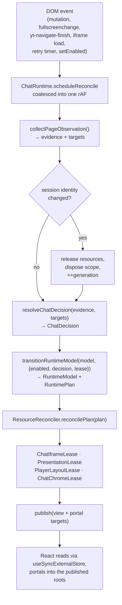

# Engineering YouTube Live Chat Fullscreen

YouTube Live Chat Fullscreen is a production browser extension that cooperates with a page it does not control. YouTube changes URLs without full reloads, replaces DOM subtrees, moves chat containers in fullscreen, and exposes different chat sources for live streams and archives. The implementation contains that instability inside a session runtime with explicit ownership boundaries.

This document is the architecture entry point: the vocabulary, the shape of one reconcile pass, and a map of where to change things. The four documents under [`architecture/`](architecture/) go deeper on each subsystem.

## Where to start reading

If you read two files, read [`ChatRuntime.ts`](../entrypoints/content/runtime/ChatRuntime.ts) and [`ResourceReconciler.ts`](../entrypoints/content/runtime/ResourceReconciler.ts). They carry nearly all the coordination complexity; most other runtime files are small and delegate.

In dependency order, the content script is:

1. [`index.tsx`](../entrypoints/content/index.tsx) — the WXT entrypoint. Deliberately 15 lines with no runtime state.
2. [`ContentBootstrap.ts`](../entrypoints/content/bootstrap/ContentBootstrap.ts) — the route gate. The only thing that runs on a non-watch page.
3. [`createContentSession.tsx`](../entrypoints/content/bootstrap/createContentSession.tsx) and [`SessionScope.ts`](../entrypoints/content/bootstrap/SessionScope.ts) — session construction and the scope that owns every timer, listener, and cleanup.
4. [`collectPageObservation.ts`](../entrypoints/content/platform/youtube/collectPageObservation.ts) and [`selectorCatalog.ts`](../entrypoints/content/platform/youtube/selectorCatalog.ts) — the compatibility adapter.
5. [`resolveChatDecision.ts`](../entrypoints/content/runtime/resolveChatDecision.ts) and [`runtimeModel.ts`](../entrypoints/content/runtime/runtimeModel.ts) — the pure layer.
6. [`ChatRuntime.ts`](../entrypoints/content/runtime/ChatRuntime.ts) and [`ResourceReconciler.ts`](../entrypoints/content/runtime/ResourceReconciler.ts) — the driver.
7. The four leases in [`runtime/resources/`](../entrypoints/content/runtime/resources/), plus [`iframeAttachment.ts`](../entrypoints/content/features/YTDLiveChatIframe/utils/iframeAttachment.ts), which owns every borrowed-DOM restore snapshot and is larger than the lease that delegates to it.

Storage is separate and can be read on its own: [`repository.ts`](../shared/settings/repository.ts).

## Vocabulary

These terms are load-bearing in the code and unguessable from the outside.

| Term | Meaning |
| --- | --- |
| **generation** | A counter identifying the current chat session inside one watch page. It increments whenever the session identity — `videoId`, player element, or fullscreen root — changes. Scheduled callbacks capture their generation and no-op if it has moved on, so a callback from the previous video cannot mutate the current one's resources. |
| **observation** | One read of the page, split into **evidence** (JSON-serializable, no DOM nodes — diffable, fingerprintable, testable) and **targets** (live element references the leases need). The split is the entire point of the adapter. |
| **probe** | A stable id plus an ordered list of fallback CSS selectors. Query helpers report which fallback matched, and those ids go into the diagnostic report, so a bug report can say which YouTube shape was seen without leaking content. |
| **decision** | The output of `resolveChatDecision`: `inactive`, `pending`, `available`, or `unavailable`. `pending` carries `canToggle`, meaning the switch may show even though the overlay is not yet mountable. |
| **plan** | A `RuntimePlan` is *intent, not DOM commands*. Each field can be `'preserve'`, meaning "do not touch this resource this tick". This is what keeps the model pure. |
| **lease** | An object owning one reversible page mutation, which knows how to undo it. Acquiring and releasing are both idempotent, and releasing restores rather than deletes anything that was YouTube's to begin with. |
| **borrowed vs managed** | A *borrowed* iframe is YouTube's own chat iframe, moved into the overlay and handed back on release. A *managed* iframe is one the extension created. Borrowing is preferred because it preserves YouTube-owned authentication, comment posting, and Super Chat; a managed iframe is a live-only fallback. |
| **pinned** | The user positioned the overlay by hand, so automatic placement must not move it. |
| **degraded** | A canary run that executed but was partially skipped, flaky, or reported compatibility drift. Rejects a release candidate; does not turn the scheduled monitor red. |

## One reconcile pass

Everything the runtime does is one idempotent pass, coalesced into a single animation frame. Understanding this loop is most of understanding the codebase.

Two things about this loop are worth knowing before you debug it.

**The plan is applied in a fixed order**, and the order encodes safety: pending restorations are retried first, the iframe is released before anything else is torn down, and the layout and presentation leases are cleared only after the borrowed iframe is back where it came from. Release always precedes the next acquire.

**The first `available` pass usually cannot finish.** The overlay container does not exist yet, so attachment fails and the runtime settles into `recovering` with a retry pending. React then renders the overlay, and the carrier element's ref calls back into the runtime, which attaches the iframe right there. The next pass settles to `active`. If you are wondering why a state machine needs a callback from React, this is why.

The full walkthrough, including the five runtime statuses, the retry policy, the three teardown paths, and the borrowed-iframe restore path, is in [The content runtime](architecture/content-runtime.md).

## Runtime constraints

The extension restores chat in fullscreen without replacing YouTube's chat product. It must preserve posting, Super Chat, archive replay, and YouTube-owned authentication while avoiding UI on videos where chat is unavailable.

Live, archive, and no-chat pages are distinct runtime states. Live streams prefer a playable native `live_chat` iframe and create a managed `live_chat?v=<videoId>` iframe only as a fallback. Archives borrow only a playable native `live_chat_replay` iframe; when replay is unavailable the extension hides the switch rather than offering a broken overlay.

The content script matches `*://www.youtube.com/*` because YouTube is a single-page application, but [`ContentBootstrap.ts`](../entrypoints/content/bootstrap/ContentBootstrap.ts) is the only runtime that starts on a non-watch page. It reads the URL and listens for navigation signals without creating application state, a React root, locale loading, settings watchers, DOM observers, or chat iframe discovery. Entering `/watch` creates one session; leaving disposes it. An activation token disposes a session that finishes initializing after the route has already changed.

## Extension contexts

There are three runtime entrypoints, and they do not talk over `tabs` or `runtime` messaging.

| Context | Role |
| --- | --- |
| **Content script** | Injected into YouTube pages. Owns the overlay, the chat iframe lease, and all YouTube-facing behavior. |
| **Popup** | The toolbar UI: enable/disable, language, theme, settings export and import. |
| **Settings page** | A separate `settings.html` entrypoint shown through an extension iframe over the player. It has its own React root and jotai store. |

Settings changes propagate through storage, not messages: each context writes a versioned envelope carrying a writer identifier, and watchers in the other contexts ignore their own writes. The settings iframe additionally uses `window.postMessage` for the three things storage cannot carry — requesting a diagnostic report, restarting the runtime, and closing itself. See [Settings, state, and storage](architecture/settings-and-state.md).

## Resource ownership

Four leases own every reversible page mutation:

- [`ChatIframeLease.ts`](../entrypoints/content/runtime/resources/ChatIframeLease.ts) borrows or creates one chat iframe and restores or removes it idempotently.
- [`PresentationLease.ts`](../entrypoints/content/runtime/resources/PresentationLease.ts) owns the overlay shadow root and the player switch container.
- [`PlayerLayoutLease.ts`](../entrypoints/content/runtime/resources/PlayerLayoutLease.ts) owns fullscreen player layout changes and their restoration.
- [`ChatChromeLease.ts`](../entrypoints/content/runtime/resources/ChatChromeLease.ts) owns chat-only presentation changes inside the iframe document.

Restoring a borrowed iframe is the interesting failure mode. Release restores inline styles, uninstalls the injected stylesheet, and then tries, in order: a comment placeholder left at the original position, the original parent and next sibling, and finally any chat host that still belongs to the current video. If YouTube replaced the whole subtree, none of those exist; the lease enters a `restoring` state and every subsequent pass retries it, discarding the iframe if the video has changed in the meantime.

## Settings, geometry, and adaptive placement

[`repository.ts`](../shared/settings/repository.ts) is the storage boundary shared by the popup, content, and settings contexts. Stored values carry versioned envelopes and writer identifiers. [`migrateSettings.ts`](../shared/settings/migrateSettings.ts) and [`normalizeSettings.ts`](../shared/settings/normalizeSettings.ts) accept older pixel geometry without discarding it.

The overlay stores player-relative `ChatGeometryV2` ratios. Old pixel values stay pending until the player's first usable rectangle is available, then migrate once with `pinned: true`. Rendering responds to player resize and clamps the chat to a 240 by 180 pixel minimum and a 65% by 90% player-relative maximum.

[`autoSafeArea.ts`](../entrypoints/content/overlay/autoSafeArea.ts) compares the current position with four corner candidates, minimizing overlap with captions, controls, menus, the end screen, and the settings panel, then minimizing movement and maximizing visible chat area. Small improvements do not move the overlay, drag and resize pause evaluation, manual movement pins the geometry, and an unpinned session repositions at most once.

## Diagnostics

[`RuntimeTrace.ts`](../entrypoints/content/diagnostics/RuntimeTrace.ts) stores a bounded in-memory event history. Events carry stable failure codes and generation numbers. [`sanitizeDiagnosticReport.ts`](../entrypoints/content/diagnostics/sanitizeDiagnosticReport.ts) exports only the shared diagnostic schema; raw URLs, video IDs, chat text, user names, and user-specific data are excluded, and an architecture check fails the build if a `videoId` or `url` field appears in the exported type.

The failure codes in [`failureCodes.ts`](../entrypoints/content/diagnostics/failureCodes.ts) are the vocabulary a user pastes into a bug report, so they are worth recognizing on sight:

| Code | Means |
| --- | --- |
| `PLAYER_TARGET_MISSING` | The player element could not be found. |
| `CONTROL_TARGET_MISSING` | The player control bar that hosts the switch could not be found. |
| `CHAT_SOURCE_PENDING` | Chat should exist for this video but is not usable yet. |
| `CHAT_SOURCE_UNAVAILABLE` | This video has no chat, terminally. |
| `BORROWED_IFRAME_DETACHED` | YouTube removed the iframe out from under the lease. |
| `IFRAME_DOCUMENT_NOT_READY` | The chat iframe exists but its document is not usable yet. |
| `RESTORE_TARGET_MISSING` | No place remained to hand a borrowed iframe back to. |
| `PRESENTATION_TARGET_REPLACED` | The player was replaced, invalidating the overlay host. |
| `RETRY_EXHAUSTED` | The retry budget ran out; the runtime gave up on this video. |

The settings panel can copy the sanitized report or restart the current chat runtime. Canary tests emit a compatibility fingerprint from the same evidence model and classify the result as passed, degraded, or failed without adding mutable operational state to production source code.

## Where to change things

Each of these has a second edit that CI enforces. The second column is the one that catches people.

| If you want to | Edit | Also update |
| --- | --- | --- |
| Add or change a YouTube selector | [`selectorCatalog.ts`](../entrypoints/content/platform/youtube/selectorCatalog.ts) as a probe with fallbacks | Nothing automated, but do not inline the selector elsewhere — `nativeChat.ts` and `e2e/utils/selectors.ts` are checked for importing the catalog |
| Add a translation key | `shared/i18n/assets/en.json` **and all 54 other locale files** | Run `node scripts/generate-locales.mjs`; the compiler throws `Locale keys differ` if any locale disagrees with English |
| Add a language | `shared/i18n/assets/<code>.json` | `shared/i18n/language_codes.json`, a `docs/store-listing/<code>.md`, and every place the count 55 is hard-coded. See [Internationalization](architecture/i18n.md) — this is the most involved change in the repository |
| Change a geometry clamp | [`chatGeometry.ts`](../shared/settings/chatGeometry.ts) | The numbers quoted in this document and in [Settings, state, and storage](architecture/settings-and-state.md) |
| Add a runtime failure code | [`failureCodes.ts`](../entrypoints/content/diagnostics/failureCodes.ts) | The table above |
| Add a field to the diagnostic export | [`sanitizeDiagnosticReport.ts`](../entrypoints/content/diagnostics/sanitizeDiagnosticReport.ts) | Nothing — but a field named `videoId` or `url` fails `yarn check` |
| Add a Playwright scenario | `e2e/scenarios/` | `e2e/config/projectClassification.ts`, or its contract test fails for a reason that will not look related |
| Add a Vitest spec | Anywhere | Name it `*.unit.spec.ts`, `*.dom.spec.tsx`, or `*.contract.spec.ts`; a plain `*.spec.ts` under `entrypoints/` silently lands in the jsdom project |
| Add an inline style to a borrowed iframe | [`compileStylePatch.ts`](../entrypoints/content/style/compileStylePatch.ts) | `YLC_DOCUMENT_STYLE_PROPERTIES` — otherwise the property survives release and leaks into YouTube's native chat |
| Change a release workflow | `.github/workflows/` | [`check-release-workflow.mjs`](../scripts/verify/check-release-workflow.mjs), which asserts the workflows' shape and runs inside `yarn check` |
| Change the content script match pattern | [`packagePolicy.ts`](../config/packagePolicy.ts) | The duplicated literal in [`check-package-contracts.mjs`](../scripts/verify/check-package-contracts.mjs) — the checker is `.mjs` and cannot import the TypeScript source |

## Testing

Pull-request tests do not depend on YouTube's current production data. Four deterministic Playwright projects cover the browser boundary — `fixture` (typed YouTube scenarios with external requests blocked), `visual`, `accessibility`, and `production-chrome` (which boots the extracted production ZIP). Together they prove live, archive, no-chat, replay-unavailable, SPA navigation with player replacement, iframe restoration, popup, visual, and accessibility behavior.

Real YouTube checks run separately as canaries. They detect compatibility drift but do not replace deterministic contracts, because live streams and archive replay can disappear independently of a code change. The complete boundary matrix and commands are in [`testing/contracts.md`](testing/contracts.md).

Architecture checks in [`check-runtime-architecture.mjs`](../scripts/verify/check-runtime-architecture.mjs) reject module-global runtime ownership, timers created directly inside `ChatRuntime.ts` rather than through `SessionScope`, eager initialization before a watch surface exists, low-level DOM action names in the pure model, removal of any of the four lease contracts, module-global iframe restore state, and sensitive fields in diagnostic exports. They are string and regex assertions over specific files, not static analysis: passing does not mean the design is right, and the failure message names neither a file nor a line. The full rule list is in [The content runtime](architecture/content-runtime.md).

## Release safety

One WXT codebase produces Chrome and Firefox packages. CI builds both browsers from a clean checkout, verifies package contents, and builds a separate testing extension for browser contracts.

The release-candidate workflow repeats source checks, tests, production builds, package verification, fixture E2E, visual checks, and accessibility checks. It then extracts the exact Chrome production ZIP, boots it without the testing bridge, and runs the real-YouTube canary against those exact bytes. It also requires a human attestation that Chrome, Firefox, and Opera were verified on real YouTube — a mandatory workflow input, not a formality. Passing candidates receive a commit-bound SHA-256 proof and are attached to a draft release.

Publication is a separate manual promotion workflow. It downloads and verifies the draft assets, submits those exact bytes to the stores, and never rebuilds after proof — an invariant asserted by [`check-release-workflow.mjs`](../scripts/verify/check-release-workflow.mjs). The Chrome and Firefox jobs name protected environments, though naming an environment in YAML does not itself create an approval policy; required reviewers are a repository setting.

Two details are worth stating plainly because they weaken the chain:

- A canary run in which **every** test skips is classified `unavailable` and does **not** reject the candidate. The release then ships with the human attestation as its only real-YouTube evidence. Partial skips, flakiness, and fingerprint drift are classified `degraded` and do reject it.
- The store *listing copy* is not part of the pipeline. Only the ZIP is submitted; dashboard text and screenshots remain a manual step.

Testing-only assets are injected only in WXT's `testing` mode, and package contracts reject them from release ZIP files. The step-by-step procedure is in [リリース Runbook](maintainers/release-runbook.md).

## Internationalization

The English source locale defines the translation shape. [`scripts/generate-locales.mjs`](../scripts/generate-locales.mjs) compiles 55 source locale files into runtime JSON, browser manifest messages, locale metadata, and TypeScript translation keys. Generated outputs are checked in CI so missing keys and stale artifacts fail before release.

Direction is part of locale metadata. Arabic, Hebrew, and Farsi render the popup and settings with RTL direction rather than relying on browser heuristics alone.

The 55 locales cover 49 distinct languages; the remainder are regional variants such as `en_GB`, `es_419`, `pt_BR`, and `zh_TW`. See [Internationalization](architecture/i18n.md).

## Privacy and permissions

The manifest requests only `activeTab` and `storage`, with no host permissions. The extension does not require an account, add analytics, or collect personal data. The only network read in the extension source is loading its own bundled locale JSON. Its page access, settings model, diagnostic schema, package contents, and release workflow can all be reviewed from this repository, and the permission set is pinned by [`check-package-contracts.mjs`](../scripts/verify/check-package-contracts.mjs) rather than by convention.
