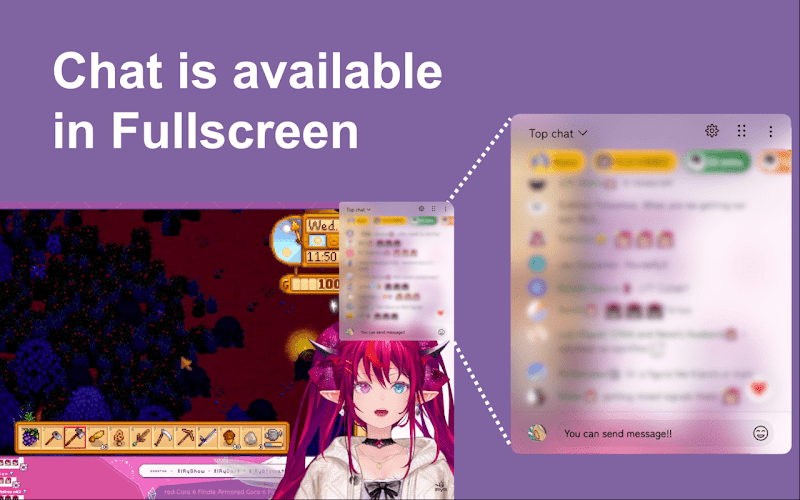
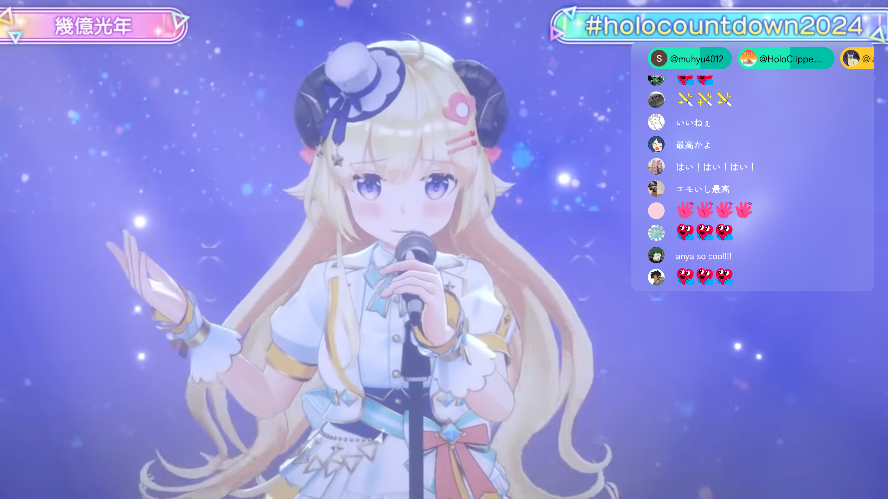
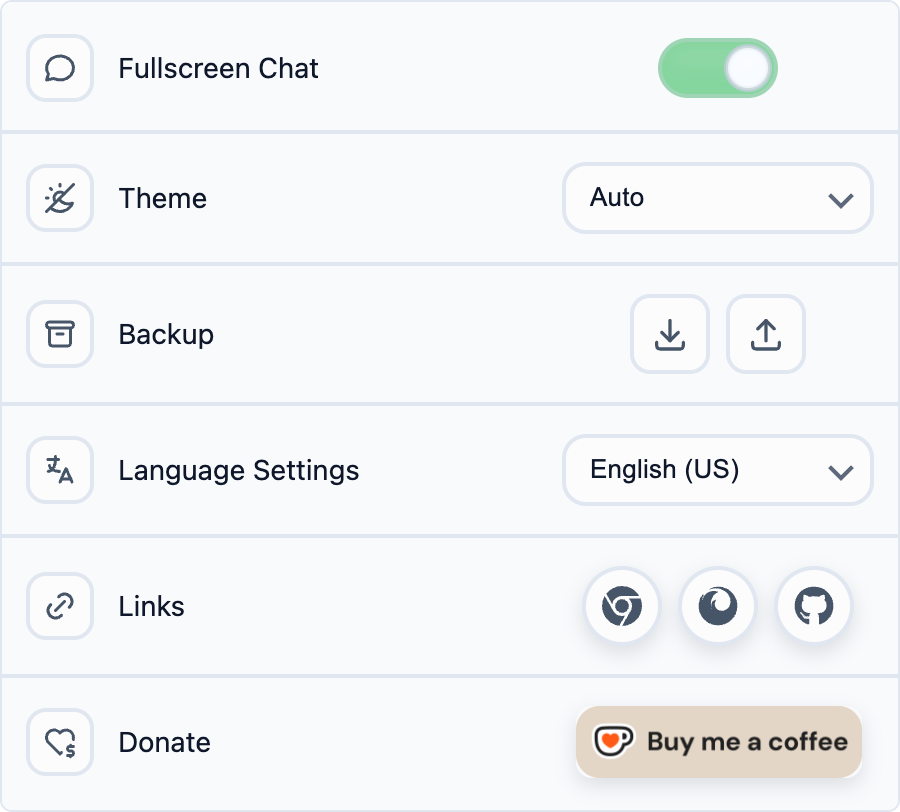
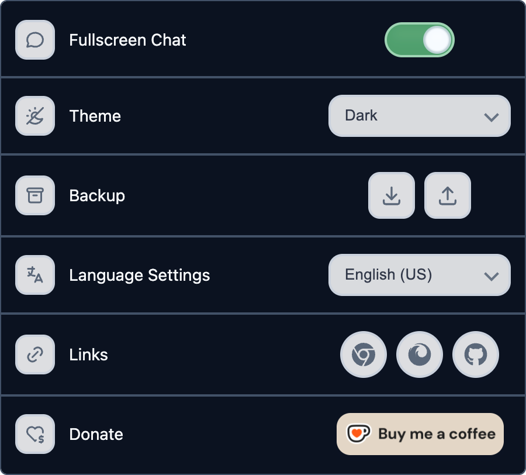
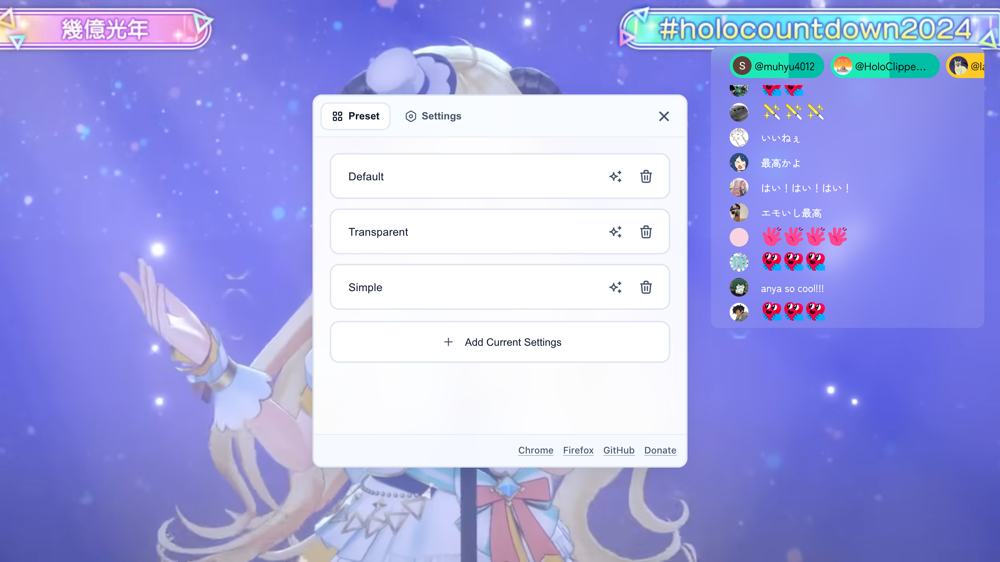
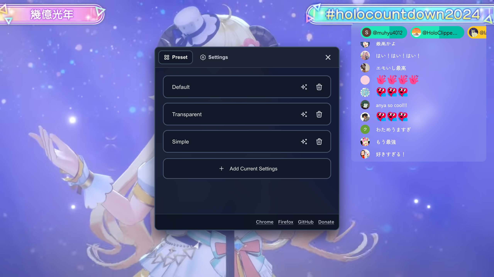
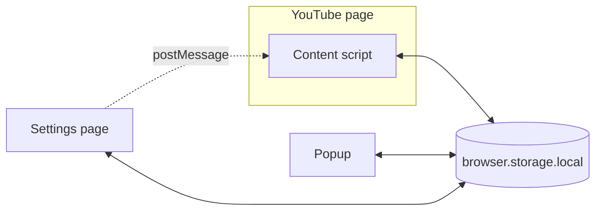

<div align="center">
  
</div>

<h1 align="center">YouTube Live Chat Fullscreen</h1>

<p align="center">
  YouTubeのフルスクリーンではチャットが消えてしまう。この拡張機能がそれを解決 — ドラッグ、リサイズ、スタイルを自由にカスタマイズ。
</p>

<p align="center">
  <strong>Chromeで20,000人以上が利用</strong><br />
  Chrome（Opera でも動作）・Firefox 対応 · 55 ロケール（49 言語） · アカウント不要 · トラッキングなし · オープンソース
</p>

<p align="center">
  <a href="../../README.md">English</a> ·
  <strong>日本語</strong> ·
  <a href="README.zh-TW.md">繁體中文</a>
</p>

<p align="center">
  <a href="https://chromewebstore.google.com/detail/youtube-live-chat-fullscr/dlnjcbkmomenmieechnmgglgcljhoepd">
    
  </a>
  <a href="https://chromewebstore.google.com/detail/youtube-live-chat-fullscr/dlnjcbkmomenmieechnmgglgcljhoepd">
    
  </a>
  <a href="https://addons.mozilla.org/ja/firefox/addon/youtube-live-chat-fullscreen/">
    
  </a>
  <a href="https://addons.mozilla.org/ja/firefox/addon/youtube-live-chat-fullscreen/">
    
  </a>
</p>

<p align="center">
  <a href="https://chromewebstore.google.com/detail/youtube-live-chat-fullscr/dlnjcbkmomenmieechnmgglgcljhoepd">
    
  </a>
  <a href="https://addons.mozilla.org/ja/firefox/addon/youtube-live-chat-fullscreen/">
    
  </a>
  <a href="https://github.com/daichan132/Youtube-Live-Chat-Fullscreen">
    
  </a>
</p>

<p align="center">
  フルスクリーンチャットが便利だと感じたら、YouTube視聴者や拡張機能開発者がこのプロジェクトを見つけられるよう、GitHubでStarしてください。
</p>

---

## プレビュー



### スクリーンショット

<table>
<tr>
<th align="center" colspan="2">フルスクリーンチャットオーバーレイ</th>
</tr>
<tr>
<td colspan="2"></td>
</tr>
<tr>
<th align="center">ポップアップ — ライト</th>
<th align="center">ポップアップ — ダーク</th>
</tr>
<tr>
<td align="center"></td>
<td align="center"></td>
</tr>
<tr>
<th align="center">設定 — ライト</th>
<th align="center">設定 — ダーク</th>
</tr>
<tr>
<td></td>
<td></td>
</tr>
</table>

## 30秒クイックスタート

1. [Chrome ウェブストア](https://chromewebstore.google.com/detail/youtube-live-chat-fullscr/dlnjcbkmomenmieechnmgglgcljhoepd) または [Firefox アドオン](https://addons.mozilla.org/ja/firefox/addon/youtube-live-chat-fullscreen/) からインストール。Chrome 版はそのまま Opera でも使えます。
2. YouTube のライブ配信、またはチャットリプレイ付きアーカイブ動画を開く。
3. フルスクリーンにすると、チャットはもう映像の上にある。最初からオンなので、何も押さなくていい。表示と非表示は、コントロールバーに増える吹き出しボタンで切り替え。
4. ドラッグ/リサイズし、設定からスタイルを自由に調整。

## ブラウザの中に残るもの

アクセス解析もトラッキングもありません。読んだメッセージも入力した文字も、集めず、どこにも送りません。外から読み込むのはフォントだけです。初期設定以外の書体を選んだときに Google Fonts から取得します。

- **集めるものがない:** 個人データは収集しません。アカウント登録も不要です
- **設定の置き場所:** 見た目、配置、プリセット、バックアップは、このブラウザのストレージから出ません
- **権限は2つだけ:** `activeTab` と `storage`
- **確かめられる実装:** ソースコードもリリースの手順も、このリポジトリで読めます

## 機能

### 💬 フルスクリーンチャット

- フルスクリーンを維持したまま、オーバーレイから直接コメントを投稿。ライブ配信ならスーパーチャットも送れます
- ライブ配信とチャットリプレイ付きアーカイブの両方に対応
- 「操作していないときも表示」は、プレイヤーの操作 UI が消えている間もオーバーレイを表示し続けます（既定で有効、自動的に隠す設定にも切り替え可能）

### 🎨 スタイル & 外観

- 背景色・文字色・フォント・文字サイズ・ぼかし・余白を配信画面に合わせて調整
- 通常のメッセージの「ユーザー名を表示」「ユーザーアイコンを表示」はそれぞれ切れます（スーパーチャットの名前とアイコンは残ります）。「スーパーチャットバーを表示」も切り替えられ、「チャットのみ表示」は「操作していないときも表示」がオンのときだけ選べます
- オーバーレイのドラッグ・リサイズ・位置調整が自由自在
- ライト・ダーク・オート（システム追従）テーマをオーバーレイ・ポップアップ・設定パネルに適用

### 📋 プリセット & バックアップ

- 名前付きスタイルプリセットを保存し、ワンクリックで切替
- 全設定を JSON でエクスポート/インポート — バックアップやデバイス間同期に

### 🌐 多言語対応

- 55 ロケール（49 言語）をビルトインでサポート（アラビア語・ヘブライ語・ペルシア語の RTL レイアウト対応）

<p align="center">
  <a href="https://chromewebstore.google.com/detail/youtube-live-chat-fullscr/dlnjcbkmomenmieechnmgglgcljhoepd">
    
  </a>
  <a href="https://addons.mozilla.org/ja/firefox/addon/youtube-live-chat-fullscreen/">
    
  </a>
</p>

---

## 動き続けるページの上で動く本番拡張

この拡張機能は 2 万人以上の Chrome ユーザーが使っていますが、その下にある YouTube のページは決して静止していません。URL はフルリロードなしで変わり、チャットの DOM は差し替えられ、ライブとアーカイブのリプレイでは同じチャットソースの規則が通用しません。コードベースはその差異を、散らばった例外処理ではなく明示的なランタイム契約として扱っています。

- 単一の WXT コードベースから Chrome / Firefox 両方をビルド（Chrome 版は Opera でも動作）
- React 19、TypeScript、Jotai、Tailwind CSS v4
- 55 ロケール（49 言語）を生成、RTL 対応
- チャットソースの純粋な判定を YouTube DOM の副作用から分離
- ユニット、契約、決定的 Playwright E2E、視覚、アクセシビリティ、実 YouTube canary
- SPA 遷移、DOM 差し替え、ライブチャット、アーカイブリプレイの明示的な処理
- バージョン管理された設定移行と、拡張機能コンテキスト間の同期
- リリース成果物は一度だけビルドし、ハッシュで証明し、再ビルドせずに公開

ランタイムの境界、テスト戦略、設定の所有権、リリースの安全装置は [Engineering YouTube Live Chat Fullscreen](../engineering.md)（英語）に記載しています。

## Tech Stack

| カテゴリ | スタック | プロジェクトでの役割 |
| --- | --- | --- |
| **Core** |   <a href="https://wxt.dev"></a> | React 19 でオーバーレイ UI を構築、TypeScript で型安全を確保、[WXT](https://wxt.dev) をクロスブラウザ拡張フレームワークとして採用 |
| **State & Style** | <a href="https://jotai.org"></a> <a href="https://tailwindcss.com"></a> | Jotai で同期状態と状態遷移、Tailwind CSS v4 でスタイリング |
| **Quality** |    | Vitest でユニットテスト、Playwright で E2E、Biome で lint & format |

## アーキテクチャ

<details>
<summary>クリックして展開</summary>

### システム概要



3 つのエントリポイントで構成されます。background service worker はありません。

| コンポーネント | 役割 |
| --- | --- |
| **Content Script** | YouTube ページに注入。チャットオーバーレイの描画、ドラッグ/リサイズ処理、チャットソースの解決（ライブ / アーカイブ / チャットなし）を担当。 |
| **Popup** | 拡張機能ツールバーの UI。有効/無効、言語、テーマ、設定のエクスポート/インポート。 |
| **設定ページ** | プレイヤー上に拡張機能の iframe として表示される独立した `settings.html`。専用の React root と状態ストアを持つ。 |
| **Shared** | 3 つで共有するモジュール — 設定リポジトリと移行、Jotai 状態、生成済み i18n アセット、UI コンポーネント、テーマ。 |

3 つのコンテキストは `tabs` / `runtime` メッセージを使いません。それぞれが書き込み元 ID 付きのバージョン管理された封筒を拡張機能ストレージに書き、他のコンテキストの watcher が自分の書き込みを無視しつつ変更を受け取ります。設定 iframe だけは、診断レポートの取得・ランタイム再起動・自身のクローズという 3 つの用途で `window.postMessage` を使います。

### チャットソースの解決

Content Script が動画タイプを自動検出し、適切なチャットソースを選択します:

可能な場合、拡張機能は新しい iframe を作らず **YouTube 自身のチャット iframe を借用**します。認証・コメント投稿・Super Chat が YouTube 側に残るためです。作成した iframe はライブ限定のフォールバックです。

| 動画状態 | チャットソース | スイッチ / オーバーレイ |
| --- | --- | --- |
| ライブ配信（ネイティブチャットあり） | 借用したネイティブ `live_chat` iframe | 表示される |
| ライブ配信（ネイティブ iframe なし） | 作成した `live_chat?v=<videoId>` iframe | 表示される |
| リプレイ可能なアーカイブ | ネイティブ `live_chat_replay` iframe | リプレイが再生可能な時のみ表示 |
| チャットなし / リプレイ不可 | なし | 非表示 |

### プロジェクト構成

```
entrypoints/
├── content/          # Content Script（YouTube に注入）
│   ├── bootstrap/    # ルートゲート、セッション生存期間、スコープ所有
│   ├── platform/     # YouTube 互換アダプタとセレクタカタログ
│   ├── runtime/      # チャット判定、純粋モデル、リコンサイラ
│   │   └── resources/  # ページ変更を所有する 4 つの lease
│   ├── overlay/      # オーバーレイ、ジオメトリ、ドラッグ/リサイズ、自動配置
│   ├── features/     # iframe スタイル、設定パネル、プレイヤースイッチ
│   ├── style/        # スタイルパッチのコンパイルと注入
│   ├── diagnostics/  # ランタイムトレース、失敗コード、診断レポート
│   └── settings/     # 設定 iframe のホスト側
├── popup/            # Popup UI（拡張機能ツールバー）
└── settings/         # settings.html — 設定アプリケーション本体
shared/               # 3 つのエントリポイントで共有
├── settings/         # ストレージ、移行、ジオメトリ、バックアップ
├── state/            # Jotai 状態と write-only command
├── runtime/          # コンテキストごとの起動処理
├── i18n/             # 55 ロケールのアセットと生成物
├── components/       # 共有 UI コンポーネント
├── styles/           # テーマトークン
└── hooks/            # 共有 React hooks
```

アーキテクチャの詳細は [`docs/architecture/`](../architecture/)（英語）にあります。

</details>

## 開発者向けセットアップ

### 必須環境

- **[Node.js](https://nodejs.org)** v24.x
- **[Yarn](https://yarnpkg.com)**（Corepack 経由を推奨）

### インストール

```bash
git clone https://github.com/daichan132/Youtube-Live-Chat-Fullscreen.git
cd Youtube-Live-Chat-Fullscreen
corepack enable
yarn install
```

### コマンド

| コマンド | 説明 |
| --- | --- |
| `yarn dev` | 開発サーバー起動（Chrome） |
| `yarn build` | 本番ビルド（Chrome） |
| `yarn check` | 読み取り専用の Biome チェック + TypeScript 型検査 |
| `yarn fix` | Biome の安全な整形・lint 修正を適用 |
| `yarn test:unit` | ユニットテスト実行 |
| `yarn e2e` | E2E テスト実行 |

> Firefox 向けは末尾に `:firefox` を付けてください — 例: `yarn dev:firefox`, `yarn build:firefox`

### 品質チェック

Pull Request 前に実行してください:

```bash
yarn check
yarn test:unit
yarn build
```

Firefox 互換に関係する変更では `yarn build:firefox` も実行してください。

## コントリビュート

バグ報告・機能提案・Pull Request、すべて歓迎です。

- [Issue](https://github.com/daichan132/Youtube-Live-Chat-Fullscreen/issues) を作成するか、[Pull Request](https://github.com/daichan132/Youtube-Live-Chat-Fullscreen/pulls) を送ってください。
- PR 前に `yarn check`、`yarn test:unit`、`yarn build` を実行してください。クロスブラウザに影響する変更では `yarn build:firefox` も実行します。
- セットアップ、検証、翻訳、スクリーンショットの手順は [CONTRIBUTING.md](../../CONTRIBUTING.md)（英語）にまとまっています。CI が課すゲートのうちローカルで再現されないものもここに書かれています。
- 脆弱性は公開 Issue ではなく [SECURITY.md](../../SECURITY.md) の非公開の手順で報告してください。
- README の翻訳も歓迎です — `docs/translations/README.<locale>.md` を追加してください。

<a href="https://github.com/daichan132/Youtube-Live-Chat-Fullscreen/graphs/contributors">
  
</a>

## サポート

この拡張機能が役に立ったら、Star が継続的なメンテナンスと更新の後押しになります。

<p>
  <a href="https://github.com/daichan132/Youtube-Live-Chat-Fullscreen/stargazers">
    
  </a>
  <a href="https://ko-fi.com/D1D01A39U6">
    
  </a>
</p>

## ライセンス

GPL-3.0 ライセンス。詳細は [LICENSE](../../LICENSE) を参照してください。
