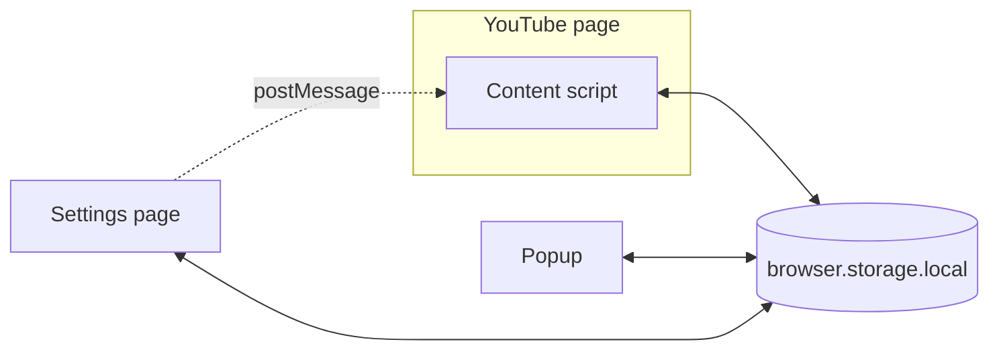

<div align="center">
  
</div>

<h1 align="center">YouTube Live Chat Fullscreen</h1>

<p align="center">
  YouTube 全螢幕模式下聊天會消失。這個擴充功能把它帶回來 — 自由拖曳、縮放、自訂覆蓋視窗的樣式。
</p>

<p align="center">
  <strong>20,000+ 名 Chrome 使用者</strong><br />
  Chrome（也能在 Opera 上使用）+ Firefox · 55 個語系（49 種語言） · 無需帳號 · 無追蹤 · 開源
</p>

<p align="center">
  <a href="../../README.md">English</a> ·
  <a href="README.ja.md">日本語</a> ·
  <strong>繁體中文</strong>
</p>

<p align="center">
  <a href="https://chromewebstore.google.com/detail/youtube-live-chat-fullscr/dlnjcbkmomenmieechnmgglgcljhoepd">
    
  </a>
  <a href="https://chromewebstore.google.com/detail/youtube-live-chat-fullscr/dlnjcbkmomenmieechnmgglgcljhoepd">
    
  </a>
  <a href="https://addons.mozilla.org/zh-TW/firefox/addon/youtube-live-chat-fullscreen/">
    
  </a>
  <a href="https://addons.mozilla.org/zh-TW/firefox/addon/youtube-live-chat-fullscreen/">
    
  </a>
</p>

<p align="center">
  <a href="https://chromewebstore.google.com/detail/youtube-live-chat-fullscr/dlnjcbkmomenmieechnmgglgcljhoepd">
    
  </a>
  <a href="https://addons.mozilla.org/zh-TW/firefox/addon/youtube-live-chat-fullscreen/">
    
  </a>
  <a href="https://github.com/daichan132/Youtube-Live-Chat-Fullscreen">
    
  </a>
</p>

<p align="center">
  喜歡全螢幕聊天嗎？在 GitHub 上給專案一顆 Star，讓更多 YouTube 觀眾與擴充功能開發者找到它。
</p>

---

## 預覽


### 截圖

<table>
<tr>
<th align="center" colspan="2">全螢幕聊天覆蓋視窗</th>
</tr>
<tr>
<td colspan="2"></td>
</tr>
<tr>
<th align="center">Popup — 亮色</th>
<th align="center">Popup — 暗色</th>
</tr>
<tr>
<td align="center"></td>
<td align="center"></td>
</tr>
<tr>
<th align="center">設定 — 亮色</th>
<th align="center">設定 — 暗色</th>
</tr>
<tr>
<td></td>
<td></td>
</tr>
</table>

## 30 秒快速開始

1. 從 [Chrome 線上應用程式商店](https://chromewebstore.google.com/detail/youtube-live-chat-fullscr/dlnjcbkmomenmieechnmgglgcljhoepd) 或 [Firefox 附加元件](https://addons.mozilla.org/zh-TW/firefox/addon/youtube-live-chat-fullscreen/) 安裝。Chrome 版同樣可以裝在 Opera 上使用。
2. 開啟 YouTube 直播，或有聊天重播的存檔影片。
3. 把播放器切到全螢幕，聊天室已經在影片上了 — 預設就是開著的，不必先按什麼。開關是控制列裡多出來的那顆對話框按鈕。
4. 依需求拖曳、縮放，並在設定中調整樣式。

## 留在瀏覽器裡的東西

沒有分析工具，也沒有追蹤。讀到的訊息和輸入的文字，都不收集、不保存、不外傳，開發者這邊也收不到資料。需要從外部取得的只有字型：選了預設以外的字型，才會從 Google Fonts 下載。

- **沒有東西可收集：** 不收集個人資料，也不必註冊帳號
- **設定只留在這個瀏覽器：** 外觀、版面、預設方案與備份，都不會離開瀏覽器的儲存空間
- **權限只有兩項：** `activeTab` 與 `storage`
- **實作查得到：** 原始碼與發布流程都在本儲存庫裡

## 功能

### 💬 全螢幕聊天

- 無需離開全螢幕，直接從覆蓋視窗發送留言；直播時還能送 Super Chat
- 適用於直播與具備聊天重播的存檔影片
- 「閒置時顯示聊天室」會在播放器控制列隱藏時繼續顯示覆蓋視窗（預設開啟，也可切換為自動隱藏）

### 🎨 樣式 & 外觀

- 調整背景色、字色、字型、字級、模糊、間距，讓覆蓋視窗融入你的觀看畫面
- 一般訊息可以分別關掉「顯示使用者名稱」和「顯示使用者頭像」（付費訊息的名稱和頭像仍然保留），「顯示 Super Chat 欄」也能切換；「僅顯示聊天室」則要在「閒置時顯示聊天室」開著時才能選
- 聊天覆蓋視窗可自由拖曳、縮放、調整位置
- 亮色、暗色、自動（跟隨系統）主題，覆蓋視窗、Popup 與設定面板一致套用

### 📋 預設 & 備份

- 儲存命名樣式預設，一鍵切換
- 以 JSON 匯出/匯入全部設定 — 方便備份或跨裝置同步

### 🌐 多語系

- 內建支援 55 個語系（49 種語言），包含阿拉伯語、希伯來語、波斯語的 RTL 版面

<p align="center">
  <a href="https://chromewebstore.google.com/detail/youtube-live-chat-fullscr/dlnjcbkmomenmieechnmgglgcljhoepd">
    
  </a>
  <a href="https://addons.mozilla.org/zh-TW/firefox/addon/youtube-live-chat-fullscreen/">
    
  </a>
</p>

---

## 在一個不斷變動的頁面上運行的正式產品

本擴充功能服務超過 20,000 位 Chrome 使用者，但其下的 YouTube 頁面從未真正靜止。網址會在不完整重新載入的情況下改變、聊天 DOM 會被替換，而直播與存檔重播並不共用同一套聊天來源規則。這份程式碼將這些差異視為明確的執行期契約，而非散落各處的例外處理。

- 以單一 WXT 程式碼庫建置 Chrome 與 Firefox（Chrome 版同樣可在 Opera 上執行）
- React 19、TypeScript、Jotai 與 Tailwind CSS v4
- 產生 55 個語系（涵蓋 49 種語言），支援 RTL
- 將純粹的聊天來源判定與 YouTube DOM 副作用分離
- 單元、契約、確定性 Playwright E2E、視覺、無障礙與實際 YouTube canary 測試
- 明確處理 SPA 導覽、DOM 替換、直播聊天與存檔重播
- 版本化的設定遷移，以及跨擴充功能情境的同步
- 發布產物只建置一次、以雜湊證明，發布時不重新建置

執行期邊界、測試策略、設定所有權與發布防護措施記載於 [Engineering YouTube Live Chat Fullscreen](../engineering.md)（英文）。

## Tech Stack

| 分類 | 技術棧 | 在此專案中的角色 |
| --- | --- | --- |
| **Core** |   <a href="https://wxt.dev"></a> | React 19 建構覆蓋 UI、TypeScript 確保型別安全、[WXT](https://wxt.dev) 作為跨瀏覽器擴充框架 |
| **State & Style** | <a href="https://jotai.org"></a> <a href="https://tailwindcss.com"></a> | Jotai 輕量同步狀態與狀態遷移、Tailwind CSS v4 原子化樣式 |
| **Quality** |    | Vitest 單元測試、Playwright E2E 測試、Biome lint & format |

## 架構

<details>
<summary>點擊展開</summary>

### 系統概覽



此擴充功能由三個進入點組成，沒有 background service worker。

| 元件 | 角色 |
| --- | --- |
| **Content Script** | 注入至 YouTube 頁面。負責聊天覆蓋視窗的繪製、拖曳/縮放處理，以及聊天來源的解析（直播 / 存檔 / 無聊天）。 |
| **Popup** | 擴充功能工具列 UI。啟用/停用、語言、主題，以及設定的匯出/匯入。 |
| **設定頁面** | 獨立的 `settings.html`，以擴充功能 iframe 顯示於播放器之上，擁有自己的 React root 與狀態儲存。 |
| **Shared** | 三者共用的模組 — 設定儲存與遷移、Jotai 狀態、產生的 i18n 資源、UI 元件、主題。 |

三個情境之間不使用 `tabs` / `runtime` 訊息。每一方都將帶有寫入者識別碼的版本化封包寫入擴充功能儲存空間，其他情境的 watcher 接收變更並忽略自己的寫入。只有設定 iframe 會使用 `window.postMessage`，用於取得診斷報告、重新啟動執行期，以及關閉自身。

### 聊天來源解析

Content Script 自動偵測影片類型並選擇適當的聊天來源：

在可行的情況下，擴充功能會**借用 YouTube 自身的聊天 iframe**，而不是自行建立，因為這樣可以將驗證、留言發送與 Super Chat 保留在 YouTube 一側。自行建立的 iframe 僅作為直播的後備方案。

| 影片狀態 | 聊天來源 | 開關 / 覆蓋視窗 |
| --- | --- | --- |
| 直播（有原生聊天） | 借用的原生 `live_chat` iframe | 可用 |
| 直播（無原生 iframe） | 建立的 `live_chat?v=<videoId>` iframe | 可用 |
| 可重播聊天的存檔 | 原生 `live_chat_replay` iframe | 需重播可播放時才可用 |
| 無聊天 / 重播不可用 | 無 | 隱藏 |

### 專案結構

```
entrypoints/
├── content/          # Content Script（注入至 YouTube）
│   ├── bootstrap/    # 路由閘門、工作階段生命週期、範圍所有權
│   ├── platform/     # YouTube 相容層與選擇器目錄
│   ├── runtime/      # 聊天判定、純粹執行期模型、reconciler
│   │   └── resources/  # 擁有頁面變更的四個 lease
│   ├── overlay/      # 覆蓋視窗、幾何、拖曳/縮放、自動避讓配置
│   ├── features/     # iframe 樣式、設定面板、播放器開關
│   ├── style/        # 樣式 patch 的編譯與注入
│   ├── diagnostics/  # 執行期追蹤、失敗代碼、診斷報告
│   └── settings/     # 設定 iframe 的宿主端
├── popup/            # Popup UI（擴充功能工具列）
└── settings/         # settings.html — 設定應用程式本體
shared/               # 三個進入點共用
├── settings/         # 儲存、遷移、幾何模型、備份
├── state/            # Jotai 狀態與 write-only command
├── runtime/          # 各情境的啟動流程
├── i18n/             # 55 個語系資源與產生的檔案
├── components/       # 共用 UI 元件
├── styles/           # 主題 token
└── hooks/            # 共用 React hooks
```

架構的詳細說明位於 [`docs/architecture/`](../architecture/)（英文）。

</details>

## 開發者安裝

### 環境需求

- **[Node.js](https://nodejs.org)** v24.x
- **[Yarn](https://yarnpkg.com)**（建議使用 Corepack）

### 安裝

```bash
git clone https://github.com/daichan132/Youtube-Live-Chat-Fullscreen.git
cd Youtube-Live-Chat-Fullscreen
corepack enable
yarn install
```

### 常用指令

| 指令 | 說明 |
| --- | --- |
| `yarn dev` | 啟動開發伺服器（Chrome） |
| `yarn build` | 正式建置（Chrome） |
| `yarn check` | 唯讀 Biome 檢查 + TypeScript 型別檢查 |
| `yarn fix` | 套用 Biome 的安全格式化與 lint 修正 |
| `yarn test:unit` | 執行單元測試 |
| `yarn e2e` | 執行 E2E 測試 |

> Firefox 版請在末尾加上 `:firefox` — 例如 `yarn dev:firefox`、`yarn build:firefox`

### 品質檢查

提交 Pull Request 前，建議執行：

```bash
yarn check
yarn test:unit
yarn build
```

若涉及 Firefox 相容性，也請執行 `yarn build:firefox`。

## 貢獻

歡迎提出問題回報、功能建議或 Pull Request。

- 建立 [Issue](https://github.com/daichan132/Youtube-Live-Chat-Fullscreen/issues) 或送出 [Pull Request](https://github.com/daichan132/Youtube-Live-Chat-Fullscreen/pulls)。
- PR 前請執行 `yarn check`、`yarn test:unit` 與 `yarn build`。若變更會影響跨瀏覽器行為，請一併執行 `yarn build:firefox`。
- 安裝、驗證、翻譯與螢幕擷圖的完整步驟記載於 [CONTRIBUTING.md](../../CONTRIBUTING.md)（英文），其中也列出 CI 會執行但本機不會重現的檢查。
- 安全性漏洞請依 [SECURITY.md](../../SECURITY.md) 的非公開流程回報，切勿開立公開 Issue。
- README 翻譯也十分歡迎 — 請新增 `docs/translations/README.<locale>.md` 檔案。

<a href="https://github.com/daichan132/Youtube-Live-Chat-Fullscreen/graphs/contributors">
  
</a>

## 支持

若功能不如預期，請看[疑難排解](../troubleshooting.md)（英文）：切換鈕未出現時的檢查、Opera 專屬檢查，以及如何送出診斷報告。

如果這個擴充功能對你有幫助，給個 Star 有助於持續維護與更新。

<p>
  <a href="https://github.com/daichan132/Youtube-Live-Chat-Fullscreen/stargazers">
    
  </a>
  <a href="https://ko-fi.com/D1D01A39U6">
    
  </a>
</p>

## 授權

採用 GPL-3.0 授權，詳見 [LICENSE](../../LICENSE)。
